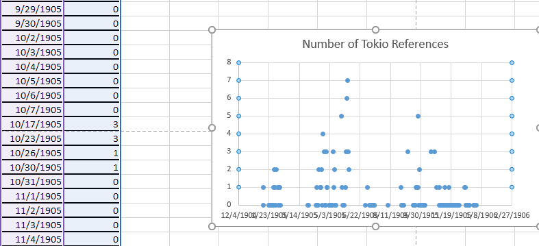
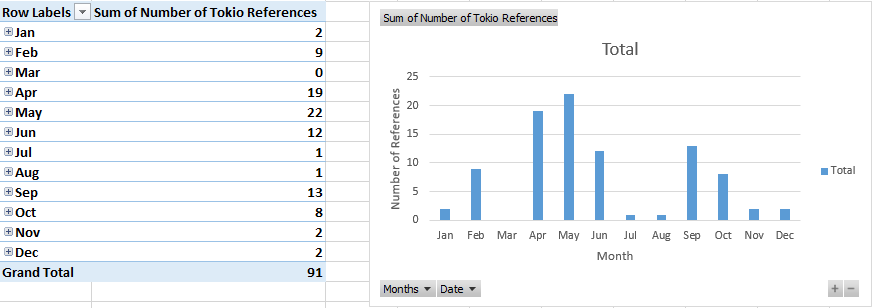
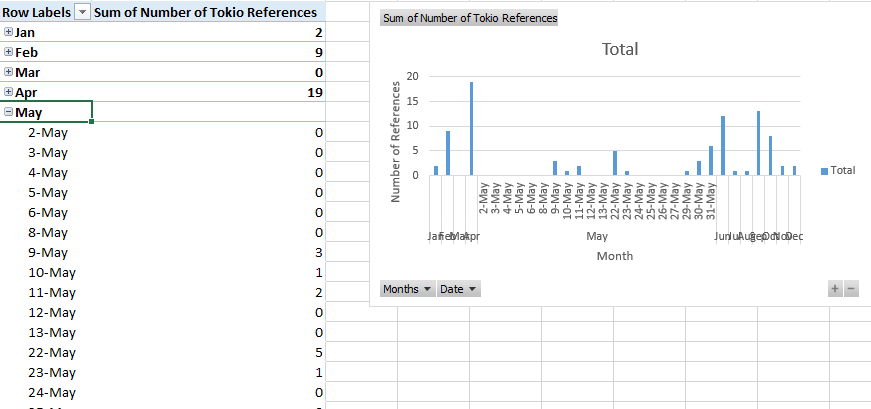
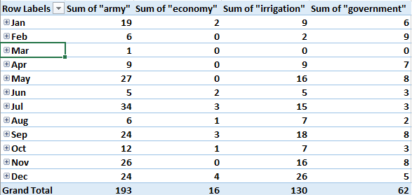
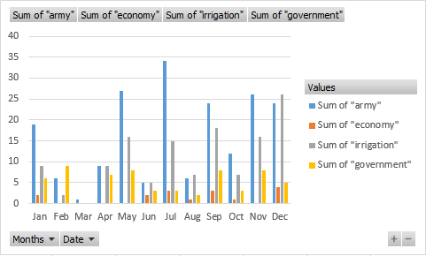
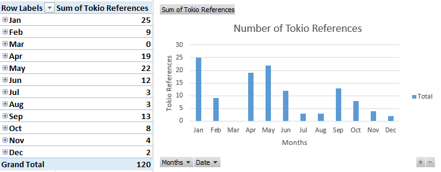

The Egyptian Gazette is made up of a myriad of information. This information takes many forms, and because the newspaper issues are from 1905, the newspaper's structure and content can be confusing. However, this also provides an opportunity, the ability to explore. With over one hundred and fifty days of newspaper, a picture of life in Alexandria, Egypt at the time can be glimpsed. Some will choose to focus on stories and events. Others might spend their efforts looking at tables and making conclusions about Alexandria's economy based on that information. While I initially shared those goals, I came to see a unique opportunity. After months of painstaking work, I wanted to do some analysis that could potentially help others long-term. As I began querying, I was immediately drawn to counting and the different ways that I could use it.  

Once I decided to focus on counting, I immediately began familiarizing myself with XPath and exploring some of the simpler ways to use it. Initially, I used XPath to count simple things, such as advertisements, heads, or paragraphs on specific pages. I used `count(//div[@n="1"]//div)` to find the number of advertisements on each page 1. Then, I just altered this query in order to search for other general things, such as for person names with `count(//persName)`.

As I kept trying to count advertisements, I became more and more frustrated. Each advertisement was only in each issue once at the most, and because of structural differences, counting them in bulk was almost useless. After struggling with advertisements, I shifted gears towards some of the financial tables. One table especially, the Export Manifests, intrigued me. The Export Manifests was structured differently throughout each issue. I came up with a specific query, `count(//div//head[contains(.,'Export Manifests')]//table//cell)`, in order to count the number of cells in each financial table. Unfortunately, structural differences struck again. Many of the issues contained heads beneath the one containing Export Manifests, causing the query to receive limited results. There is great potential for counting with advertisements and financial tables; however, for my purposes, I began at looking at the content of the paper for answers.  

After some thought, I used `count(//div//p[contains(.,'Tokio')])` to count the number of times Tokio was mentioned throughout each issue. This immediately gave results that I could potentially graph and analyze. When I inputted these results into excel, I quickly ran into another problem. Graphing over one hundred and fifty issues of newspaper in the same graph does not provide great results. After some searching, I found a much better avenue for graphing this information.  

After highlighting the dates and number of Tokio references, I clicked the Insert tab, then clicked in PivotTable. This PivotTable option organized the dates into months that can be expanded into days. For the sake of graphing, I kept the dates as months and made a bar graph depicting the number of Tokio references throughout the year of 1905. The Pivot Graph actually allowed me to change months into days or vice versa. I could change just the month of January into days and leave the other eleven months alone. This would be especially useful to pay special attention to any discrepancies or other interesting information.  

  

I then decided to use counting to find information that can be more easily analyzed. After some thought, I decided to make a bar graph comparing the number of times several words were mentioned throughout the newspaper. I initially thought of war as a major topic. Unfortunately, this led to a variety of other problems. While I was excited at first at the large amount of results, I quickly realized that the results were not all what I wanted. The first occurrence of 'war' actually took place within the word 'forward.' As I tried more queries, I could not manage to figure out a way to ask for only war. I conceded and just queried for words that would not provide mixed results. I decided to focus on economy, army, government, and irrigation for my graph. After getting all of my results into an excel spreadsheet, I created a bar graph showing how many times each of those words was mentioned in each month. The Pivot Table even gave a total for each word.  

After using Pivot Table to graph the data, I found that economy, army, government, and irrigation were mentioned 16, 193, 62, and 130 times respectively. The months of February, March, and April barely mentioned any of these words. While February and March were missing many issues, April was not. This might point to unfinished work or a boring time of year in Alexandria. Regardless, it is much more interesting to look at the the words "army" and "irrigation" later in the year. Army is mentioned the most throughout the year except for in the month of December. From the month of January to the month of November, army is mentioned almost twice as much as irrigation. This points to a major concern in the lives of the people of Alexandria, Egypt. During December, irrigation must become a much greater problem. Overall, using counting to make graphs like this one shows the different priorities at different times of the year. By inputting different words into XPath and graphing the results, a much broader perspective of Alexandria in 1905 can be found.  

In addition to counting the number of times one word was used in the newspaper, I tried counting words in other ways. After some querying, I was able to use `count(//div[contains(.,'United States')] [contains(.,'America')])` to count the number of times that America and United States were used in the same div. This could of course be done with paragraphs or other groups of texts as well. This helps with analyzing correlations in foreign policy and other aspects of life. Also, by using `count(//div[contains(.,'United States')]), count(//div[contains(.,'America')])`, I was able to count the number of divs that had America, the United States, or both mentioned in them. This can be done with any two words and can be used for paragraphs as well. I initially tried doing this with XPath 2.0; however, I could only do this type of search with 3.0. Overall, XPath 3.0 seems to offer much more flexibility with querying.  

As I researched my serial question, I found out more what not to do than what to do. I quickly came to the conclusion that this type of querying is most effective with better structured and more similar files. Also, while it is fun counting a variety of things, it is difficult to find specific ways in which those numbers can be useful. With a better version of the newspaper, I  would have focused more on ad and financial table formats. However, the counting was also interesting when looking at foreign affairs, such as how often foreign countries were mentioned and when. Connecting counting results with context could be a serial question all on its own. Also, I found using PivotTable in Excel to be the most effective means of organizing results. It does not translate well into pie charts, but those can be easily done manually with totals. By trial and error, I was able to find the strengths and weaknesses of counting and the best way to organize information found. I tried to use `ancestor::` and `string()` with counting but could not find how to effectively do so or how to make use of the information if I had gotten it. There are just so many possibilities when making queries, and I spent countless hours just trying to figure out how to graph the information I managed to find. Because of the massive returns with counting queries, I find that specific, simple queries probably work best.  

###UPDATE  

I ran the counting query for Tokio references about a week after finishing my initial serial question analysis. After updating my content folder, I had two extra weeks that were completed. Unfortunately, both of those weeks had errors and did not provide any data. However, there was more work put into other weeks throughout the year of 1905. After running the query and comparing the data, the months of January, July, August, and November all had aditional Tokio references. While several of these did not have many additional references, the Egyptian Gazette mentioned Tokio 23 more times in January. While this cannot be used to make any solid conclusions, it does point to the importance of completing the OCR and encoding for the year. Queries are only as good as the text that they are querying.  

