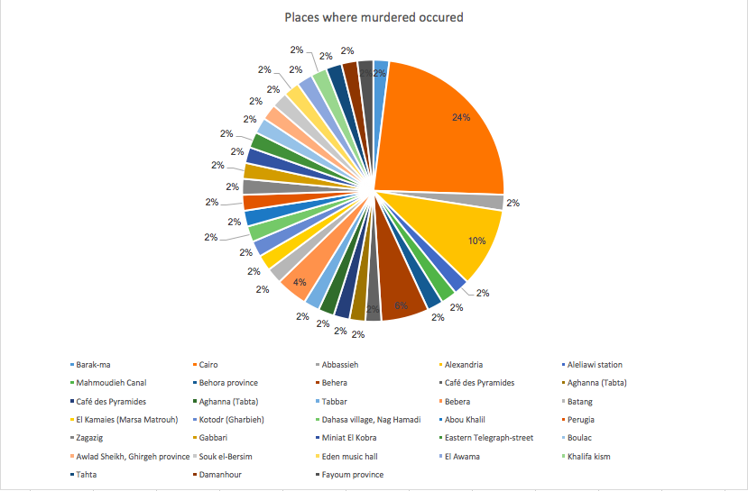
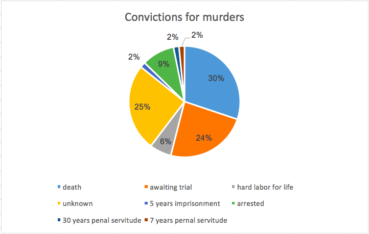

My serial question is where were murders most frequent in the *Egyptian Gazette* in the year 1905? And how many of these trials ended up in the death sentence or in something else. This drew my attention after seeing an article where there were three death sentences in only twenty days because of murders. This got me thinking and left me with my question, where do murders occur most frequently and how many end in the death sentence?

To start off my project, I did an XPath query using the word "murders." This gave me about 132 results. I then went through each one and read the articles that popped up. I collected data of what crime was committed, which were mostly murders but sometimes included attempted murder, murder and robbery, threatened to murder, and double murder. I also collected where these murders took place. Sometimes the article would say a city and sometimes it would give the village of where the murder or victim was from or it give the village in where it happened. And finally, I collected what the conviction was just out of curiosity of how many murder trials ended in the death sentence. Some of the results I got were just talking about murder trials and were updates on when the trial would take place. Other results I got were nothing that had to do with a crime but had the word murder was used in the article somewhere. For example, "murderous" was used an an adjective to describe a hotel. Most of the results gave me what I was looking for and this way i could collect my data and make my visuals.

I decided to use the word "murders" for the XPath query because that is what I was looking into. I tried many different words such as "executions," "crime," and "death sentenced." When I put in those words in the XPath query, I got very few results or I did not get the results I was looking for. When I typed in "murders," I found exactly what I was looking for. I was specifically looking for articles on a murder that had occurred. In these articles, I would look for what kind of murder or crime was committed specifically, where, and what the conviction ended up being. For almost all if the results that I received, it said where the crime had taken place. For a few, it did not. The same thing happened for the convictions. In some articles, it would not say what the conviction was so I assumed they were awaiting trial unless otherwise stated.

This image shows the places where the murders happened:

I noticed that the place that had the most murders was Cairo. I think this is because Cairo was a very big city and a lot of people were concentrated there so it made for easier targets. And since there is more people, there is more of a likelihood that more people are going to get murdered there. I also noticed that most of the murders ended up in the death sentence. The ones that did not end in a death sentences ended with hard labor for life or they were awaiting trial or had just been arrested and not tried yet.

This image shows the conviction percentages of each conviction that was made for the murders:

I also noticed that the people who committed the crimes did not have good reason to murder someone (not that any reason is a good reason to take someone's life). Most of these murders were out of hate or jealousy of their victims. Sometimes the murders were accidents. For example, this man goes in to kill his wife's lover but ends up murdering her brother. If this man was not jealous, he would have not died for nothing. Another example of this is when a man goes to murder another man and in his gunfire, he accidentally shoots an innocent woman.

As I was reading these articles on different murders that took place in the *Egyptian Gazette* in 1905, I noticed that the main way people killed another person is through the head. Some people shot their victims in the head with a gun and others took a rock or some wort of tool and bashed their victims head causing them to die. I also noticed when reading that many people when going to their assigned destination to receive their punishment do not put up a fight nor do they say anything. They just go willingly. Some people even confessed to their crimes on the spot without denying anything. This struck me as interesting because in today's world, most people would not confess a murder they committed because they know it will mean life in prison. This makes me wonder if life in prison is worse than the death sentence. It could also be the times and how it was back then compared to how it is now.

I can see how microhistory can teach one a lot about different types of things but one weakness I found that there is a plethora of results one has to go through in order to find what they are looking for. It took me a couple of hours to thoroughly read every article that I gathered in my results. In order to research sufficiently and thoroughly, it takes a lot of time which some people do not have. A strength that can be seen is that this is an easy way to find information and to learn about the *Egyptian Gazette* in 1905 and other topics. Another weakness about this is, sometimes you cannot read what the newspaper says even when you fix it up. Sometimes it would look good on one side but not good on the other. This results in the process being time consuming and tedious.
