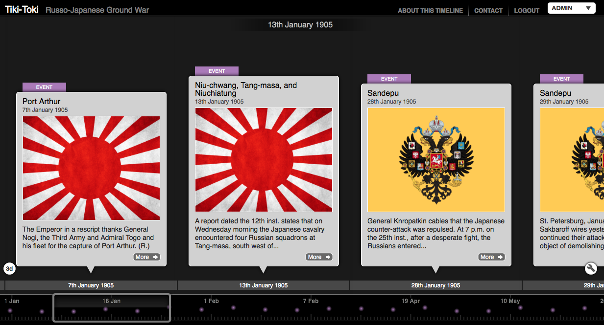
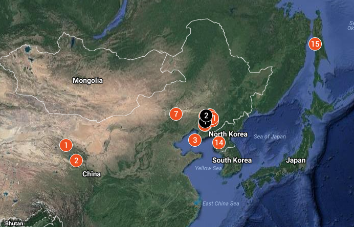

My serial question for the analysis project deals with the land battles reported in the *Egyptian Gazette*. Probably most people, even in the early 1900’s, could predict that Japan wouldn’t have any trouble with the Russian Navy. The Japanese Navy was strong and effective, which helped propel them into the international spotlight. There are tons of reports from both Tokyo and St. Petersburg about the battles in the sea, but what caught my interest was the reports of the fighting on land. We know the Japanese Navy was strong, but how would their Army perform in a foreign land? Would the Japanese stand a chance against the might of the Russian army who, before and after this war, won many battles through the ability to overpower and outnumber their opponents? The answer is a resounding ‘yes.’ According to the reports from both sides, Japan had no issue on land.

The first visualization I wanted to create to help visualize the small victories of both Russia and Japan was a timeline. You can find the full timeline [here](https://www.tiki-toki.com/timeline/entry/833923/Russo-Japanese-Ground-War/). I figured that the best way to present nearly 30 reports on fighting would be to create an easy to follow visualization that could quickly show the viewer which country made the report along with the report itself, one-by-one. Using tiki-toki.com, I created a timeline where each event is evenly spaced out. For each report that I added, I also attached a picture of the flag that correlated to where the report came from. Overall, I had nearly 30 reports, most of them from Japan. Reading these reports, you will notice that Japan was winning battle after battle while also losing very little men in comparison to the Russians. I can only speculate why the Russians had so much trouble with the Japanese, but one of the easier conclusions that I can make is that the Russians were not as invested into the war as Japan. With a little research using Wikipedia, I learned how this war began in the first place and what each side was fighting for. Japan was basically fighting to keep their influence in the region of China and Korea, which they felt was threatened by the Russians. The Russians, on the other hand, were attempting to get a warm water port, one that could be used year-round. If I had to guess, I’d say that any initial problems that Russia had would be due to an underestimation of Japan’s military might. It seemed that the Tsar expected an easy victory, and even when things were not looking great, Russia would not accept defeat if it meant bringing shame back with them. There was one report from St. Petersburg that convinced me that this was the view of the Russians. I think that later in the war, Russia began dealing with issues at home, forcing them to focus more on the civil unrest than their military endeavors. Looking at the reports from Tokyo, it seems that Japan was actually quite focused on the war. It may be that Japan, being a relatively small nation, was set on keeping other nations out of their sphere of influence. Doing this successfully could keep any dangerous threats far away.

The reports basically say that most of the fighting, or at least the fighting that both sides were willing to report on, occurred not too far north of Korea. The reports don’t directly say this, though. I myself did not know this just from reading the reports. Also, I decided that a timeline really didn’t help visualize what was actually going down in China, so I decided to create a map of the reported battles, showing the Japanese victories in orange and the Russian victories in black. You can find the full map [here](https://www.google.com/maps/d/viewer?mid=1-CDd8p08OrFWzvT423adKbXoY5A&ll=43.69479974000802%2C118.71709812314236&z=4). I also had placed the reported battles in order, showing each point with a number. Overall, simply reading the reports doesn’t do enough to visualize the ground war. You can read them and have the idea that Japan was really effective, but you have no idea where the fighting is happening and how detailed the reports really are. The reports not only mentioned the name of the area, but also specifically named the distance that one battle was from another battle or town. They also, although I did not make a visualization of this, mention casualty numbers and the number of men captured for some battles.

So the question is, what can be learned from all of this information? I think what we can take from all of this is that Japan wasn’t just a dominating sea power, but was incredibly effective on land as well. Also, I think it’s important to realize that if things are not going so well at home, it will be incredibly difficult to take on such an effective military with as many distractions as the Russians had. This war didn’t really have any effect on the rest of the world that I’m aware of, but what it did do was introduce Japan onto the world stage, something that plays a role in decades to come.

The way I had obtained all of this information was simple. I had used the XPath query `//div[@type="item"]//p[contains(., 'St. Petersburg')]` and `//div[@type="item"]//p[contains(., 'Tokio')]`. I then sifted through each result, finding reports of land battles. What was nice for me was that the war ended in the first few days of September, so I didn’t have to search through 12 months of content, but it still took some time to write down every report that I needed.

For this project specifically, I ran into some problems when it came to making the map. Almost every single location given in the reports do not pop up on google as they are reported. Instead, a lot of the places have either changed their names throughout the 112 years since the war occurred, or the names were reported with a different enough spelling that it was incredibly difficult to find. I think that for most of the points I had on the map, the locations are correct but some of them might be off.

Overall, this class was very different than anything I’ve taken so far. It was very different doing the kind of work that we had done, where everyone is sort of working together for a bigger purpose. I think the class gave me more pain than satisfaction, and I will go into detail about the struggles that probably everyone in the class has had.

First, let’s talk about getting the pictures of our newspaper. The process of getting the microfilm and taking pictures was tedious. Taking 4 pictures for every page of every single day was honestly really annoying. Also, although it didn’t take much effort, stitching the photos was not fun either. This part of the course was necessary, and there is probably no other way to do it, but it was not enjoyable. What was to come, however, was even worse.

Without a doubt the most painful part of this entire course was correcting the text that was read by our programs like Cisdem. Firstly, Cisdem was not capable of reading the text in order from top to bottom and then left to right. This left me with jumbled up articles that were not in order at all. After putting them in order, I then moved on to correcting the text that I was given. Hours and hours were spent, reading every single line of text in like 40 pages of my newspaper. It probably wouldn’t have been that bad if Cisdem didn’t replace literally every ‘o’ or ‘n’ with a ‘c’ or a ‘u.’ Also, the pages in the Gazette weren’t perfect either. There were many times when ink had bled through from one page to another, majorly messing up the text that Cisdem gave me. Overall, the activity of correcting the text was a literal pain in my back because the longer I had to spend on the text, the more hunched over I would be by the end of it.

After finally correcting the text, I would move on to actually placing the ads and articles within Oxygen. This process, although it took many hours, wasn’t actually that bad. It was nice that most of the ads that I needed to place into Oxygen already had a template, so the articles were the only things I really had to create on my own. I didn’t encounter any serious problems and if I didn’t like to procrastinate, I would have been done way earlier. Once everything was placed in, I attempted to edit the financial tables. I corrected the tables on about three days of my week, until I gave up on it completely. By the time I would have everything there in Oxygen, I was completely worn out. Maybe if the numbers within the tables were actually clear enough to read, then I would have done more, but they weren’t and I probably would have become even more insane if I followed through with editing every table.

Overall, I think that this class can only be improved over time and even though it was stressful, it was still interesting. I also think that some of the things that we have been exposed to, such as markdown and markup languages, can only help us in the future.
