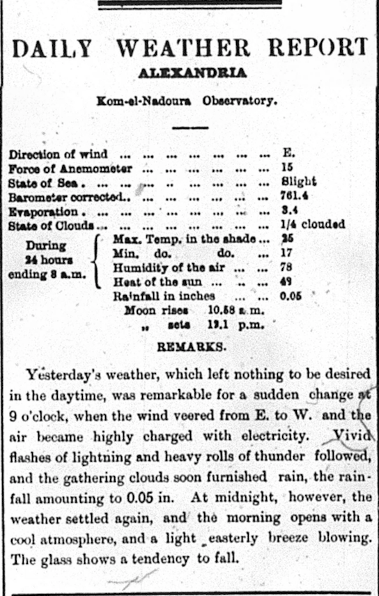
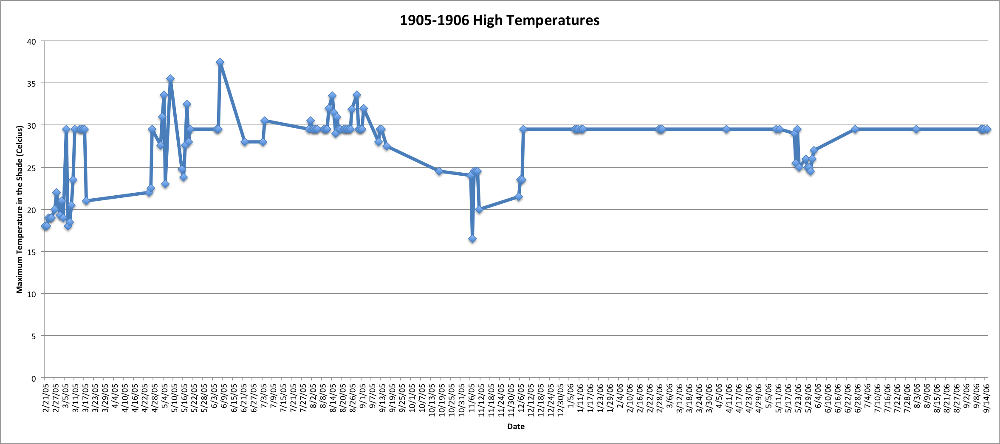

Weather is not usually the topic that comes to one's mind when they begin to talk about ancient Egypt. However, myself being an upcoming meteorologist, I look for weather in anything because, not only does it stimulate my current interests, but also engages me in other topics. In the _Egyptian Gazette_, there is a section found in almost all of the daily issues from 1905 to 1906 and it is called the _Daily Weather Report_. Here, the readers can find out the high, low, current humidity, chance of storms, etc. for their hometown as well as other surrounding cities. While this may be useful, why does it matter?

On the news, a meteorologist may mention the almanac or climatological data. An almanac is an annual publication containing a calendar for the coming year, such as regional weather predictions, times of sunrises and sunsets, as well as phases of the moon and tides. Something like this is still produced every year and it known for it's accuracy. Back in 20th century Egypt, a publication like this is very important due to the fact that many people at this time were farmers. Farmers need to know when floods, sunrises, sunsets, freezes, etc. are going to place so that they can better prepare and protect their crops as to prevent shortages and starving people. Climatological data, rather than predicting the weather like the almanac, looks back at the composite or generally prevailing weather conditions of a region such as temperature, air pressure, humidity, precipitation, etc. averaged over a series of 30 years. How can something like weather data from Alexandria, Egypt over only two years have an impact on something as large as the climate?

Suppose that the climatological data for Tallahassee, FL weather from the year 2015 to 2016 just went away. If this were to happen, two of the hottest years on record would be erased. Now living in Florida would be much easier if we could just get rid of the hot days! Sadly, that is not the case. While this data may not seem that important, it actually skews the averages so it is a bit higher. While some people may not be a big fan of heat, it is significant enough that if there is a warming trend, using this data can better help meteorologists and computers to predict upcoming droughts and storms. It's obvious now as to why this data is very important to not only historians, but also to modern day scientists.

Sometimes, people can be skeptical about scientific data, especially if it came from over 100 years ago. For instance, the instruments that they used to measure weather phenomena are most likely not as accurate as today's. Also, the process in which they measured weather phenomena may have been different than today. Small variables such as these seem unimportant; however, these were the exact same variables that got the world's hottest temperature ever recorded to be disqualified back in the year 2012. 'Aziziya, Libya held this record for over 90 years before scientists re-evaluated the data recently. Not only should scientists be wary of such data while taking the readings from _The Egyptian Gazette_, but also should take into account possible misreadings or lack of data. Considering many students put this together, there is a large room for human and computer error, especially because not everyone is a programmer or scientist. For example, when I was using my XPath Queries, I began running into some errors because some issues of the paper, did not even contain a _Daily Weather Report_ section. Another error that came up when I was constructing my data visualizations was the fact that some people left the default data on the table, or there was no data available. Because of this, there are some obvious errors that can be seen on the graph. To improve on this data and to get more accurate readings in the future, students should ensure that they do not leave the default text by looking it over carefully and setting aside some extra time to do so. During that extra time, the student who issues did not contain a weather report should note as such to prevent future error.

On a microhistory scale, weather is extremely important. Many people tend to look over microhistory because nothing big or extreme may happen over a short period of time. Weather, on the other hand, is constantly changing and can make a huge impact on a persons day to day life. I touched on this a bit in my blog post, but many citizens of Alexandria, Egypt at this time were farmers. Farmers depend on accurate weather reports and predictions so that they can plan when to protect, preserve, and harvest their crops. Something like this is especially important due to the fact the Nile River has a tendency to flood. Flooding at first may not sound good, but in Egypt, this flooding allows for river deposits to enter the soil and make the ground more fertile. If the farmers and scientist know when these floods will take place, then they can better prepare for famine by stockpiling food early. Another way weather can affect the microhistory is the state of the seas. At this time in history, automobiles were just staring to come out so the main mode of transportation is by boat. Considering that Alexandria and Port Said are major trading ports, how rough the waters that day can determine whether or not a shipment of food or supplies will be on time. If these sailors and scientists have the accurate data to predict the chop in the sea, then they can better plan out alternate routes or dates that these shipments should take.

## XPath Queries

`//table[@xml:id="deg-ta-dawr01"]/row[4]/cell[3]/measure[text()]`

`//table[@xml:id="deg-ta-dawr01"]/row[5]/cell[2]/measure[text()]`

### Sources
- http://www.dictionary.com/browse/climate?s=t
- https://www.wunderground.com/history/airport/KTLH/2017/05/07/DailyHistory.html?req_city=Tallahassee&req_state=FL&reqdb.zip=32301&reqdb.magic=1&reqdb.wmo=99999&MR=1
- https://en.wikipedia.org/wiki/List_of_weather_records
- http://www.dictionary.com/browse/almanac
