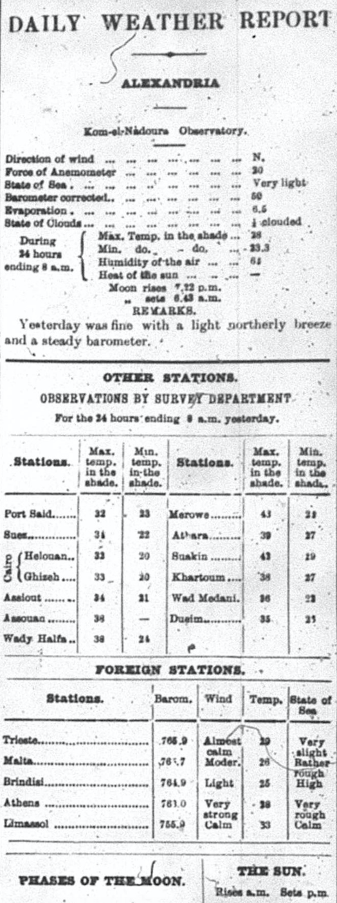
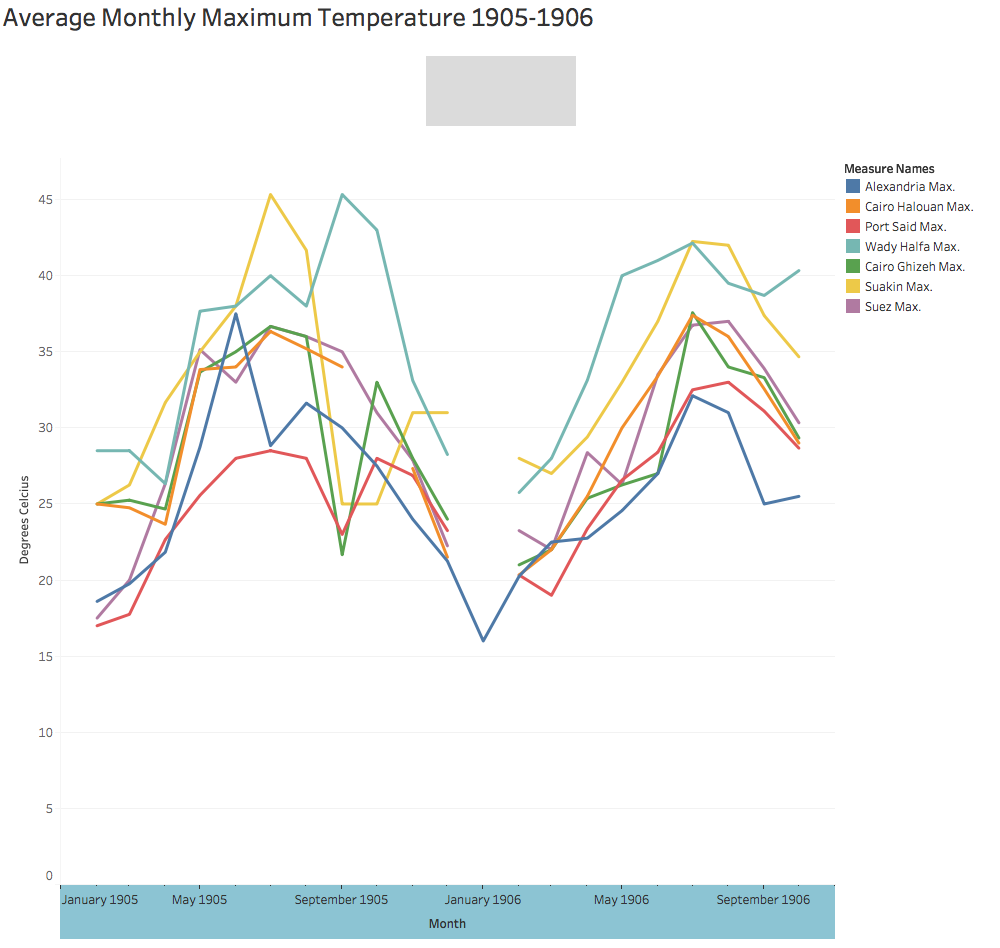

The data I used for this project was gathered from two separate tables within the [Daily Weather Report](https://dig-eg-gaz.github.io/templates/#daily-weather-report).

The Alexandria temperatures were retrieved from the bottom of the first table in this section, appropriately titled "Alexandria". Acquiring this section of the data required two X-Path queries as follows- `//table[@xml:id="deg-ta-dawr01"]//cell[contains(.,"Min. Temp in the shade")]/following-sibling::cell[1]/number()` and `//table[@xml:id="deg-ta-dawr01"]//cell[contains(.,"Max. Temp in the shade")]/following-sibling::cell[1]/number()`. These gave me both sets of temperatures for Alexandra, the maximum and minimum.

All other data was gathered from the "Other Stations" table, as each location reporting data corresponds to a weather station in Egypt. For these stations I used a similar query to the one used for Alexandria, just with a different xml:id. These were all some variation of `//table[@xml:id="deg-ta-dawr02"]//cell[contains(.,"Port Said")]/following-sibling::cell[1]/number()`. I manipulated this query, changing the `[contains(.,"-")]` to different station names, also using both `cell[1]` and `cell[2]` to obtain the maximum temperature values as well as the minimum.

#### Why temperature?
Analyzing and observing the variations in temperature reported in the *Egyptian Gazette* may be relatively boring on its own, but the applications of such a query are boundless. The weather in cities affects a huge number of variables from tourism to cotton prices. My own analysis project only focuses on temperature because the area alone has not been explored in depth before. I wanted to fill a hole of information as well as to provide some preliminary analysis/data compilation for future analysts of the *Egyptian Gazette* who may be interested in the effects of temperature on some other phenomenon, but don't necessarily want to spend the time compiling and organizing such a large amount of raw data.

#### The Data
All data is what was updated as of noon on April 12th for the purposes of being able to clean up data and create visualizations before continuing the project. For each location, for both the maximum and minimum temperature, I removed the data that was the same as the template data. The incomplete data (i.e. data that was copy and pasted from the template but not updated with the data from the contributor's week) was more common in the "Other Stations" chart than in the Alexandria temperatures. A few days also appear to not contain an "Other Stations" table at all, so Alexandria Station has a good deal more data than the other locations, making the averages more accurate than any other station included.

These are the monthly average temperatures in some of the stations reported in the Daily Weather Report
during 1905 and 1906. I chose the seven that are included because they were contained in the most editions of
the *Egyptian Gazette* and actually contained data the most often. There were a few excluded from my data analysis
because they were either only included in a smaller portion of the newspapers or contained too much null data to be
at all useful.

As you can see in the graph, there are a few months which contain no data for one or many locations. The limitations of the data are such that the month of October in 1905 only has one day of the newspaper containing a daily weather report with the proper xml:id, and so only returned one piece of data for every location. The average for that month, therefore, is only one number. This single day had no recorded data for the Cairo Halouan station, and so one missing number results in an entire month missing from our visualization. The entire month of January in 1906 is also missing for every station except for Alexandria; this month also was an average of only one day, and that day of the newspaper did not contain the "Other Stations" chart at all.

The same gap in data for the maximum temperatures in January 1906 exists for the minimum, breaking up the data for all stations other than Alexandria. Both Port Said and Suakin stations have similar gaps in data for August 1906 because of data limitations- there are only two days of data for October.

#### Conclusions

Speaking to the accuracy of this data, the only other source I could locate that had records of temperatures in Egypt in 1905/1906 was the NOAA Library of Records. Annual Meteorological reports on Egypt are available in pdf form; linked here is [1905](ftp://ftp.library.noaa.gov/docs.lib/htdocs/rescue/cd006_pdf/00233A82.pdf) and [1906](ftp://ftp.library.noaa.gov/docs.lib/htdocs/rescue/cd006_pdf/00233A83.pdf). It appears from their reports that August of 1905 was the hottest month, while the data from the *Egyptian Gazette* suggests that October had the highest temperatures. It should be noted that the reports from the NOAA library are from the Helwan Observatory, located in Cairo, Egypt. We would expect the reported temperatures in these annual reports to then reflect most closely to the Cairo station, Ghizeh and Halouan. In general, the data from the *Egyptian Gazette* seems to line up with that from the Helwan Observatory reports. This is a promising development, as it means that the flaws inherent to the sort of data analysis we're embarking on are not detrimental to the usefulness of the data itself once certain measures are taken to "clean up" query results as necessary.

As the text of the *Egyptian Gazette* is updated and edited, the data for this analysis will grow in size and will (hopefully) become increasingly accurate. There are a lot of problems that come up when dealing with a large amount of data compiled from crowd-sourced type documents. Human error, neglection of updated contents, and gaps in the editions of the Gazette itself lead to a sort of haphazard compilation and analysis of these temperatures recorded in the Daily Weather Report. Add to that the consideration that the dates currently in existence span only a portion of a two year period, and the data itself can easily be considered as barely accurate at best. That being said, I worked to the best of my ability with the resources available, and was able to study this vast amount of temperature ranges in some form.
