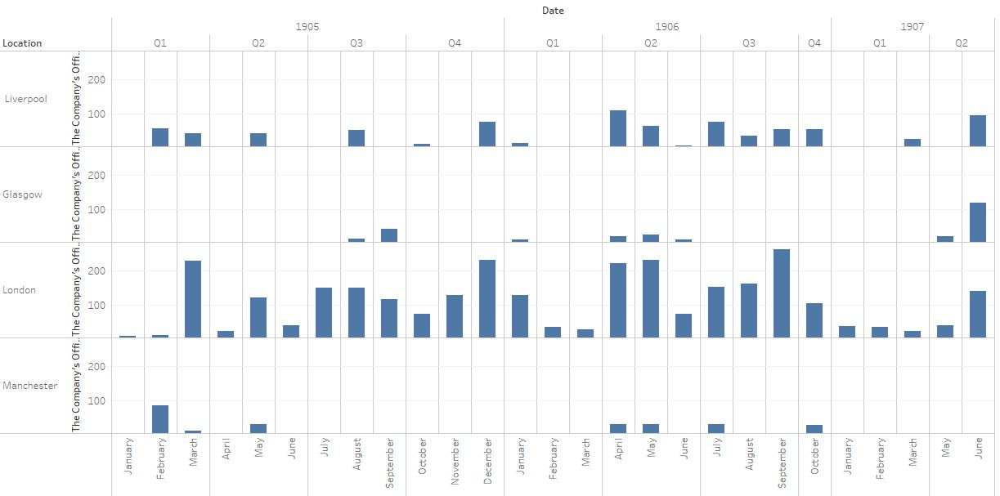
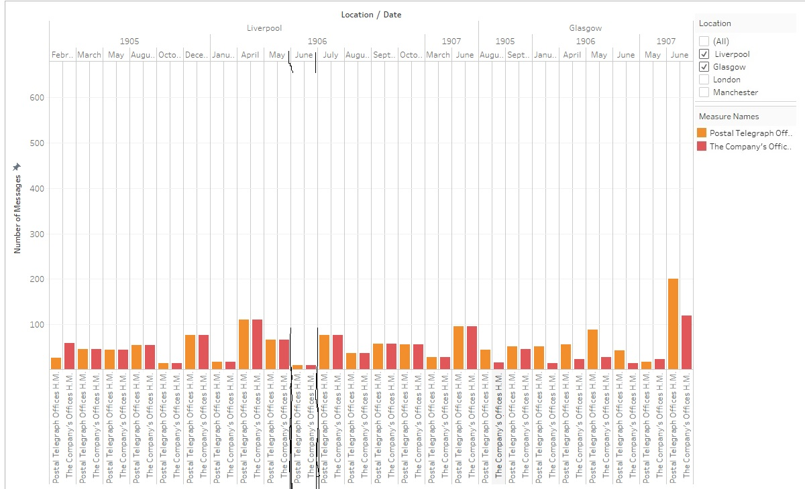

My research topic is communication and travel in Alexandria/ Cairo, through means of Telegraphs.

## Method
`//div//head[contains(.,"EASTERN TELEGRAPH CO. LTD.")]//following-sibling::table[contains(.,"FROM")]//following-sibling::cell[1]//string()`

The Code was used to acquire the information analyzed and assessed in the paper. It reads every cell after the first cell of a table containing “FROM,” within a headline that contains “EASTERN TELEGRAPH CO. LTD.” Inside of each division of all the pages of every file inside of the content folder of the repository from the course website. The data is given in a form containing the date and desired data of the pages assessed.

 Figure 1

## Purpose

The purpose of this research is to analyze records of messages - asked by the people whom inhabited the area - to be sent to Glasgow, Manchester, Liverpool, and London. The information will be displayed in various forms throughout the paper and will be analyzed in relation to events occurring around the time, more so understanding the actions that would have occurred in Alexandria/ Cairo from 1905 to 1907.

During the 1905 time, the British Occupation Army began to become more so relaxed in Alexandria causing the citizens to feel slightly lied to as they continued to show their authority over the people of Egypt by making decisions regarding their land and relationships. The data collected showed two areas that sent the messages to the other areas of the world. The first location was referred to as “The Company’s Office H.M.” The slight variation regarding period of time for messages sent from this group likely means that it had been used by more private companies/ industries. The other location was “The Postal Telegraph Office H.M.” A company that seemed to send messages from the citizens of Alexandria as well as the British Occupation Army Soldiers and Officials. Each of the locations seemed to be used by different members of the area due to the different amounts of time that it would take for each to send messages to the cities.

Records of Telecommunication during 1905 seemed to be healthy, likely being used by some citizens and soldiers – whom knew people in Glasgow, Manchester, Liverpool, and London. A similar period of time for messages had been sent during that year in relation to other years. Though, the times were different for each year’s month, the same areas received the fastest messages. The country of London has been observed to have the most messages being sent in every month of every year (other than February 1907). This large period of time for messages recorded information being sent to a city shows the population of the army, which would have likely lived in the differing locations with the United Kingdom.

The leaders of the British Army in Egypt and the soldiers they were with during the time would do messages sent to London. Many messages were likely sent in the years during which the Egyptians would have noticed they were not going to leave peacefully without being confronted about the problem. As stated by Stephan Luscombe, “as the Suez Canal continued to grow in importance… the conviction grew that the British had no intention of leaving.” This seems to be rather true in relation to the plans made with France, causing the Northern area of Africa to be Great Britain’s Share and the lack of Egyptian members of the parts of the government, which made important decisions for Egypt and its people. The “temporary” guests from a foreign land were already sowing the seeds of anger in the land of Egypt. The action resembles someone asking to stay in your home, but then sleeping with your husband/ wife. Their actions were clear, to establish complete control over Egypt’s government then its people; the next event which occurred showed this to be true.

While assessing the data, the highest amount of time for messages were sent to each of the areas directly before and after June 1906. The month seemed to be the period of great unrest and interest for the people of Cairo. After assessing the information, I began to perform some research on the time. The day of June 12, 1906 (Figure 1) was the day of the Denshawai, soldier incident; there have been several iterations of the story told about the event since the time of its occurrence. A general summation would be some soldiers came back from the hunting pigeons and met a crowd of citizens who needed the birds for food, there was a fight and then a woman had been shot by a soldier causing the citizens to become more upset and on soldier was injured and left the group of soldiers. He later died due to exposure from the sun during his attempt to return to the camping ground, he was found next to a citizen whom had been attempting to help him. The man was thought to have killed him and was beaten by another group of soldiers, fifty other members from the group of citizens were then judged and had received punishments for their acts. Two people were sent to death and the others were given prison time and 50 whips. The actions, which occurred toward the people in the town were not just or fair, they were the way the colony controlled many of the areas they inhabit. As the views and thoughts on the Denshawai incident varied the manner of which it had been told to other people also varied.

Before the event messages sent from the two locations in Alexandria to the cities in Europe were done so at more similar speeds for both postal areas but still not the same. Though, the citizens would still be able to send messages, they would likely. The assumption is that the soldiers from London going on their month-long breaks then returning to the area two months before the event; continuing their communication with their friends and family after they returned. This would be shown in the large increase of the times of messages recorded and sent during April and May 1906(Figure 1). During June the amount of time for message’s speed increased to a time that was rather distinct from the other points, this had been likely due to the imposition of the soldiers on the people. After the Denshawai incident the citizens were highly upset with the British Army and the ways that the event was handled, along with the strange manner of the punishments to the people who were considered innocent. As expected for the two months following the events of the Denshawai Incident, the amount of time taken for messages sent out to other areas had increased and had been the largest amount of time taken for messages during the three-year period. This was most likely due to the British leaders sending messages to their officials about the event, soldiers speaking with their friends and families, and the Egyptians whom desired as many people to know of the British forces’ acts against their people. As well as the amount of pressure put onto the telegraphs that would not have really been done in the year before. The British may have also given the citizens slower telegraphs on purpose to be able to give the citizens in Glasgow, Manchester, Liverpool and London their views on events before everyone else, first impressions are everything…

Though after the incident, there was likely less use of the areas to send messages due to the punishments the government had been giving some of the citizens who spoke of it in journals. The amount of time taken for messages sent to Glasgow, Liverpool, Manchester, and London during the rest of the year and during 1907 had been the least during the years. The reason may have been the lack of events that occurred in the area causing soldiers to send messages to their friends and families. Many of the citizens would no longer have a need to send information to the areas within Europe after the time. Though, the cause of the decrease may relate to the Nationalist groups that had been created, and the soldiers whom were likely told to arrest any members they might have been found committing any acts against the government.

The amount of data had been sufficient in determining the changes in the times needed for messages to be sent to the assessed locations from Alexandria/ Cairo. Though, if the research were to be continued on the topic the manner of collection would need to be improved. To attain the data a program had been made which analyzed data in an excel document and converted it into a format that could be converted into a chart. The current data being added onto could be done so with more efficiency by utilizing a general text editor to organize the information that would forma it in the correct manner to be converted into a chart. Attaining more information on the actions of the British Occupation Army such as the times they returned and the thoughts of the soldiers in relating t the incident and the way that it had been treated. Though, the messages had been sent it was rather difficult to attain one that would have kept.

This was attempted by the current researcher but was not able to be performed due to technological miscommunication of information of different systems (Mac and Windows). To improve the presentation of the information in a visual context different forms of the time presented could be used, as the other styles would cause the information of the graph to be too large to quickly observe.  Along with this the use of the map feature would aid in providing a vivid example of the data in relation to the areas in the United Kingdom. Also assessing the units would aid in conserving time and increasing understanding of the information analyzed. Along with assessing data as true by association of similar information, though the actuality of the events may be properly represented in the data. Although as time, years, increases the performances and speed of the devices would likely increase causing the amount of time to decrease.

## References
Luscombe, S. (n.d.). Egypt and the British Empire. Retrieved April 02, 2018, from http://www.britishempire.co.uk/maproom/egypt.htm
