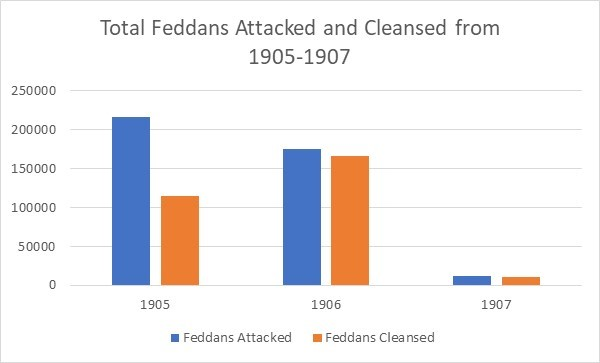

Cotton has been an essential export from the Egyptian economy for centuries, sometimes being referred to as the country’s “white gold”. In the beginning of the twentieth century, there was a cotton worm epidemic that greatly threatened the cotton plants across all the Egyptian provinces. The Khedive made a national decree that informed the public of the cotton worm menace, and contained a call to action for citizens to band together to combat the cotton worm. One way that Egypt went about protecting their harvests from the cotton worms was to conscript local children to go out into the fields and pick the cotton worms and cotton worm larvae off the plant stems by hand. From the years 1905 to 1907, thousands of children were enlisted to help save the harvests in every cotton containing province. The amount of land that was affected by the cotton worms is measured in feddans, an arabic unit to measure land. One feddan is just under the size of one acre (1 feddan=1.03 acre). Within the Egyptian Gazette, there is a copy of the Khedivial Decree of the cotton worm menace, many articles containing information about the amount of feddans affected by the cotton worm and how much of the land was cleansed by a certain number of children, and other articles relevant to the cotton worm situation. By examining the amount of land affected, how much of that affected land was picked free of cotton worms and larvae, and how many children were working to get rid of the cotton worms, the general success of the movement against the cotton worm from 1905 to 1907 can be determined.

The Khedivial Decree, found in the 1905-03-01 edition of the Egyptian Gazette, informs that the plants infested with the cotton worm must be stripped and burned. It outlines that any able-bodied men from ages 9 to 17 must work in the fields to cleanse the cotton worm for a minimum salary that matched the market prices. Any child that refuses to work or commits any act of negligence while working could be fined and thrown in prison for up to a week. The Khedivial Decree was originally published in French and was translated to English via Google Translate. The Khedivial Decree shows the serious nature of the cotton worm menace, and how it posed a critical threat to all of Egypt. By taking such extensive measures like child conscription, it is evident that the Egyptian authority realized the potential danger of the cotton worm and the necessity to take drastic measures to avoid an even worse outcome.
	Articles titled “The Cotton Worm” in the Egyptian Gazette pop up pretty often in the “Local and General” section of page 3 and detail the latest reports on the cotton worm infestation. Cotton Worm articles show how many feddans are affected, and how many were cleansed, and sometimes how many children were used to do the work. The data these articles provide is the main method in tracking the progress of the fight against the cotton worm. Most of the articles appeared in the months of July and August.
Following are graphs of the amount of land that was attacked by cotton worm, how much was cleansed, and how many children were used to pick the worms.
Note: for 1906 and 1907, there was no report of the number of children used in the combat of the cotton worm.

Here is a map showing the Egyptian provinces. Spelling of the province names may slightly vary.

There may be errors in the data due to cotton worm infestations that were not reported in the Egyptian Gazette, problems with OCR, the existence of articles that did not show up in any of the xpath queries, or various other forms of human error. Regardless, I believe that the graphs serve their purpose in giving a general understanding of when the cotton worm epidemic was most prevalent in Egypt from 1905 to 1907 and which provinces were most affected. It also gives an idea of the sheer number of local children that were conscripted to go out in the fields and pick the worms and larvae; in 1905 there were at least 250,000 children, although the real number is likely much higher. From 1905 to 1906, the amount of land affected by the worm seems to slowly decline, revealing a steady success from the worm picking and cotton burning conscripted force. 1907 shows a sharp decrease in the number of attacked and cleansed feddans, but I think this is extremely exaggerated from the truth because of data that has not yet been entered into the content repository.
Further contextual information and analysis can be found in the essay [Boom, Bugs, Bust: Egypt’s Ecology of Interest, 1882-1914] (https://onlinelibrary.wiley.com/doi/abs/10.1111/anti.12216) of A Radical Journal of Geography. In the essay, author Aaron Jakes tells of the cotton worm infestation that took root in 1904. He explains that it posed a devastating outcome to the Egyptian economy and, as a result, the Ministry of Interior drafted all boys from ages 9 to 17 to do gang work in picking the worm off of cotton stalks, stripping the plants of their leaves, then transport them to a site to be burned. He also addresses the fact that most of these boys came from poor farming families that depended on their children’s labor.
The cotton worm targeted the vast fields of cotton in the provinces near and along the Nile and its delta. In order to combat the epidemic infestation, Egypt issued a decree forcing young boys to go out in the fields and manually pick the cotton worms off the plants, strip the stalks, then transport and burn them. After the khedivial decree in 1905, cotton worm combat forces surged, and the amount of land affected to slowly and steadily declined as the epidemic seemed to be taken under control. Over the years, hundreds of thousands, if not millions, of boys were drafted into the cotton worm destruction force.
