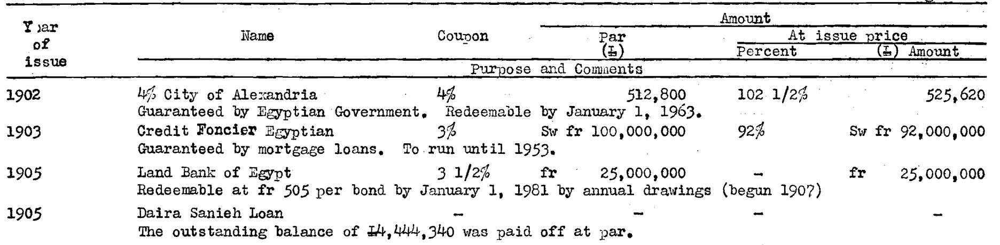
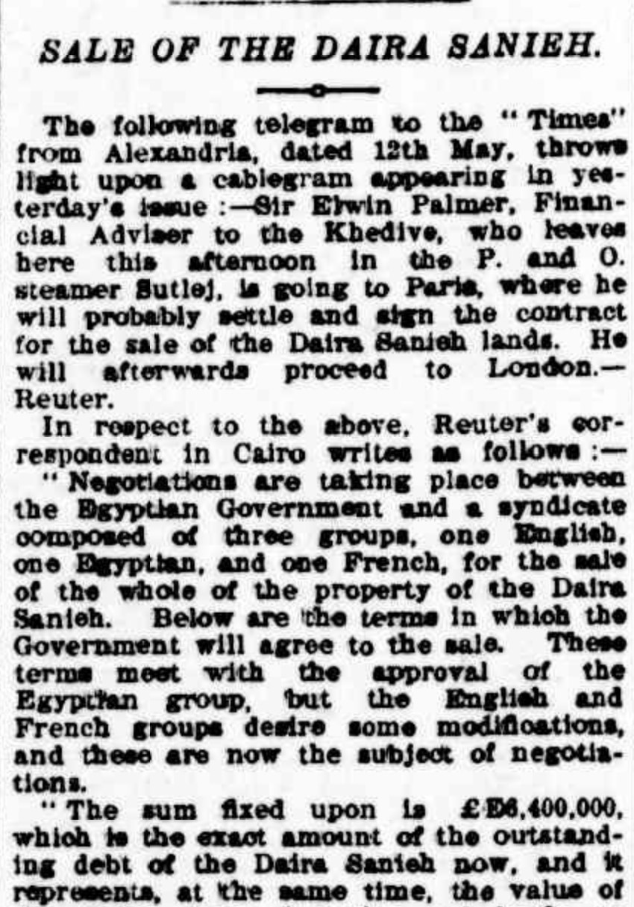
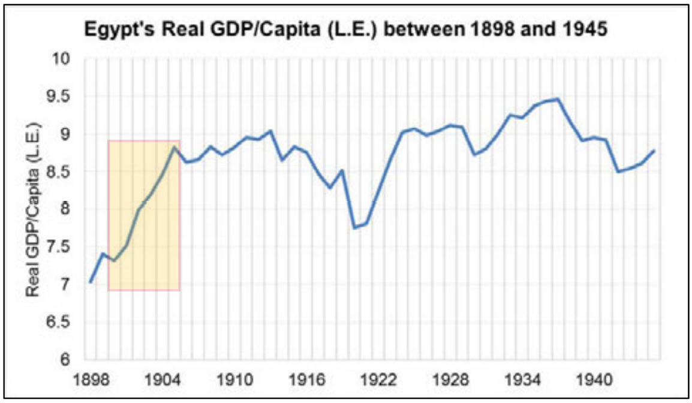

### Introduction
This individual research extends the [group project on the topic of economics and trade in Egypt](/post/19-analysis-stocks/). After the war with Britain, Egypt was turned into a colony of Britain. Its economy had significant growth from the business introduced by the British. Businessman and the Egyptian colonial government promoted the transfer of western industry to the locals. They strived to make the region like a European state. [1](#f1) To achieve that, many local resources such as arable lands and mineral pits were used for growing crops and mining. As more local industries started trading with other parts of the world, the stock and exchange market formed. 

### The History of Daira Senieh
The newspaper _Egyptian Gazette_ was the primary source for this analysis project. A company named Daira Senieh caught my attention. The classification of Daira Senieh was ambiguous. During the group project, some of my research partners found that the company was associated with land. However, Daira Senieh was also a sugar company that owned several agricultural plants and sugar cane fields. The company was known for its sugar plantation in Upper Egypt and its massive freight transportation. Samir Raafat, a former banker, a columnist, wrote in his article that Daira Senieh owned 470 km of railroad lines, 65 locomotives, and 2,092 wagons. [2](#f2)  Even in the present day, the company's scale is sizable. Additionally, the company originated from lands of the Egyptian royal family. There was a time when the company had a financial crisis. Egypt had a loss of its political sovereignty around the 1870s as the foreign rivalry entered. However, one study suspected that Egypt had sufficient resources and potential economic growth. Still, the reformed British government had mismanaged Egypt's financial revenue, so the depression of the Egyptian companies started forming. [3](#f3) Companies like Daira Senieh had to either borrow loans or sell the company's assets, such as lands. In addition, the bad harvest and Russo-Turkish War aggravated Egypt's financial situation. 

### The Occurrence of Daira Senieh
To understand the significance of the company in this analysis, I queried the data set of the newest DEG .xml archives (right before first-time publishing this article.) I thought the occurrence of Daira Senieh might leave hints on its economic activities in different periods. I, therefore, sorted out the data via the XPath 2.0 search with the code, `count(//div/head[matches(.,'Daira', 'i')]/following-sibling::p)`, and got the result which revealed in the following treemap (cubics) and bar graph. 

<iframe seamless frameborder="0" src="https://public.tableau.com/views/Book2_15765347843500/Cubics?:showVizHome=no&:embed=true" align="center" width="90%" height="500"></iframe>

Going further in-depth with the date featured with Daira Senieh, I found more content that is relevant to the companies' shares and properties. Other than the company name found in Stock and Exchange, Page 3 articles often wrote about company meetings involved with legal, liabilities, assets of the company. Along these lines, the occurrence helped to link the history and changes of Daira Senieh. It additionally enriched the explanations of the events of the company. 

### Privatization of Land
As I mentioned earlier, the company had relationships with the Egyptian royal family. At surface level, its land could be the company's private property, but, in reality, it also could be seen as the state's territory/land. It attempted to bail out the company through auctions. As we know, the company had Royal family ties, so the auction set by Daira Senieh was controversial because the properties of the company could also be deemed as the nation's properties. Indeed, auctions on lands ended with a failure. In one report published by The Brisbane Courier [4](#f4), an Australia newspaper, the sale of Daira Senieh had disapproval from the English and the French syndicate groups. The Egyptian government demanded to have one-third of a share from the final sale price which hindered the auction process. Subsequent to the auction held in the last ten years, the company "was unable to let a single acre of the sugar lands for 1888 in eight out of nine districts, and only 95 acres in the ninth district (the number offered to be let being about 25,000).” [5](#f5)
In the 1900 Annual Report by Consul-General Cromer on the Finances, Administration, and Condition of Egypt, an excerpt stated, "the Government and the Company share equally in the net profit derived from the sale of land… meanwhile … the company now offers to sell lands on payment of one-tenth of the price, before 1905, after which time the buyers will have the option of paying the balance in cash or in fifteen annuities." It seemed that the government and Daria Seineh were encouraging peasants to be the owner of the debts, but it also sold out the land to foreign proprietors. [6](#f6)

As the Daira Senieh continued to privatize its agricultural properties, the value of the lands, which was diluted on the open market, increased tremendously [1](#f1). Therefore, the company's consortium gained revenue, which exceeded their outstanding debts, so it paid off its debt of 4,444,340 Para in 1905, according to the World Bank documentation [7](#f7). Meanwhile, more foreign competitors acquired lands from Daira Senieh to begin their industry in Egypt. 

### Stock Value Analysis
The scope of this research project is focused on the years of the newspaper I could access, between the year 1905 to the year 1908. I adopted the Stock and Share table, which described Egyptian companies' value changes. I used an Xpath query to search the latest content repository, which was updated by the end of Fall 2019. Inserting `//div[@xml:id="deg-el-stsh01"]/table//cell[contains(.,'New Daira Sanieh Fond')]/preceding-sibling::cell/measure`, 126 results was found. I then organized the data with a trendline graph.
The accuracy of the data obtained from Xpath 2.0 is plausible. This is mostly due to the incomplete updates in the .xml files for the tables of measures. Besides, some outliers in the graph below could be the typo during the process of digitizing the newspaper. 

<iframe seamless frameborder="0" src="https://public.tableau.com/views/DairaSeniehStock/Sheet1?:showVizHome=no&:embed=true" align="center" width="90%" height="500"></iframe>

From the data, we can roughly see the growth of Daira Senieh's stock which might due to the sale of lands. Its decline after 1905 also coincides with the nation's GDP since the company's size shared a significant component of the Egyptian economy. It is known that Egypt went through economic crisis in 1907[8](#f8). This matched with the highlighted region of the real GDP graph showing below. 

### Summery
In a glimpse of the economics of Egypt in the 1900s, I found Daira Senieh was established during the invasion of Britain. However, it had some crisis in finance in 1886, perhaps due to warfare. In the later decades, the company announced its bankruptcy and put its lands on sale. This incident was later known as the Daira Senieh scandal. [9](#f9) After it sold a fraction of the company owned lands, the company escaped the danger of bankruptcy. As the side effect of the sold lands, it reshaped Egypt's economy. The government gained fortune from the auction to fill the financial holes of national debts, but opened the door for the foreign influences on its domestic economy. 

### Source

<b name="f1">1</b> M. CAMPANINI, Storia dell’ Egitto contemporaneo. Dalla rinascita ottocentesca a Mubarak, Roma 2005, page 28 [↩](#a1)

<b name="f2">2</b> SAMIR RAFAT, “Familiar Ground: the 19th Century Privatization of Daira
Sanieh doesn’t seem that Distant,” Business Monthly Magazine [↩](#a2)    [Link](http://www.egy.com/historica/97-07-00.php)

<b name="f3">3</b> ALI COŞKUN TUNÇER, “Sovereign Debt and International Financial Control of the Middle East and the Balkans, 1870 –1914” [↩](#a3)    [Link](https://warwick.ac.uk/fac/arts/history/students/modules/hi173/classesandreading/colonialegypt/tuncer_-_middle_east_and_the_balkans_1870-1914_chapter_3_-_egypt.pdf)

<b name="f4">4</b> THE BRISBANE COURIER, “Sale of The Daira Sanieh”,1898 [↩](#a4)    [Link](https://trove.nla.gov.au/newspaper/article/3673866/555286)

<b name="f5">5</b> UK PARLIAMENT, “Egypt—The Daira Sanieh of the Khedive” [↩](#a5)    [Link](https://api.parliament.uk/historic-hansard/commons/1888/apr/10/egypt-the-daira-sanieh-of-the-khedive#column_847)

<b name="f6">6</b> 1900 Cd.95 Egypt. No. 1 (1900). Reports by Her Majesty's agent and consul-general on the finances, administration, and condition of Egypt and the Soudan in 1899 [↩](#a6)

<b name="f7">7</b> INTERNA TIONAL BANK FOR RECONSTRUCTION AND DEVELOPMENT, “The External Debt of Egypt”, Table A-3 [↩](#a7)    [Link](http://documents.worldbank.org/curated/en/912111468022761475/pdf/670930SR0Box46000E1680debt0of0Egypt.pdf)

<b name="f8">8</b> DAILY CONSULAR AND TRADE REPORTS, “Trade Review of Egypt”, page 787 [↩](#a8)    [Link](https://books.google.com/books?id=PbKRr5Z5PmIC&pg=PA787&lpg=PA787&dq=financial+crisis+in+egypt+1905)

<b name="f9">9</b> THE NEW YORK TIMES, “A Public Scandal in Egypt”, 1886 [↩](#a9)    [Link](https://www.nytimes.com/1886/03/19/archives/a-public-scandal-in-egypt.html)
