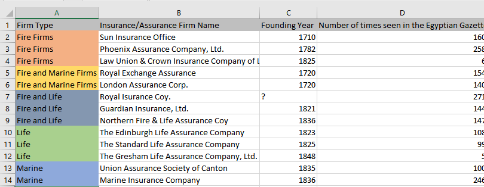
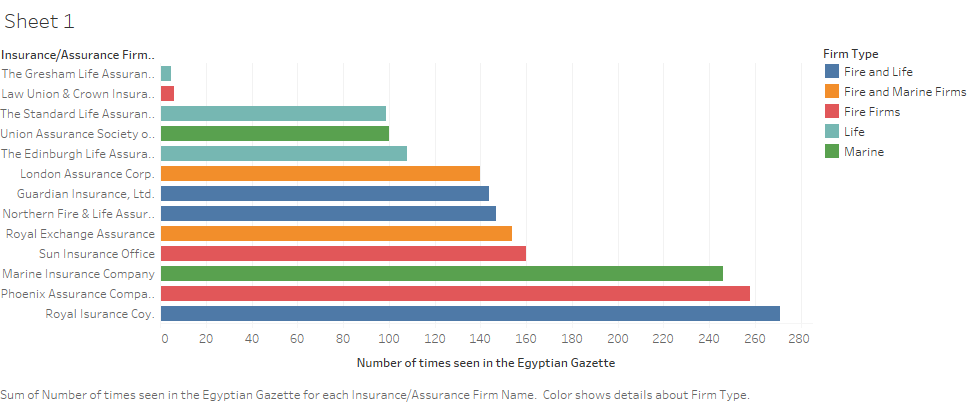

After completing my Bachelors in Spanish and Commercial Entrepreneurship, I plan on earning my Masters in Health Administration and hopefully opening up my own health insurance company. Therefore, when I noticed the many ads for different insurance companies in the Egyptian Gazette newspaper, it sparked a topic for me to put my concentration toward, learn more about, and do my analysis project on.

##  WHAT IS INSURANCE vs WHAT IS ASSURANCE
”Insurance is an agreement in which and individual pays a company to protect him/her from possible loss or damage, can be a property loss or financial loss. It is a form of risk management, primarily used to hedge against the risk of a contingent or uncertain loss.” The belief has been formed that during the time the Egyptian Gazette was first being issued that the idea of insurance was first being created. One of the primary things I noticed while I was using the ‘Find/ Replace’ tool in oxygen to skim through the newspaper for insurance ads, were that there were a lot of different ads for not only insurance firms, but assurance firms as well. Following the research I did, my understanding concludes that assurance is basically just another form of insurance. The rates, policies and procedures are different, but they both fill a similar need. Insurance alludes to a coverage over a limited period of time, whilst assurance pertains to continuing coverage for extended periods of time or in some cases until death. As a matter of fact, I noticed that in the newspaper many insurance ad squares advertise both forms by placing two firms of diverse specialties in one square. For example, the Royal Insurance Company is quite often gathered with the Phoenix Assurance Company in their ad square. Therefore, I presumed that both organizations either cooperate with one another or they are associated with each other in some way to almost always consume the same space.

## INSURANCE FIRMS AND THEIR SPECIALTIES
A large portion of my research was completed by utilizing the XPath search functions’ like  ‘Find/ Replace’ tool in oxygen and reading information from different online sources. In this analysis report I will discuss what my results were, some of the different steps in my research process and analysis, and a few different ways to proceed with this study given what information I have now.
I began my analysis by utilizing the XPath steps to find the words ‘insurance’ and ‘assurance’, so I could come across each different insurance and assurance firm mentioned throughout the newspaper issues that I have completed. Here are a portion of the core searches that produced the most results:

- ``//div[@type="page"][@n="1"]//head[contains(.,"Insurance")]``
- ``//div[@type="page"][@n="1"]//head[contains(.,"Assurance")]``
- ``//div[@type="page"][@n="3"]//p[contains(.,"surance")]``

In this approach, I basically skimmed through every paragraph ``
`` and header ``</head>`` for “insurance” and “assurance”. Most of the results came from either the first two pages of any issue or the last two pages, in the form of advertisements.
Looking anyplace else brought integrated results like; mentions of insurance within headers were rare outside pages 1-2; however, looking inside different sections brought a bit of triumph. Each result came in the form of articles. While a few firms were referenced in the articles, I chose to limit my concentration to the advertisements, as the articles’ information regarding firms was not adequate for the sort of analysis I wanted to endure.

Below is the list of the insurance and assurance firms, their specialties, and their founding years.

## DATA VISUALIZATIONS
Insurance firms in the Gazette were rated highly in the Insurance Almanac. Therefore, I tried to see whether there was a relationship between an insurance firm’s success and its pervasiveness in the newspaper (all thirteen firms were in the almanac). A number of firms mention their funds in their ads, though, so that would be my second parameter, and a more objective one at that.
Here are the numbers of times a company's ad showed up in the Gazette, utilizing XPath to check the quantity of valid objectives:

## CONCLUSION

I was not impressed with my outcomes. Choosing to center my research and data through the advertisements not giving myself enough time to fully develop my findings, may have been the reason for my poor outcome. I believe that a more profound analysis of this topic requires great comprehension of history and finance (a skill I do not have). However, I did notice that there are some other directions that this study can take with regards to insurance in the Gazette that may lead to more substantial analysis projects, like using “The Reuter’s Telegrams and Share List tables.”
