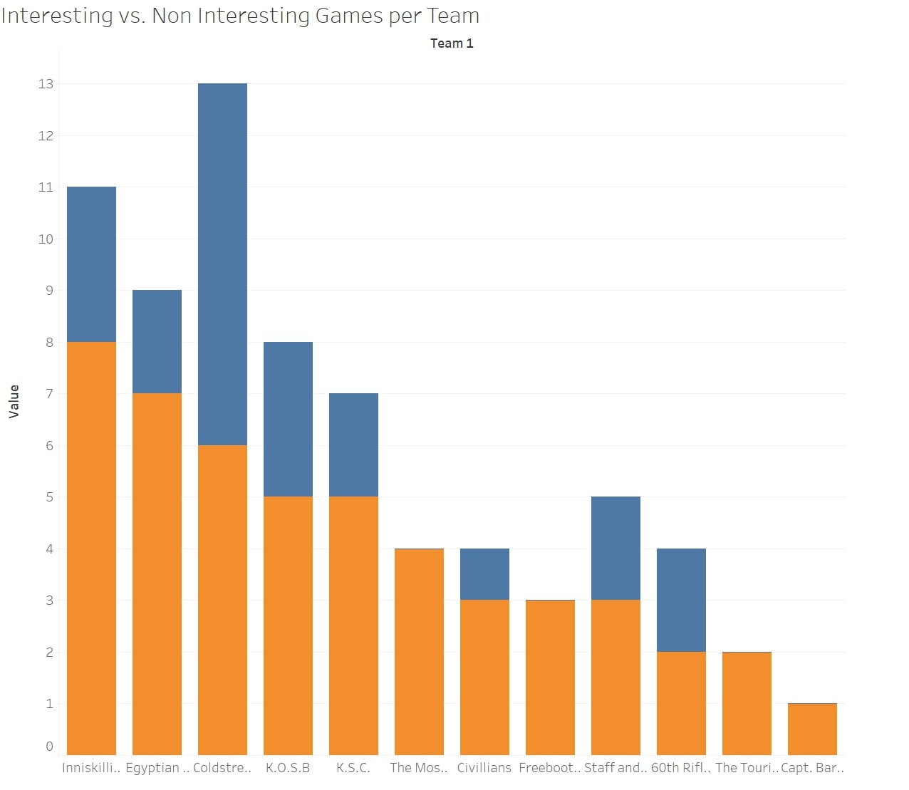
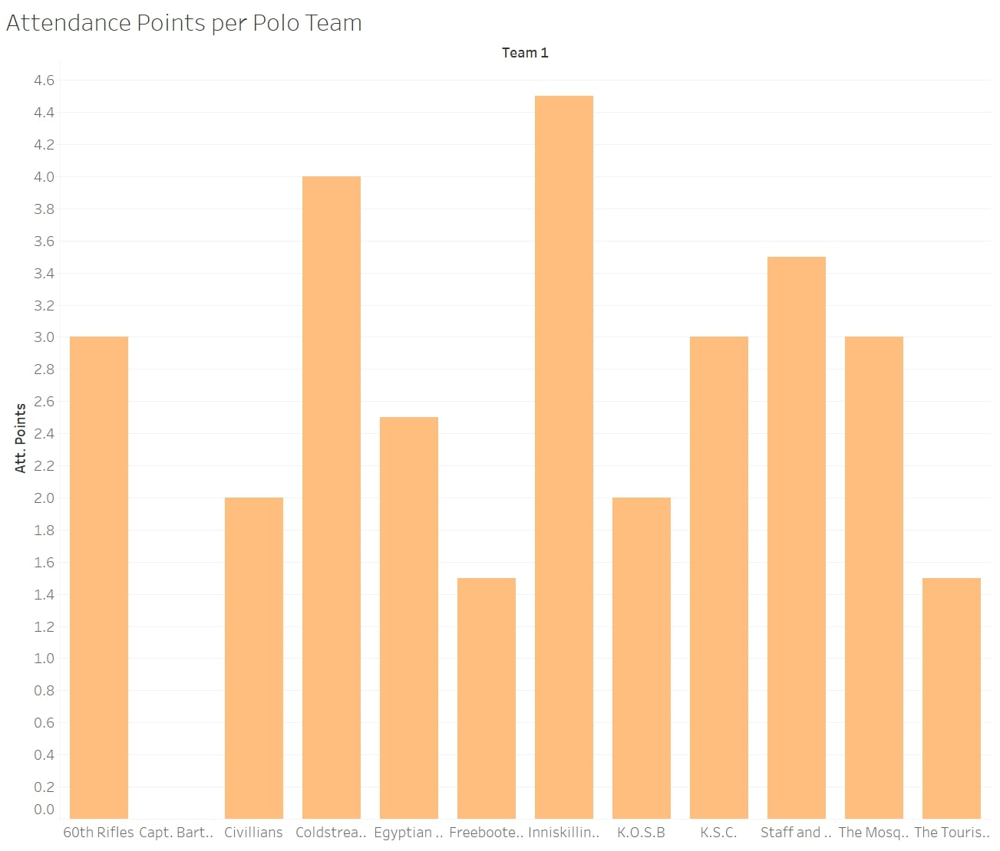
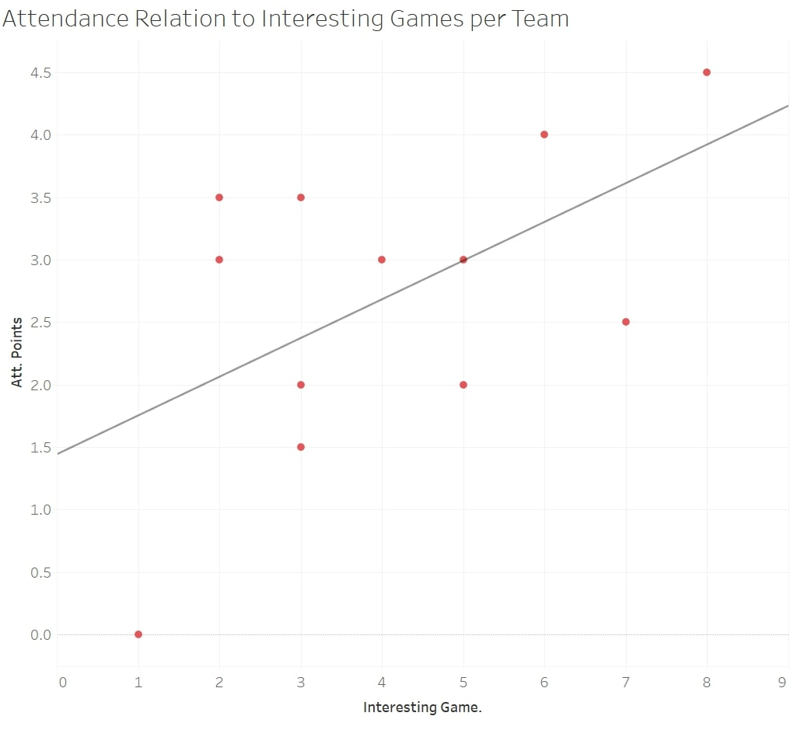
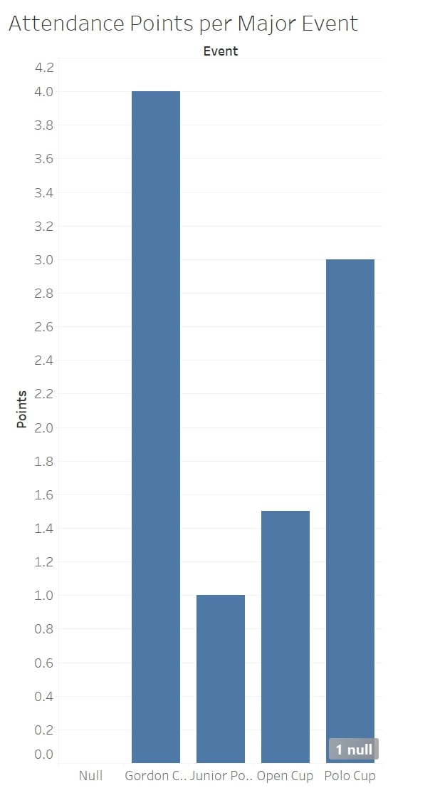
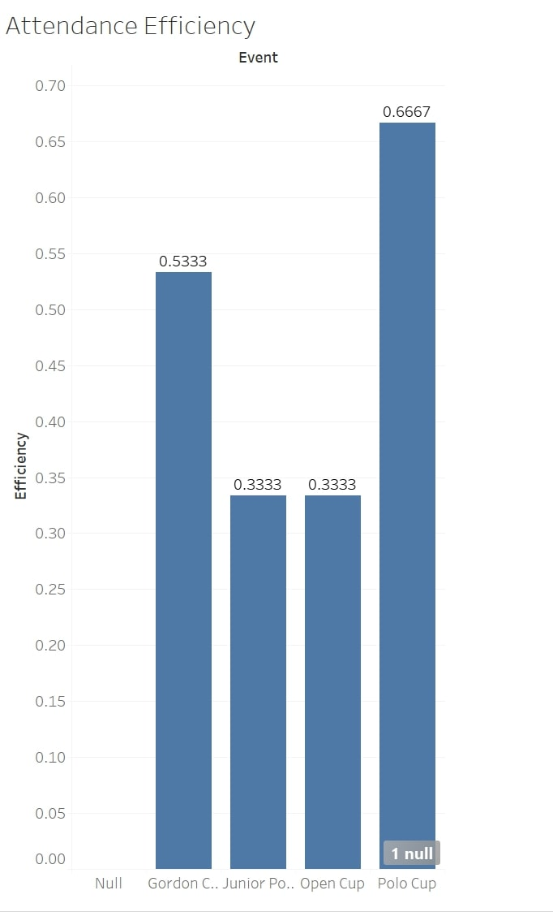

What first comes to mind when hearing the term “polo”? Is it a horse? A grassy field? A shirt worn to a somewhat formal occasion? While the term is indeed applicable for all three of these, for the purpose of this analysis I will focus on the Polo relating to the first two. By this I am referring to one of the oldest sports to still be played today. Polo is a team sport where four members of each team mount their horses and, with mallets in hand, strive to direct a ball between a set of goal posts. The game is divided into four to six periods called “chukkers” lasting 7 minutes each.

The origin of the horseback sport can be traced back to Central Asia as early as 600 B.C. These nomads originated a variation of the game including teams with as many as 100 men to a side, with the main purpose of the sport being military training. After the nomads migration into Persia, polo became a national sport and its popularity blossomed. The invention of modern polo can be credited to British tea planters in Manipur, India, establishing the first polo club known as The Silchar Polo Club. This foundation set in 1859 quickly spread across Europe, becoming popular in Malta, England, and Ireland within a short period of time after its genesis. Polo became a very popular activity for militaries, especially once the game found its way to the United States for its ability to improve the riding skills of cavalrymen, teach leadership qualities, and develop camaraderie among troops. A further history of the sport can be found [here](https://www.polomuseum.com/sport-polo/history-polo)
The Egyptian Gazette highlights the sport quite often and it is without a doubt one of the more popular sports in the region. The Gazette makes reference to 12 teams over the span of 1906-1908 as well as four tournaments. My analysis project is set to discover which of these teams produce the greatest amount of “interesting games” as I would like to call them as well as if there is a relation to the amount of interesting games a team has to the spectator turnout for that team’s polo match. I will also be looking into the attendance for each of the four Major tournaments the Gazette reports on.

## Step 1: Methodology
Over the course of this project, I set out to discover which team creates the most amount of what I like to call “interesting games.” I have classified these as games where the final score pins the teams within two goals of each other. For example, games ending 3-1 or 3-2 would be considered interesting. However, games ending 3-0, 4-1, etc. would not be classified as “interesting games.” Also, I did not include tie games into my “interesting games” category despite being within the two goal margin. A widespread opinion in modern sports culture is that tie games can ruin great events and I do believe in this to an extent. Therefore, for the purpose of this study they will not be included. While looking at which teams created the most interesting games, I plan on showing my results with the total amount of games played by each team to see the ratio of games played by a specific team resulting in “interesting games” to total games.
Next, I will be looking into which teams gathered how many spectators. The Gazette often reports the amount of spectators, however I noticed it mostly mentions the crowd during tournament events and not single match friendlies. Hence why there will be more reported scores in my analysis than reported attendances. In this analysis, I will scale the attendance on a point based system giving 0.5 points for a “fair” crowd, 1.0 point for a “large” crowd, and 1.5 points for a “very large” crowd, while giving 0 points for events where attendance was failed to be reported. This will be known as a team’s “Attendance Score.” With the number of interesting games and Attendance score acquired, I will then compare the two to see 1. Which team provides the greatest quantity of interesting games, 2. Which team gathers the greatest amount of spectators, and 3. Is there a correlation between these two variables.

Finally, I will use the same method as I did to find Attendance Scores for independent teams as I will for the major events, giving each event their own Attendance Score. I will then divide this by the maximum number of points possible to provide more accurate results. I will do this for if an event is shown for example 10 times in the newspaper and garners a 5 attendance score, than it will be evenly compared with another event shown 5 times that finishes with a score of 2.5. Despite, 5>2.5, the adjusted attendance score would conclude the two events to be equal in drawn attendance.
## Step 2: Querying
My analysis resulted in two main query searches. Unfortunately, many of the authors of prior deliverables used different headings in their ‘div’ sections, with some not making the polo section its own ‘div’ all together. Therefore, I used the query //div[@type="page"][contains(., "chukker")] to search out all dates where there was a reported score for a match. I used the term chukker for each it appears every time there is a reported score in the Gazette. After using this, I manually transferred the teams and scores into an excel document, for there was no uniform way the Gazette reported scores and thus making it almost impossible to make a specific query to target the scores. I also took note of any mention of spectators during this search. My second query served as a backup to my first to find any additional reports of a polo score. Within the Gazette, the team roster is most often mentioned and can be transferred into oxygen by use of a table. One of the players on the team is noted as ‘back’ identifying him as a defensive type player. This term back often appears in a cell within a table and therefore I used the query //table//cell[contains(.,’back’)] to find these tables and see if any reported scores not found in the first query pop up here. Surely enough, I was able to find 6 additional dates with reported scores.
## Step 3: Data Visualization

## Step 4: Analysis
There were twelve teams identified by my query. The Tourists, 60th Rifles, Freebooters, The Mosquitos, Egyptian Army, K.S.C., Inniskilling Dragoons, Coldstream Guards, K.O.S.B, Civilians, Capt. Bartlett's Team, and Staff and Departmental. After running my test and plugging my data into Tableau, the first table shows a stacked bar graph comparing the total amount of games played per team to the amount classified as “interesting.” As seen in the graph, the Inniskilling Dragoons lead the way by means of “interesting games”, followed closely by Egyptian Army and Coldstream Guards. Interestingly enough, the Coldstream Guards lead the group in total games played yet rank third. Less than half of their games played were classified as ‘interesting.’ The Freebooters played only 3 games, however all of their matches can be deemed interesting.  

Shifting to the second visualization, where I look at Attendance Scores for each team, Inniskilling Dragoons once again lead the charge followed by Coldstream Guards. However, Egyptian army seems to have fallen off for its Attendance score ranks 7th among the 12 teams. Staff and Departmental while only playing 5 games managed to rank third in this category. K.O.S.B and K.S.C both ranked the same in the amount of “Interesting Games”, however, K.S.C finished much higher in Attendance score.

The third visualization is what I deem to be the most important of the bunch as it shows if there is any connection between the two variables. The upward sloping line of best fit does conclude that despite the small sample size, there indeed seems to be a direct relation between the two, with an increase in teams that play interesting games result in a greater turnout of spectators.
Shifting away from individual teams and into the major events, there are four that the Gazette reports: The Gordon Cup, The Junior Polo Championship, The Polo Cup, and the Open Cup. The fourth visualization shows total attendance per major event and has the Gordon Cup leading the way. The fifth visualization takes this statistic and adjusts it for the maximum amount of potential points. For example, if an event was reported three times, then the maximum points would be 4.5. If the reported Attendance score was 3, then the efficiency score would be .66. This bar graph shows a more accurate result than the fourth, resulting in the Polo Cup drawing the biggest number of spectators per match, surpassing the Gordon cup. This conclusion leads me to believe if both the Gordon Cup and Polo Cup were reported and equal amount of times, the Polo cup would achieve a higher attendance score.

## Step 5: Conclusion

So after all of this, what does it all mean and is there any significant value to this analysis? The short answer is yes, there is significant value. While being very limited in the quantity of analyzed attendances, there is an upward trend between the two variables. An important conclusion that could be considered is the fact that the newspaper serves as a medium of information for these games, and for readers of these newspapers, seeing exciting matchups between teams may entice residents to go out and see these teams perform. It is difficult to find a connection between these numbers and the economy for these were not regulated by any governing association. A further study could investigate the formation of rivalries between squads as I noticed a few matchups appeared much more than others such as the Coldstream Guards and K.S.C. playing the most head to head games at four. These rivalries could also be compared to attendances later down the line when the game is better regulated for I know present day professional sport teams draw bigger crowds when a big rivalry is in town.

I would also like to note a possibility for error in my analysis. There were only 25 reported matches over the span of three years, which seems very low, as well as attendance numbers only showing up during tournament dates rather than single match friendlies. With more data, the trend line could be shifted and therefore alter my conclusion.
