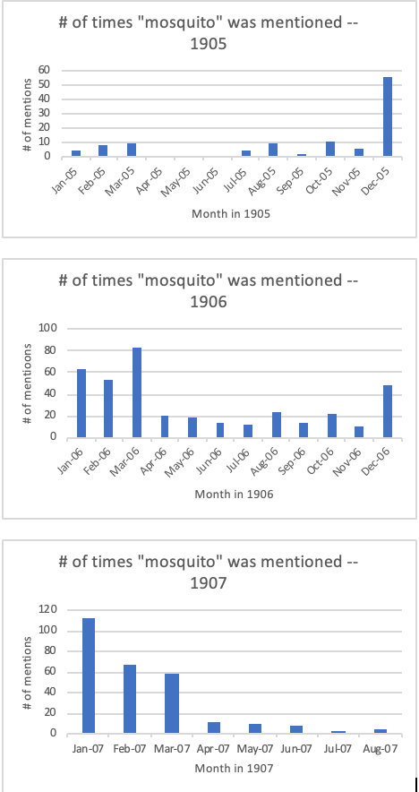
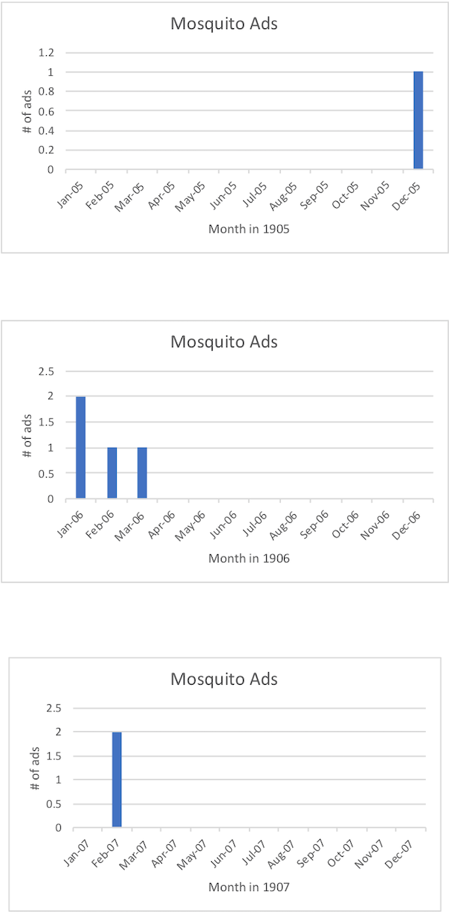

For the analysis project, my group focused primarily on the environment in Egypt, and the various aspects of the environment. For my individual analysis, I’ve decided to focus on the mosquitoes in the environment in Egypt. I was curious as to how mosquitoes tied into the environment, more specifically if they were prevalent in the environment, what time of year mosquitoes seemed to come around and interfere with the daily lives of the individuals living in Egypt, and how they affected individuals and business in Egypt. After I found the various data, I created bar graphs to compare the data I found, and I strived to find connections and similarities in the different sets of data I was looking for.

First, I wanted to discover the time of year that mosquitoes came around in Egypt. To do this, I decided to create an Xpath query to search for the number of paragraphs in which individuals in the Egyptian Gazette mentioned mosquitoes in the newspaper, by searching “count(//div[contains(., ‘mosquito’)]).” My thought process was that if people in the newspaper are mentioning “mosquitoes,” that must mean that mosquitoes are around, and more importantly affecting the people in Egypt. When I searched for these results, I found many instances of the word “mosquito,” and put it into Excel. My results were very consistent through the years 1905-1907, mostly finding prevalence in mosquitoes from December-March, with few inconsistencies. Although the word “mosquito” was found mostly in this time frame of months, the word “mosquito” was still mentioned throughout the year, just much less than from December-March. Because, for the most part, “mosquito” was mentioned at the same time each year, I can come to the conclusion that the number of times that word was mentioned directly correlates to the times of year that mosquitoes were around and affecting the population. 

Next, I wanted to study the various ways mosquitoes affected the individuals in Egypt. I conducted this research by searching online for this information. In [this link](https://ajph.aphapublications.org/doi/pdf/10.2105/AJPH.16.4.419), I found that work had been done in the history of Egypt to exterminate mosquitoes, beginning with studying the biology of them, and then figuring out different techniques to get rid of them completely. At first, people in Egypt drained oil in order to keep mosquitoes away from their environment, but there was a shift in how they got rid of them. Because Egypt is home to many deserts and dry areas, mosquitoes don't seem to be very much around, except for the areas which have pools of water, where mosquitoes are most attracted. Through thorough research, I also found on [this link](https://books.google.com/books?id=If1AAQAAMAAJ&pg=PA305&lpg=PA305&dq=mosquitoes+egypt+1905&source=bl&ots=Rizc18319z&sig=ACfU3U09pYf7mNMniX-IEpniS1c8GzMnbw&hl=en&sa=X&ved=2ahUKEwj8xKShh6XmAhVBn-AKHeuFCgoQ6AEwDHoECAoQAQ#v=onepage&q=mosquitoes%20egypt%201905&f=false) that mosquitoes were reproducing heavily in 1904 and 1905, causing the Dengue disease, causing so many people to visit the hospital and this disease existed even throughout 1907, making it's way through Cairo, but somehow avoiding Port Said and Ismailia. Mosquitoes were able to transmit this disease from man to man through sucking blood out of individuals. Clearly, mosquitoes were a large issue and affected many people in the town, as well as many businesses, like the hospital.

Aside from the hospitals, mosquito infestations made Calvert’s business boom. While coding the 1908 newspaper, I found that there were many Calvert’s advertisements that promoted various creams and ointments for sunburns, as well as mosquito irritability. I found these ads mostly in pages 1 and 2, however one advertisement was on page 5. I was curious as to what time of year these Calvert’s advertisements showed up in the Egyptian Gazette. My hypothesis was that they would show up at the same time of year as the word “mosquito” was mentioned the most in the newspaper. If mentioning “mosquito” many times in the newspaper meant that was when mosquitoes were affecting the population the most, the Calvert’s business would boom off advertising their products at the same time. So, I did a key word search for Calvert’s ads, and found, as I suspected, that the advertisements that promoted ointments for mosquito bites, showed up at the same times as the word “mosquito” was popular in the newspaper. I created bar graphs to clearly see the correlation between the word “mosquito” popping up in the newspaper, and the Calvert’s ad popping up in the newspaper. 
