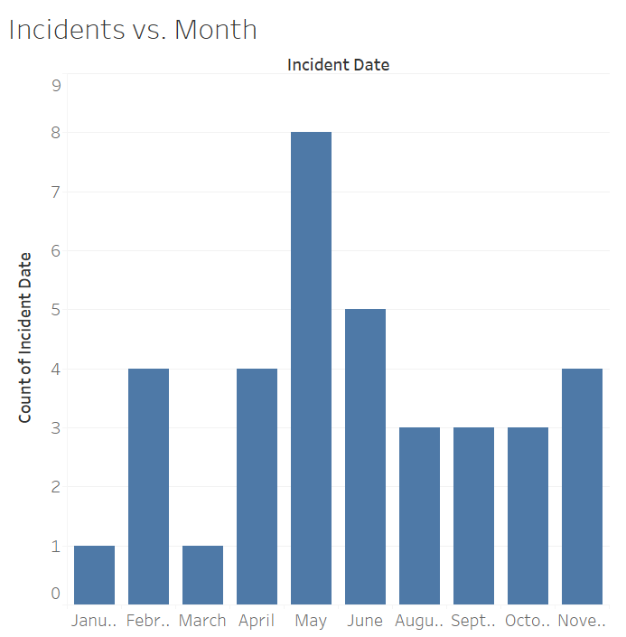
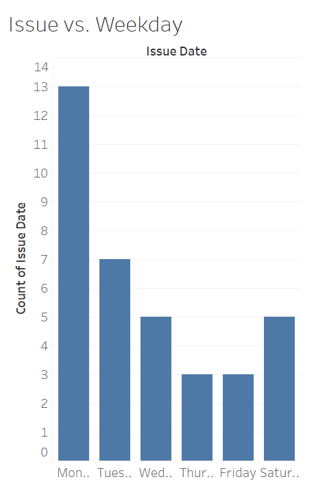

`//p[matches(., 'sank', 'i') and matches(., 'ship', 'i')]|//p[matches(., 'collision', 'i') and matches(., 'ship', 'i')]|//p[matches(., 'sank', 'i') and matches(., 'collision', 'i')]|//p[matches(., 'collide', 'i') and matches(., 'ship', 'i')]|//p[matches(., 'sank', 'i') and matches(., 'collide', 'i')]|//p[matches(., 'shipwreck', 'i')]`

This query returns 66 different results. The goal of this query is to return as many mentions of shipwrecks and ship collisions as possible. However, some manual filtering is required to get rid of irrelevant results. Once the irrelevant results are removed, there are about 36 different mentions of various shipwrecks that include a location and date. There may be a more concise or effective query than this, so if I come across it I will amend this document to reflect that query’s results instead.

I made two bar graphs and one scatterplot. While I could just make a graph of the number of incidents over time based on the issue dates, most of the incidents are not reported on the day they occurred. Obviously, this is because it is nearly impossible to write and publish a newspaper article on something that happened that same day, especially if it happened far away. Because of this, I made a bar graph displaying the number of incidents that occurred in each month.

The x-axis on the graph separates the results into the twelve months of the year, and the y-axis displays the number of incidents. The shape of the bar graph is somewhat symmetrical and centered around the month of May. I suppose this could be due to more raw materials being exported and imported around the summer months, which would lead to more ships being in use, which would lead to more collisions.

I also made a bar graph depicting the relationship between the number of incidents reported and the day of the week of the issue it was reported in.

The graph is very asymmetrical, with more incidents being reported on Mondays and a general decrease in reported incidents as the week goes by. The fact that more incidents are reported on Mondays than any other day of the week is, most likely, mainly due to the fact that the Egyptian Gazette did not publish issues on Sundays.

Then, I made a scatterplot depicting the relationship between geographical distance between Cairo and the location of the incident and the time it took for the Egyptian Gazette to report on the incident. I used Google Maps to determine the approximate distance.

On this graph, the x-axis displays the distance (in miles) between Cairo and the incident. The y-axis displays the time it took to report on the incident (likely in days). My hope in making this graph was that there would be a visible pattern in the results that will allow me to infer something about the way these incidents are reported or how information spread at the time. If the correlation between distance and speed was strong and positive, it would mean that the methods of communication used were not very efficient. If there is little or no correlation, then the information spread fast enough for distance to not affect the effectiveness of communication.

After plotting the points on a coordinate plane and calculating a line of best fit and its coefficient of determination (which turned out to be R2= 0.079), it became clear that there was no correlation between the physical distance between Cairo and the incident and the time it took to report on said incident.  This indicates that the spread of information throughout the world was fast enough at the time that an incident happening far away did not determine how long it would take for that information to spread. Therefore, communication during this time period was very effective.

[Here](https://dig-eg-gaz.github.io/post/16-analysis-stefonek/) is a post tracking Russian and Japanese ships during the year of 1905.

[Here](https://dig-eg-gaz.github.io/post/18-analysis-pierre/) is a post analyzing how telegrams worked as a means of rapid communication during the time period.
