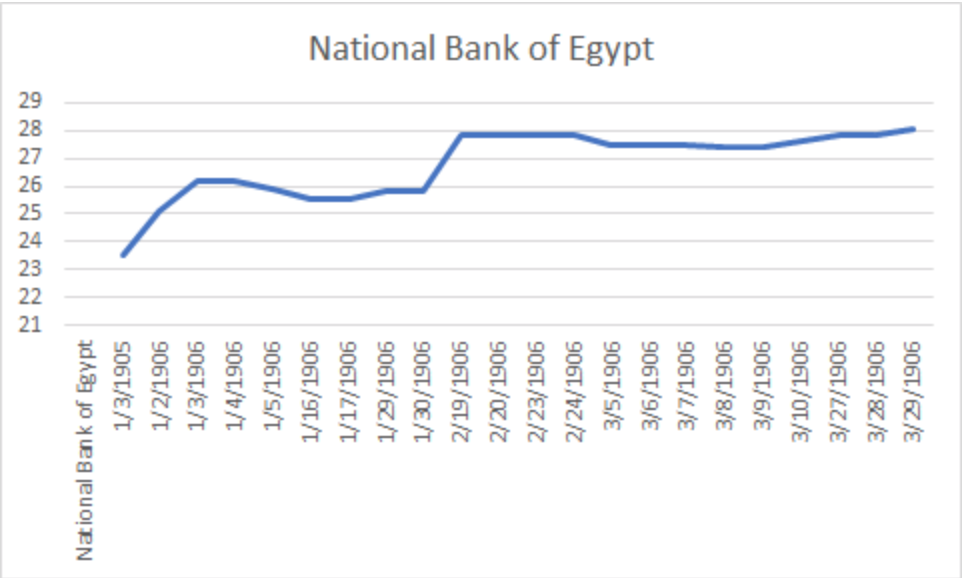

**My Question: How well would you fare if you invested in the biggest bank in Egypt at the start of 1906?**
Expanding on our group project, which was referring to the highest and lowest producing stocks in the stock market in 1906; I wanted to look further into this and see how well you could do with Bank stocks as I noticed throughout the months, while finishing my deliverables, that the banks were heavily advertised and very involved within Egypt’s economy. I looked through the “Stocks and Shares” table in quarter one of 1906 to get the most accurate results. This table not only showed the stock prices but the debentures and well. A stock is basically the digital equivalent of owning a part of a company for which they are able to buy and sell as they wish. A debenture is essentially the same thing but more similar to a bond in that it is everything that a bond is but also secured by assets.

The point of this project was basically to show how one would do by investing in the financial sector in the time of rebuilding as Egypt was still going through an economic overhaul led by the British. After the war of 1882 with the British, Egypt was taken over and made as a project by the British to rebuild the declining economy starting with their very important cotton industry. Another reason I decided to ask this question is because while Egypts economy was beginning to suffer and their recession in 1907 was becoming apparent, I wanted to see how a financial stock would fare against negative investor sentiment. The recession trend was also very similar to the US financial crisis of 2008. There is a parallel as the crisis bled into everyday life and affected almost everyone apart of the economy. Both Egypt and the US economy suffered greatly from the recessions and bled more and more everyday. The one key difference was that while the financial sector, specifically the bank stocks were hit the hardest in the US crisis; in Egypt there was really no sector at fault. To go ahead and find out the answer to my question, I decided to do a little research on each of the stocks in the financial sector at the time and figure out which made the most sense.

I chose the _National Bank of Egypt_ because it is the biggest and oldest bank in Egypt and would give me the best results in terms of the financial sector as it is a solid indicator for the sector as a whole.
Stemming from my project, the query: //div[@xml:id="deg-el-stsh01"]/table//cell[contains(.,'National Bank of Egypt.')]/preceding-sibling::cell/measure

Would allow me to see the changes in the prices of the bank shares and the growth or decline of the share as each week went by. This allowed me to also see the visualization as a graph and a trendline.

The stock is clearly a growth stock and an indicator of a winner as it has a positive trend.
From this visualization, it is obvious, in a small sample size, that the stock is a survivor during a bear market and a great recession-resistant stock. For historical context, The National Bank of Egypt, in 1906, established in Addis Ababa, the [Bank of Abyssinia.](https://www.bankofabyssinia.com/index.php/profile/company-profile.html) This bank was able to be granted a 50 year monopoly and became the Ethiopian government fiscal agent as well as the only issuer of currency. It was the most respected commercial bank in Egypt because it was never separated from the national concerns or issues. It has also been the main supporter of Egypts very important national economy by helping finance its major projects. This backed with the fact that it moved the majority of Egypts banking assets, deposits, loans, and advances at the time, it was a safe bet during the recession. So how would I do if I decided to jump the gun and invested in the biggest and oldest bank in Egypt? Not only would I do well, I would be beating the market average by a mile and then some.

As an expansion to my reasoning for this project, I wanted to credit a second source that was actually suggested to me by Mr. Hanley himself. I remembered Professor Hanley mentioning during our Blog Post project that we should try and find other blog posts similar to ours and during my search, I found a source that I kept just in case for my analysis project because I knew I was going to do something on the stock market. It just turned out that my group was also in agreeance with me and coincidentally agreed on a question very similar to the following source: [Stocks and Shares](https://dig-eg-gaz.github.io/post/18-analysis-metallo/) I just wanted to give thanks to *Sophia Metallo* (the author of the blog post) as I was able to pull very valuable information from the work and use it as guidance for this project.
