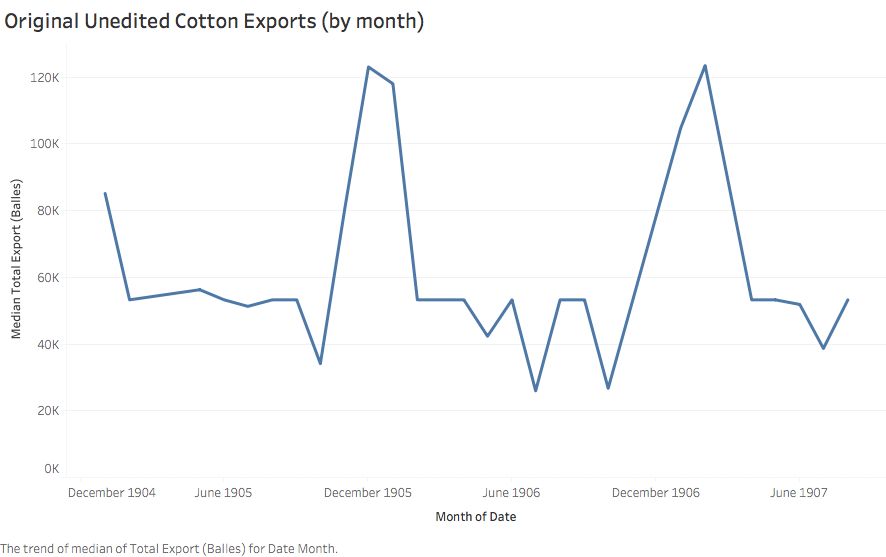
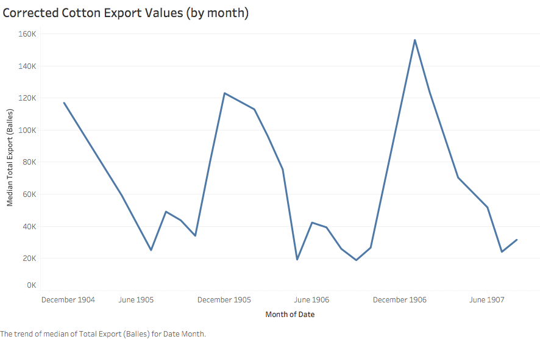

## Historical Background

Cotton played a vital role in Egyptian economy in the 19th and 20th centuries. The Ottoman governor Mehmed ‘Ali Pasha instituted corvée, in which peasant workers were conscripted into the cotton fields and other government projects such as building the Suez Canal. Throughout his reign, ‘Ali held tight control over Egypt’s economy and trade. The profits of exports were used to fund ‘Ali’s many military campaigns. However, Ali’s successors wanted to open Egypt up to European investors. By the time of Khedive Isma'il, Egypt was borrowing heavily from French and British banks on the supposition that cotton harvests would pay them back. In the 1860s, the vacuum left by the American Civil War did cause cotton prices to rise and Egypt’s cotton market to prosper. However, the influx of cotton after the Civil War caused a series of events that culminated in Egypt going bankrupt in 1876. As the economy spiraled, Egyptian citizens grew restless. General Ahmad ‘Urabi Pasha spearheaded a revolt with the support of Egypt’s citizens. In 1882, Britain took control of Egypt and ended the revolt in order to protect her investment, all under the guise of promoting [“honesty, humanity and justice.”](https://www.e-ir.info/2009/03/23/the-british-invasion-of-egypt-1882/)

Under consul-general Lord Evelyn Baring Cromer, cotton yields in Egypt increased rapidly through the end of the 19th century, aided by restructuring of irrigation, taxes, and land-ownership. This productivity encouraged investors from various countries to participate in a web of over-speculation that eventually burst in March of 1907. The following economic crisis was fueled by declining cotton yields, caused by the cotton worm, weakened seeds, and worsening soil quality. Irrigation policies developed by British engineers had actually flooded and brined the soil. The failures of certain British policies revitalized nationalist movements against outside interference and may have led to Cromer’s resignation in 1907. However, Egypt did not gain independence until after the events of [World War I](https://www.nonviolent-conflict.org/egyptian-independence-1919-22/).

## Choosing a Data Source

During the informal British occupation of Egypt, cotton exports were used to determine the state of the economy and whether new policies should be kept. Therefore, I decided to examine the table **cotn01** from _The Egyptian Gazette_. This table details cotton exports to various countries and total monthly exports in balles (French for bales). As determined in the post [_Cotton Trade_](https://dig-eg-gaz.github.io/post/17-analysis-fricano/) written by Nino Fricano, a bale of cotton at this time was approximately 20% smaller than the standard modern bale.

I ran the following XPath query to obtain the total monthly cotton export value from every **cotn01** table currently within _The Digital Egyptian Gazette’s_ content repository:

>//div[@xml:id="deg-el-cotn01"]/table//cell[contains(.,'balles')]/following-sibling::cell

Isolating only the dates and values in Atom and importing them into Tableau, I was able to create the following line graph of cotton export trends from 1905 to 1907.

Looking at the uncorrected data, the value _**53,232**_ is quite prevalent. This identical value given for months in succession creates the horizontal portions of the graph above. Such an aberration within the raw data makes sense, as 53,232 is the number inputted within the original template. Any edition of _The Egyptian Gazette_ in which the **cotn01** table was simply copied and not corrected would retain that value. It is clear that the raw data does not provide an accurate enough perspective.

### Correcting the Tables

Fortunately, since the **cotn01** table is a monthly recitation of exports, it should logically only change every four weeks. In order to narrow my search results, I decided to select the first date and **cotn01** table from every month. Therefore, the pool of data to be proofed ended up only being 27 separate tables. Of these 27 tables, 10 of them contained the stock value while 2 others contained the same value as the previous month. Thankfully, this much more manageable number would still result in a complete data set.

### Complications

The first complication that I encountered while correcting my sample of tables was unexpected. As it turns out, various encoders have made the same mistake of dropping in the **cotn01** table when the actual microfilm used another table, **ctns01**. The **ctns01** table shows stock prices for cotton shares rather than export values. In certain months, I was unable to find any **cotn01** tables. I am unsure why this is, since this table should appear at least once per month.

While checking the 2 repeated tables, I found that the table printed on January 2, 1906 is exactly the same as the one printed in December of 1905. This shows that the table does not change at the beginning of a new month, but rather somewhere in the middle. In January 1906, this change happened on the 11th. However, as the **cotn01** table does not appear every single day, it is difficult to ascertain if there is a set day where the table changes each month or if it is random.

## Interpreting the Data

After I proofed and corrected those 12 tables, I ran the same query and used only the values from the first table listed each month to create the following visualization.

The graph shows a yearly trend where exports spike in December and reach their lowest points around June or July. In the fall, there is another small spike and fall. The steady climb in exports from fall to December can be explained by [cotton maturation cycles](https://naldc.nal.usda.gov/download/CAT86200445/PDF). In both Upper and Lower Egypt, fall is the season for cotton harvesting. The **cotn01** table for any given month supplies cotton export numbers for the month previous. So, since November marks the end of the cotton harvest, a sharp decrease in exports is expected in January. (December would display sales for November, and January would show counts for December.) In a post entitled [_Fluctuation in Egyptian Cotton Exports Throughout the Year_](https://dig-eg-gaz.github.io/post/16-analysis-grieco/), Dante Grieco speculates that “a domestic policy in England” may also contribute to yearly cotton export trends, given the overwhelming presence of Britain in export numbers.  

### Lord Cromer’s Reports

According to [certain secondary sources](https://onlinelibrary.wiley.com/doi/epdf/10.1111/anti.12216), the cotton worm was said to have devastated the cotton crop in the late 1800s and early 1900s. However, the data given in _The Egyptian Gazette_ produces a very stable-looking trend line, factoring in seasonal changes, from the end of 1904 to the middle of 1907. To reconcile this apparently disparate information, I turned to Lord Evelyn Baring Cromer’s yearly _“Reports…on the Finances, Administration, and Condition of Egypt and the Soudan.”_ Lord Cromer’s annual report in 1905 (detailing events from 1904) mentions the cotton worm and suggests new policies to combat its effects. Unfortunately, the repository of _The Digital Egyptian Gazette_ does not include enough information from 1904 to provide context of cotton exports prior to 1905. (Meaning, it is difficult to visualize how the trendline would have differed.) Lord Cromer’s report from 1907 (detailing the events of 1906) is quite optimistic. In 1905, the return of corvée, which had previously been vanquished by the touted benevolence of British supervision, brought young boys en masse to the cotton fields to handpick infested leaves. State-mandated labor, combined with excellent weather and rainfall, strengthened the cotton crops in 1906. Although less land was dedicated to cotton-growing than in previous years, Lord Cromer was confident that the yield would be significantly larger. This fact is reflected in the graph above, in which peak monthly cotton exports in 1906 exceeded those of the same season in 1905 by nearly 40,000 bales. While a larger raw data source would be useful in visualizing the tumultuous period in Egypt before and during World War I, existing data paints a picture which compliments both primary and secondary sources.
