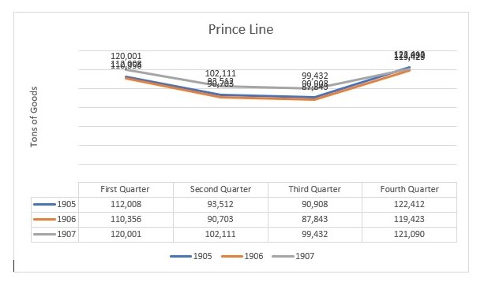

My group’s analysis of the Egyptian Gazette is focused on the Stocks and Shares tables. These tables have a lot of information about the most popular and frequently relevant companies of Egypt at the time. These include many manufacturing, industrial companies, banks, steam ship companies, local businesses, railway and tramway companies, utility works and Government businesses. Of these many fluctuating representations, I'm am going to individually analyze the navigation transportation and Lodging companies and decipher their relevance to the stocks and shares tables. There is a great amount of Transportation services in Alexandria, Egypt. Like Anchor Line Limited, Bell’s Asia Minor Steamship Co., Deutsche Levante-Linnie, The Ellerman Lines, Limited, British India S. N. Company, Limited. The Moss S.S. Company, Ltd., Bibby Line Mail steamers.

By noting the amount of people that arrive and depart from different locations, I can get a nice look at how the population is changing. Then by checking the differing numbers in the lodging of Alexandria I can get a nice look at how many tourists are coming in and out of Alexandria, Egypt. Furthermore, by compiling these findings into a quarterly consensus to decide how the quarterly stocks and shares numbers will differ, this will make a nice conclusion as to how the amount of tourism during certain seasons will affect the fluctuation of certain Stocks and shares prices.

To do this I had to query a ton for quantifiable numbers. First, I queried for departures and arrivals to and from Alexandria, Egypt with the Anchor Line Limited, Bell’s Asia Minor Steamship Co., Deutsche Levante-Linnie, the Ellerman Lines Limited, British India S.N. Company Limited. Sudan Government Railway and Hamburg-Amerika Linie. I queried for the header of these companies’ names in page 1 results because that’s where I found the best results. These findings were compiled to depict that during the first and the fourth quarters of the year there are the most arrivals and departures. Where there are significantly more arrivals at the middle of November and the most departures at the end of March. I tried to conclude why this was the case and found that the prices of fares and tickets were a bit more expensive during these months, which makes sense. But what stood out the most was when I queried for the Daily Weather Report of these months and found that the weather was significantly more tourism appealing. During the months of December through March in Egypt the weather is Mediterranean like, with a cool temperature, windy at times and occasional rain, which makes for a beautiful tourist vacation.

Then I queried for the tables under the header of a manufacturing company moving steamships with goods and services in the tons. I targeted headers like Prince Line and The Moss S.S. Company Limited during each quarter and found varying numbers for these as well that are evident of an increase in business for the first second and fourth quarters of the year. This is parallel to the influx of population during that time.

Line Graph of Prince Line during the four quarters of the years 1905-1907

Then when I look at the results of my group's findings and visualizations of the Stocks and Shares tables with the supporting query results of the Transportation of people, movements of goods and lodging vacancies. I found that these are parallel to the fluctuation of Stocks and Shares. Although the Stocks and Shares tables do not vary that frequently at the spots where they are most fluctuating correspond to the influx of people and goods during the first and fourth quarter. These stocks and shares are generally flat and at about the beginning of November and January is when the values have a pretty volatile spike upward. Then at about the end of February the stocks and shares values start to drop back to where they were. All of the stocks and shares followed this trend almost precisely, not just the companies that my group chose.

After making this analysis I would conclude that due to the ideal weather circumstances during the wintertime there is a mas influx of people coming in and out of Alexandria, Egypt. Because of this increased transportation it has caused a need for more goods and services to be transported in and exported as well. These marketing factors have led to a rise in Stocks and Shares values during the first and fourth quarters of the year.
