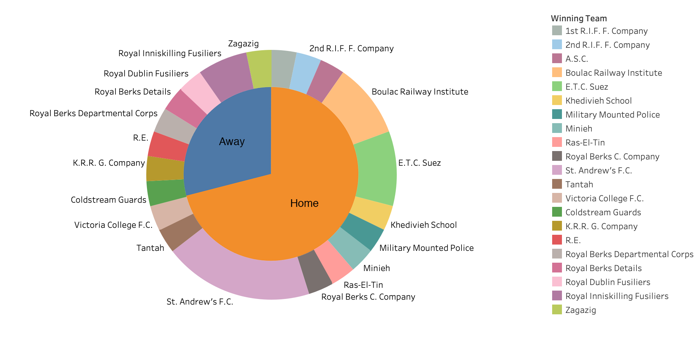
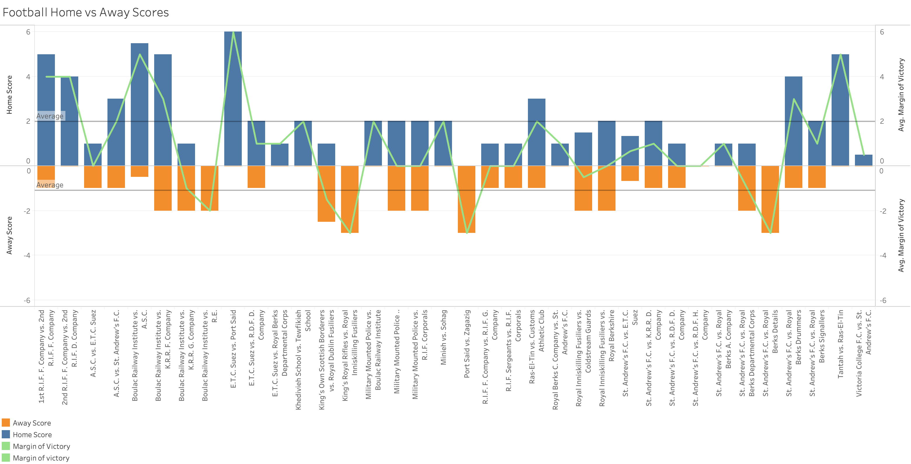

Every athlete loves to play on their home field, and it’s easy to see why. Being in front of their home fans, being on their most familiar field, and the overall convenience of home field has led to the common belief that the home team is at a measurable advantage. In the Egyptian Gazette, football (soccer) is one of the only sports with a distinct home and away team. For my individual analysis, I decided to explore this home and away data to answer the question: did home field advantage exist for football teams in early 1900’s Egypt, and why/why not?
In order to find this data, I used the same queries which I used in the group project. One of the queries I used was //head[matches(.,’sport and play’, ‘i’)][matches(.,'the plague', 'i')].  The purpose of these queries was to find every recorded football game possible in the newspaper. For each game I found, I recorded the issue date, home and away team, score, and attendance. Finding which teams were home or away seemed impossible at first, but I quickly realized that all of the recaps had the home team listed first. For example, if the section read “St. Andrew’s F.C. vs E.T.C. Suez,” it meant that St. Andrew’s F.C. was the home team.

## Results

This double-layered pie chart displays the winning team of every recorded game, separated by home or away. I found that across every game that did not end in a tie, the home team won nearly 75% of the time, or almost 300% more than the away team. Teams like St. Andrew’s F.C., E.T.C. Suez, and the Boulac Railway Institute had the most success at home, as they are the only teams with multiple home wins. St. Andrew’s played in the greatest number of recorded matches, so it is not too unusual to see them with 6 home wins. On the away side of the chart, the Royal Inniskilling Fusiliers are the only to get more than one win on the road. However, this disparity goes beyond simple win/loss statistics.

This stacked bar chart shows the home and away scores of every recorded game, along with an overlaid line chart of every game’s margin of victory. It is clear that most of the graph lies above the x-axis, on the home side. The reference lines show us that the average score of all away teams was 1.1 goal per game, while the home teams averaged 2 goals, nearly twice as much scoring per game. The most goals and highest victory margin for an away team in a game were accomplished by the Royal Inniskilling Fusiliers when they stomped the King’s Royal Rifles 5-0. Other than this game, there are a few away teams who have won by 2 or 3 goals, but the majority of away wins are by just 1 goal.

## Conclusion
So, what exactly is the reason for this seemingly enormous difference in home and away team performance? One reason could be the way that games are scheduled. In recreational sports leagues like this one, most of the time the better or at least more established teams are granted home field, while the worse or less known team must travel. This would mean that the home teams are almost always the better team before the game even starts. This explanation is plausible, but the data does not include any teams with much more home than away games. Another reason could be for the simple fact that players on the home team do not have to travel like the away players do. Depending on how far each game was, travelling to away games is inconvenient and can disrupt a player’s internal schedule or readiness. Home teams obviously do not travel, so they are able to rest, practice, or otherwise prepare during this time. Finally, this data disparity could also be due to the most common explanation for home field advantage: the fans. While this is certainly true for most major sporting events, these games were very recreational and did not have a huge number of spectators. Of the 13 games which recorded attendance, only five had over 2000 people, all of which were very anticipated games between prominent military units.
Rather than a single factor causing the home and away disparity, I believe that it is due to a combination of everything stated above. It is possible that while most teams played roughly the same number of home and away games, teams still scheduled easy games on their home field. I do not believe that simply traveling to another field could have such a large impact on its own, but it does have a perceivable effect and could easily play a role in this. Although there were relatively low numbers of attendance, over 1000 fans could definitely have an impact on the game’s outcome. However, as previously mentioned these are recreational competitions, meaning there probably are not over 1000 fans who care enough to get loud at most of the games. Overall, I believe that the massive difference in the performance of home and away teams is caused by a combination of home teams intentionally being better, away teams having to travel, and the home fans.
