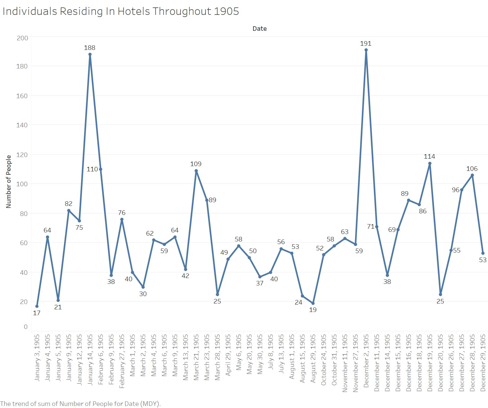
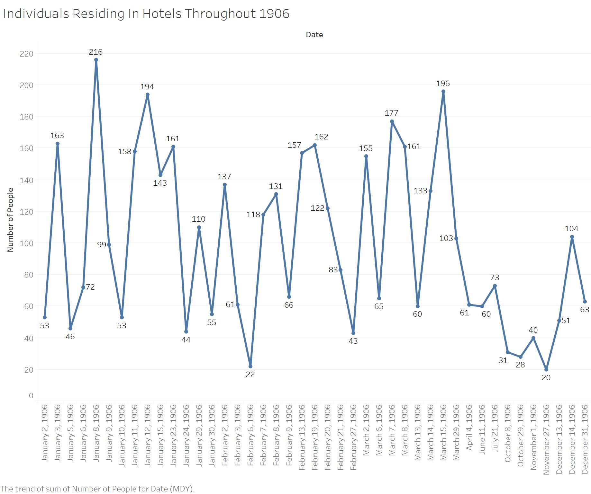
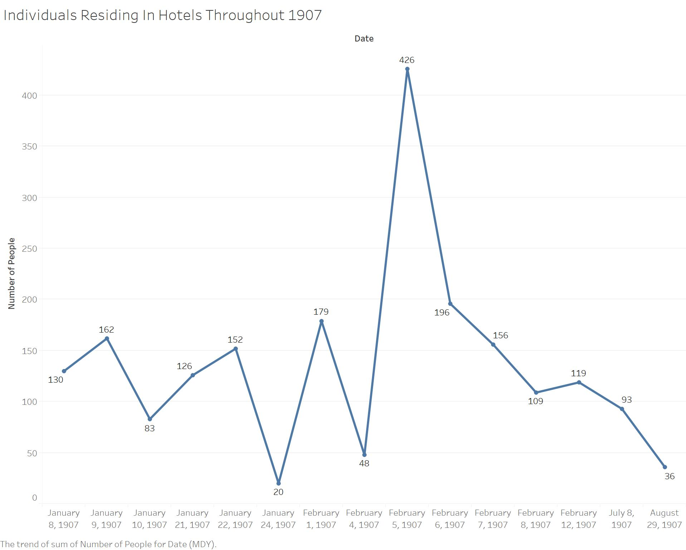
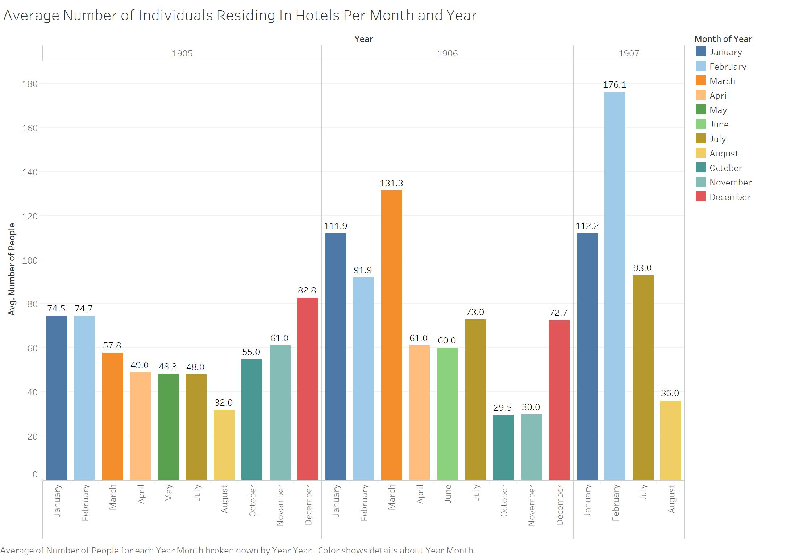

Throughout the years 1905, 1906, and 1907 in Egypt, there was a visible fluctuation in the number of individuals staying at various hotels, such as the Luxor Winter Palace, Cataract Hotel Assouan, and the Savoy Hotel Assouan. Seasonal changes, as well as the environmental changes that come with change in season, greatly affect aspects such as traveling and tourism throughout each year. According to the meteorological dates for seasons, the start of each season remains the same, however the end of each season changes slightly each year depending on how many days there are in the month. According to this [Online Almanac](https://www.almanac.com/content/first-day-seasons), Spring starts March 1st and ends around May 31st, Summer starts June 1st and ends around August 31st, Fall starts September 1st and ends around November 30th, and Winter starts December 1st and ends around February 29th. I utilized the meteorological dates for the seasons because this website states that these dates are "based on the annual temperature cycle and the 12-month calendar.” This website also mentions that “climate scientists and meteorologists created this definition to make it easier to keep records of the weather, since the start of each meteorological season doesn’t change from year to year.” The meteorological dates are most useful for this research because the start of each season starts the same day no matter what year and these dates exist strictly for weather data.

According to [Wildland Adventures](https://www.wildland.com/destinations/middle-east/egypt/seasonsclimate.aspx), Egypt’s main seasons are Winter and Summer, Egypt’s Winters are typically cold, windy, humid, and sometimes rainy whereas Egypt’s Summers are very dry, with very high temperatures. This website also states that the months April, May, October, and November are especially good for travelling. These reported most popular months for tourism fall in the seasons of Fall and Spring. With the data collected through an XPath Query, three line graphs and a series of bar graphs were created, demonstrating what months experienced more stays in hotels, which can be tied to tourism and how environment and seasons can affect travel in Alexandria.

To visually represent the number of individuals staying in hotels in Alexandria throughout the years 1905, 1906, and 1907, I used a specific XPath Query, organized my findings into Excel documents, and imported these Excel documents into Tableau. The data I collected was derived from using the XPath Query `//div[@feature="visitList"]` and searching specifically for commas in this feature to detect all of the commas present in each listing of the Visitor’s List because the Visitor’s List feature provides all hotel visitor names separated by commas. This XPath Query is not one hundred percent correct and only provides estimates, since often in these features a husband and wife along with their shared last name are included before one single comma. Using this XPath Query allowed me to detect estimates of the quantities of individuals staying in hotels throughout each year. After collecting the quantities from each year, I transferred them into three separate Excel documents so that they could later be uploaded to Tableau. In addition to the the three line graphs separated by year, I have also created a visualization, separated by year and month, of the averages of the number of individuals staying in hotels throughout each month of the year.

Once I uploaded each of the three Excel documents into Tableau, I was able to create three separate line graphs that demonstrate the number of individuals residing in hotels in Egypt. To make these line graphs even more accurate, I recorded every instance in which there was a list of names in the Visit List feature. Since I recorded every appearance of this feature, I was able to label each specific date and number of commas on the line graph to make it easier to visualize the beginning and end of seasons. By looking at all four of the visualizations, I can state that the months January, February, March, and December seem to be the months that experienced the most tourism and populated hotels. The seasons that these months fall in are Winter and Spring. The months that experienced the least number of individuals staying in hotels were August, October, and November. This data proves the "Wildland Adventures" article wrong because they stated that the most popular months for tourism in Egypt are April, May, October, and November, where in reality the most popular months were actually January, February, March and December. By looking at what months that article thought were most active, I was able to deduce that they believed the most popular tourism seasons to be Fall and Spring.

