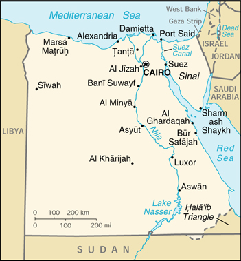
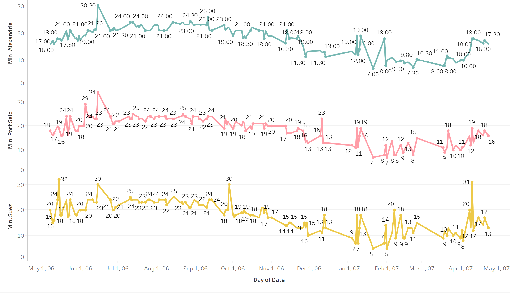

### INTRODUCTION
For my analysis project, I focused on the minimum temperatures of Port Said, Suez, and Alexandria and how they differed from May 1906 to April 1907. The goal was to see if there were any significant differences between the minimum temperatures and if so, what caused these variations. I chose these three cities for a number of reasons. I am using Alexandria as the base measure because the “Egyptian Gazette”, the newspaper from which I collected the data, is based in Alexandria. I then tried to chose stations that had minimum temperatures recorded as often as possible. Some of the minimum temperatures in the “Other Stations” table of the “Daily Weather Report” were not recorded as often as Port Said and Suez. By picking these two locations, I am able to have a continuous line graph with enough data points to create a decent line graph.

### PROCEDURE
Each of the three cities that I chose to collect data from are located all across the border of Egypt. Alexandria, the main focus of the “Egyptian Gazette”, is located on the northern border and is adjacent to the Mediterranean Sea, which allows for sea travel. Alexandria is one of the most northern cities out of the three and thus further from the equator. This allows for less intense summers and cooler winters. The second city, Port Said, is also up north, but is closer to Israel and Jorden. It is also right up on the Mediterranean Sea and is a great location for shipping docks. Because it is the other more northern city of the three, it is located further from the equator and may experience different minimum temperatures than the third city. Suez is the third and final city that I chose to collect data. It is alongside the Suez Canal, hence the name, and is more south than the previous two cities. I choose three cities that varied in location because I wanted to see if there were any trends when it came to the minimum temperatures of each area.

The “Daily Weather Report” appeared in almost every issue of the “Egyptian Gazette” and was an important section of the newspaper. It provided readers with a handful of valuable information regarding the weather for the specific day. It was important especially during this period because it was one of the only ways to quickly find out the temperature for the day. The “Daily Weather Report” also listed out other bits of information about the weather like the sun rise and set times, the humidity level, the force of the anemometer, and the heat of the sun. These were all valuable information for readers to have.

The data that I gathered came from the “Daily Weather Report”. The data for the Alexandria temperatures came from the “min. temp in the shade” row, while the minimum temperatures for Port Said and Suez came from the “Other Stations” table and the “min temp in the shade” column. When it came to getting data points for the minimum temperatures in Alexandria, I used the XPath query: “//table//cell[contains(.,'Min. Temp in the shade')]/following-sibling::cell[1]/number()”.  I used the “Daily Weather Report” to the best of my ability; I accumulated the minimum temperatures of the three specific locations, put them into an excel spreadsheet, imported them to Tableau, and created three continuous line graphs that show the varying temperatures from May 1906 to April 1907.

### ANALYSIS
The point of my analysis project was to determine if there were any major differences between Alexandria and two of the lesser known locations, Port Said and Suez in their minimum temperatures due to the various locations of these three cities. In order to do this, I gathered the minimum temperatures from Port Said, Suez, and Alexandria from the dates of May 1906 to April 1907. This span of a year allowed for a good amount of data points that would show the fluctuations in minimum temperatures in Port Said, Suez, and Alexandria.

It is important to note that some of the minimum temperatures may be incorrect. Human error is to blame; some people would forget to update the “Daily Weather Report” with the correct minimum temperatures. On the other side of the spectrum, sometimes the “Daily Weather Report” could not be located in the “Egyptian Gazette”, or the “Other Stations” table was absent. To compensate for these issues, I removed any null data points from each visualization to try and create a better flowing line graph. Another issue that is important to note is the reliability of the data. As time progresses, the technology advances and gets better and more accurate. The minimum temperatures that I collected may not be 100% the actual minimum temperature of the area, but it is still important to look at the data and learn from it.

By analyzing by data, I came across some similarities and differences between the three cities in Egypt. For instance, all three of the locations experienced a spike in temperatures on June 15th, 1906. While this date may not be of any importance besides the fact that all three stations shared higher temperatures than normal, it is an interesting trend to note, especially since the minimum temperatures for the rest of the period do not come close to June 15th’s temperatures. A key difference is the fact that during April 1907, the minimum temperatures in Suez were significantly higher than those of Alexandria and Port Said. This may be due to the location of Suez on the Suez Canal. The canal may lead to sea breezes and higher temperatures to be recorded. Besides these small details, the minimum temperatures for Port Said, Alexandria, and Suez all follow a similar path; it gets warmer during May and June and stays constant until December when the minimum temperatures start to fall into the single digits.

<iframe src="https://public.tableau.com/views/MinTemps1906-1907bargraph/Sheet1?:display_count=y&publish=yes&:origin=viz_share_link?:showVizHome=no&:embed=true" align="center" width="90%" height="500"></iframe>

Since the “Egyptian Gazette” is a newspaper based in Alexandria, it begs the questions of why did the editors and writers choose to include the maximum and minimum temperatures of other stations in their paper. One reason could be that since Alexandria is located adjacent to the Mediterranean Sea, there may be a good number of people who make trips from Alexandria to other areas like Port Said. By giving these sailors the maximum and minimum temperatures to various stations, the are better prepared for the weather and know what to expect. Another reason could be that

Looking at the minimum temperatures at Alexandria, Port Said, and Suez allow for better comparisons to the current minimum temperatures in these locations. The dates that I studied, May 1906- April 1907, were over one hundred years ago. Since there is such a large gap of time between then and now, I am able to look at the minimum temperatures for those locations now and see if there are any notable differences. Climate change is a topic that has been hotly debated for a while now. By comparing the minimum temperatures for these areas, there might be a definite sign that the Earth is heating up and thus increasing the temperatures in many areas.

An [article](https://rmets.onlinelibrary.wiley.com/doi/epdf/10.1002/joc.1321) that I found did something similar to my analysis project, but with more stations and only observed the average summer temperatures. Nonetheless, their study was eye-opening and gave me better insight to the varying temperatures of my three chosen stations. The article was published in 2006, a hundred years after the years that I studied. The researchers, Hasanean and Basset, looked at the average summer temperatures for 19 separate locations all over Egypt, including Alexandria, Port Said, and Suez. They were only able to find a limited number of reliable temperatures for their 19 stations, so they did not start looking at the average temperatures for Alexandria until 1942, Port Said until 1941, and Suez until 1968. They stopped collecting data for each of these stations in 2000. Hasanean and Basset found that the average temperatures in the summer increased in areas like Alexandria and Suez, but slightly decreased in Port Said and other Upper Egypt areas. When comparing their data to my data, one can observe that the 1906 summer average in all three stations was lower than Hasanean and Basset’s data, thus leading to the idea that there is some form of global warming occurring that makes the average summer temperature raise by a couple of degrees.

### CONCLUSION

When I first began my analysis project, I did not know that I would gain better insight into the recording and reporting of the weather in Alexandria. Yet, as I continued to conduct research and collect data, I learned that the “Egyptian Gazette” played a vital role in reporting weather data. As for the minimum temperatures in Alexandria, Port Said, and Suez, it is clear that there are similarities between their minimum temperatures. All three roughly experienced the same minimum temperatures with the exception of a couple of instances previously discussed. By studying the minimum temperatures in Alexandria, Port Said, and Suez, I gained a better understanding as to why the “Egyptian Gazette” chose to include the minimum temperatures for both Alexandria and a number of other stations across Egypt.
