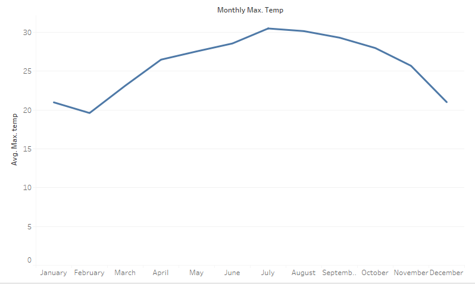
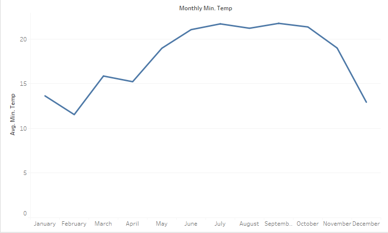

Temperature and Cotton production are tied together at a fundamental level. This is because temperature is a key component of agriculture, due to plants growing better in different climates. However, when looking at Egypt, their climatic tendencies have to be taken care of. These include temperatures ranging from “115 degrees F.” to “40 degrees F.” [example]( https://babel.hathitrust.org/cgi/pt?id=uc1.a0010953297&view=1up&seq=50). Cotton needs specific temperatures to grow well, those being around 70 degrees Fahrenheit to 100 degrees Fahrenheit. Seedlings can be stunted by heat, thus causing smaller cotton bulbs. Smaller bulbs mean less total cotton being produced. Because of this, temperature has a huge effect on cotton exports and, therefore, temperature has a huge effect on global economy. Because the Egyptian Gazette was produced during the shift from industrial times to a more information-based era, textile production was a huge factor in the global economy. It was also one of Egypt’s more important exports, again showing the importance of temperature in terms of the Egyptian cotton market and the global cotton market. Changes in the global cotton market directly affected the people of Egypt since it was their primary export, meaning most of their money comes from it. Thereby, lots of crop means lots of money for the country. Lots of money for the country eventually gets to the people, meaning more money for the people and a better standard of living, resulting in higher GDP and better livelihoods. Because of this, temperature should be vastly important to the wellbeing of Egypt due to its relation to cotton production.

This graph demonstrates the highest average temperatures for the months January through December, 1905-1097 in Alexandria. Egypt has a “mild winter from November to April and hot summer from May to October [example](http://www.geography-site.co.uk/pages/countries/climate/egypt_climate.html). This is clearly seen in the graph with lower temperatures being reported in the winter months while higher temperatures are recorded in the summer months. As seen, the average maximum temperatures reach, at their lowest, just below 20 degrees Celsius while, at their highest, they are just above 30 degrees Celsius. The highest temperature was recorded in July while the lowest temperature was found in February.

This graph demonstrates the highest average temperatures for the months January through December, 1905-1097 in Alexandria. Egypt has a “mild winter from November to April and hot summer from May to October [exampleh](ttp://www.geography-site.co.uk/pages/countries/climate/egypt_climate.html). This is clearly seen in the graph with lower temperatures being reported in the winter months while higher temperatures are recorded in the summer months. The lowest temperature was recorded in January, just like with the highest average temperatures, while the highest minimum temperatures were recorded in July and September. The lowest minimum temperature was between 10 and 15 degrees Celsius while the highest minimum temperatures were somewhere between 20 and 25 degrees Celsius.

This chart shows the average number of bales of cotton produced from January to December in Alexandria from 1905 to 1907. The peaks of bales produced were in January, May, and August, while the lowest dips are in March and September. January has an inordinately huge peak at around one million bales produced while the next highest month only has around six-hundred-thousand bales produced. Either this is correct or data from the Egyptian Gazette has been incorrectly computed or entered, resulting in this large peak.

The correlation between cotton production and temperature is somewhat hard to understand in individual graphs. It takes around six months for a cotton crop to reach maturity and be reaped. Because of this, one has to look six months back to see what months affected that particular crop of cotton. Because of this, I will be looking at the peaks in the cotton crop and see how they correspond to the average max and min temperature. For January, that means the temperatures from the month of July had the most impact on cotton growth. These temperatures ranged from just above 30 degrees Celsius to around 20 degrees Celsius, meaning the cotton grows best in higher temperatures. The lowest recorded number of bales produced happened to be in March, so the corresponding month is September, which has similar temperatures to July. Therefore, it could be deduced that temperature has little affect on the production of cotton. Instead, some other environmental factor(s) has a great affect on cotton production. However, when compared to current average temperatures, changes in climate can be found, thereby supporting or denying climate change and its inherent effects on the Earth.
