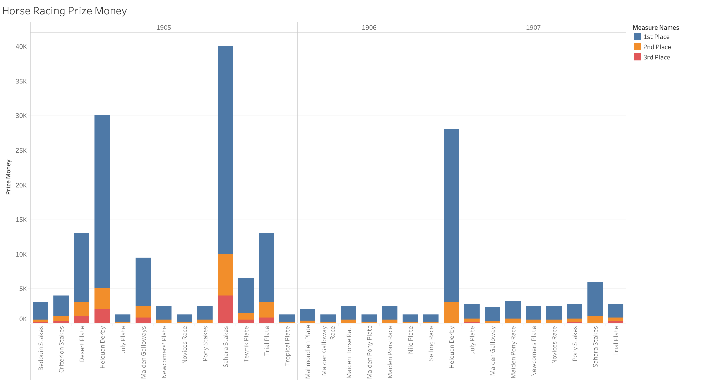

Throughout history, sports have impacted the lives of not only the participants, but also the fans who choose to watch them. As the sports group, we decided to focus our analysis project on the different factors which can affect spectator turnout across the major sports of the Egyptian Gazette. Among residents of early 1900’s Egypt, three of the most popular sports were football (soccer), polo, and horse racing. By looking into the data that we have collected for these sports, we are able to get an idea of what Egyptian sport fans wanted to see. Through our analysis of the Egyptian Gazette data and cross-checking with multiple studies on attendance of various sports, we have concluded that in early 1900’s Egypt, there were three major factors of sports attendance: level of competition/skill of either side, rivalry between the two sides, and importance/stakes of the competition.  

The question of how to get fans in attendance of sporting events is nothing new; as long as there have been sports, there have been those in charge trying to increase attendance. Especially recently, sporting events provide a large stream of revenue, so factors which influence attendance are important information for those involved in sports. Experts and researchers, such as John Douvis and Peter Bird, have tried finding these factors in many different ways across a wide range of sports. These publications are looking at current factors, of which many do not apply to early 1900’s Egypt, however common themes across generations have held true.  

In order to collect this data, we ran a series of XPath queries aimed at finding as many games as possible for each sport. We searched for the “sport and play” sections of the newspaper, where sports data and stats are most often found. One problem we came across was that many of the sport and play sections were not tagged with the sport feature type. To combat this, we removed //div[@feature=”sport”] from our queries and replaced it with //head[matches(.,’sport and play’, ‘i’)]. What this did was return to us any div with the header “Sport and Play,” which only included sport and play sections. We utilized this along with searching for sport-specific terms like “chukker” (polo) to collect the full data range that was available to us. We also realized that many sections use qualitative descriptions instead of numbers for attendance data. These sections often used the same terms, such as “fine,” “large,” and “very large,” so we recorded these descriptions anyway.  

## Football
Football was one of the most popular sports at the time, often played between different military regiments or schools. The military teams, such as the Royal Inniskilling Fusiliers, were split into teams or “companies,” although they did sometimes compete together. This brings us to our first factor of attendance, level of competition.

When looking at the attendance data for these games, the effect of this factor becomes clear. The matches with high attendance are all between two of the military unit teams at full strength, and not divided into companies. Matches between two of the subdivided units, such as the Royal Inniskilling Fusiliers F. and D. Companies, tended to have much less attendance than the more high-profile competitions. This, of course, is logical because more fans are going to be willing to attend a game if it is between two good teams. The research of Peter J. W. N. Bird on league football attendance also supports this factor. In [“The Demand for League Football,”](https://www-jstor-org.proxy.lib.fsu.edu/stable/2348449?seq=1#metadata_info_tab_contents) Bird looks at various teams and determined that whether or not the team was a contender during the season or a contender for the play-offs was a highly significant factor with a strong positive relation to attendance. Continuing with this first factor, the skill level of the away team appears to also play a role.

The data above shows that there was significantly higher attendance in games where the away team had a bigger the margin of victory (shown by the points below 0). This correlation is strikingly direct, and displays an positive relationship between attendance and away team performance. This suggests a number of things, but we concluded the reason for this trend is that when a good team is in town, fans in the area would be likely to attend the game. Often, teams would have large gaps between games at the same away location, so fans understood that each of these games was the last time they could see the team for a while.  This is supported by Hal Hansen and Roger Gauthier, who in 1989 researched and collected [40 different factors](http://content.ebscohost.com/ContentServer.asp?T=P&P=AN&K=16462549&S=R&D=s3h&EbscoContent=dGJyMNLr40Sep644wtvhOLCmr1Gep7dSsKa4TbSWxWXS&ContentCustomer=dGJyMPGrsUi2pq5MuePfgeyx43zx) which impact attendance. Included in these are the record of the visiting team and the number of star athletes on the visiting team. Like it does for the home team, the skill level of the away team makes people more inclined to attend.  

## Polo
One of the oldest team sports in history, polo was also very popular in early 1900’s Egypt. Like football, polo was often played by military regiments, but polo also included more organized teams. Because there was more parity between teams, attendance is more uniform across games than football.

Polo attendance in the Egyptian Gazette was only recorded as “fair,” “large,” or “very large,” so we decided to display these terms numerically 1-3 for our data visualization. Our second attendance factor, rivalry or repeated matchups, applies to our polo data. Teams like the 60th Rifles, the Mosquitos, the Egyptian Army, and the Tourists played each other more often than other teams did, and thus drew significantly bigger audiences for their games. This factor is corroborated by Hansen and Gauthier, who have “Rivalry between competing home team and opponent” as a significant factor. G.V. Wall, a researcher who analyzed attendance of Toronto Blue Jays’ games, also determined that rivalry is an [“especially prominent indicator of attendance.”](http://sparti.uop.gr/~toda/asmrj/Vol1_c.pdf) As teams play each other more, the competitiveness of the matchup rises, and fans are more interested in the result. Along with this, these teams played more games in general, meaning fans were more familiar with them and more likely to attend a game.  

## Horse Racing
The next sport of the Egyptian Gazette that we are analyzing is horse racing. The data we found for horse racing was unique to that of our other sports because of the different stats and measurements that are recorded for it. First of all, these races all had different stakes and payouts for 1st-3rd place. Helouan was very popular venue for these horse races, but most of these races tended to be lower stakes, more recreational competitions. Instead, we are focusing on the derbies or “plates” with higher stakes. Along with the increased competition, spectators were drawn to these races because of the money on the line. Some of these plates had first place prizes upwards of 25,000 Egyptian pounds, which naturally generated more interest from fans.

We call this factor the importance factor, because spectators are generally more interested in competitions that are more important and have more on the line, whether it be prize money or a championship trophy. This factor is why, for example, NBA Finals games are more watched than regular season competitions. The importance factor stems from a combination of multiple other factors, as many things go into how “important” a competition is. In the case of horse racing in the Egyptian Gazette, this importance comes from the large sums of money available to the winners. Unsurprisingly, the plates highest in prize amounts are the plates which were most popular and anticipated. The Sahara Stakes is especially significant, boasting a 33,000 first place prize, and a second-place prize double that of any other race we found. These plates are among the most popular of any sporting event in the Egyptian Gazette because of their high stakes and intensity. The importance factor is also seen in the sport of billiards. Despite its popularity, the data found for billiards in the newspaper is rather sparse. However, we can see that the attendance in the match referred to as the “final match” was described as “smoking” and “a concert,” as opposed to others which just state that attendance was “few.” Overall, the factor of importance describes how much the average fan cares about the result of the competition.  

## Conclusion
Across any sport, there are common factors which influence spectator turnout. The level of competition, or the skills of either team, is our first attendance factor. Fans would rather watch competition between two good teams than two poor ones, so games with better participants competing will draw more of a crowd. Specifically, in the case of football, the skill of the away team also impacts attendance, as more fans will go to a game if the visiting team is especially good. Rivalries are also a significant factor in attendance, because as two teams continue to play each other, the intensity and emotions of the matchup increase with each game. Finally, fans have more interest in important games with higher stakes and more on the line. When the competition has a large prize, like in horse racing, or is a championship, like in billiards, people have more interest in the outcome of the game and are more likely to choose to attend.
