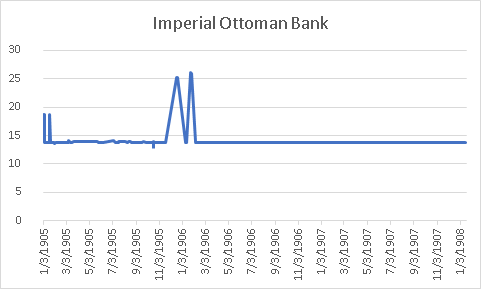
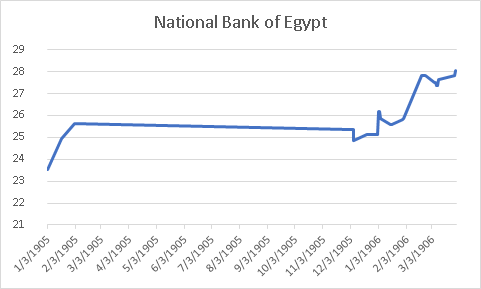
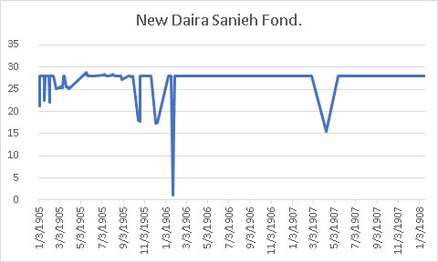
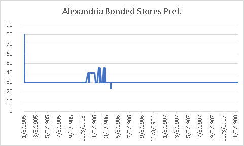
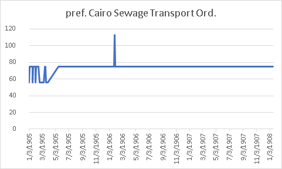
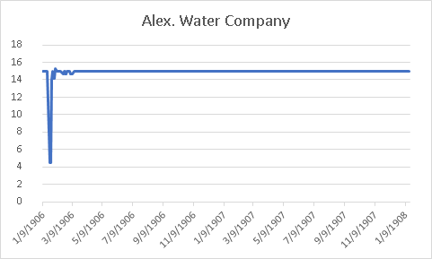
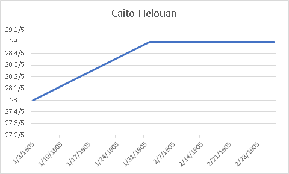
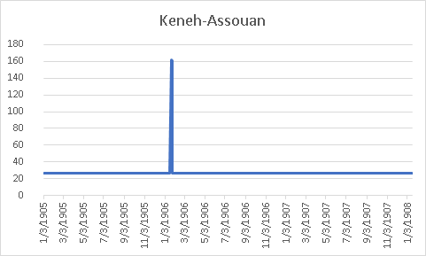

## Identifying Data Sets: Bailee

Our group was primarily focused on the section of the Egyptian Gazette called Stocks and Shares, a table listing various companies and the prices of their respective shares. The companies are divided into various sections such as “banks,” “land,” “commercial/industrial,” “navigation & water works,” and “railways and tramways.” To select specific companies to analyze within each industry, I looked for one or two companies whose shares were listed in pounds (for ease of comparison- though it would be possible to convert from one type of currency to another, it was simpler this way), then picked the companies with the highest share prices. Choosing one or two companies with the highest share prices seemed like one possible way to find companies who were dominating those industries and could therefore provide an accurate assessment of Alexandria’s economy during a specific time period. The following eight companies were selected from those criteria: Imperial Ottoman Bank, National Bank of Egypt, New Daira Sanieh Fond., Alexandria Bonded Stores Pref., pref. Cairo Sewage Transport Ord., Alex. Water Company, Cairo-Helouan, and Keneh-Assouan. (For clarity, these names were lifted directly from the tables in question.)

## Introducing the Datasource: Alvin

With the selection of the eight companies above, we found that those companies can be distinguished into two categories.

One of them is finance, which includes Imperial Ottoman Bank, National Bank of Egypt, New Daira Sanieh Found, Alexandria Bounded Stores Pref, and Keneh-Assouan (Assurance). It is apparent that bank, insurance, and estate companies are likely to have more influence on the stock market, so we choose to observe them from a micro-scale, and then link them to the macroeconomics of Egypt. For instance, [Ottoman Bank](http://psi424.cankaya.edu.tr/uploads/files/Pamuk,%20Evolution%20of%20Financial%20Institutions,%201600-1914%20(2004).PDF) helped foreign interest groups to have their investments in Egypt. Its shares consisted of thousands of English Group and French Group. It also functioned as a loan provider by issuing loans to the government of Egypt.

It makes sense that the investors and businessmen in Egypt needed to borrow loans to develop and establish their industries to the emerging economics boom at the start of the 1900s. In return, the consumers and investors built up their credits and deposited their revenues to the bank, which allows the bank to have more power to promote regional development. As the economy boomed, the values of land prices increased. [Daira Sanieh](http://www.egy.com/historica/97-07-00.php)  was a sugar company, and it also held many lands in North Egypt. During the booming, its lands were brought by several foreign investors. It used to have about 4 million Para (Ottoman Turkish currency) debt. After the sale of lands, its debt was paid off. On the sides of that, insurance companies had roles in decreasing the risk of the investors in the financial system and preventing the cost when companies have defaulted or failed to obligate the promise of paying back loans. Meanwhile, insurance companies hold [large shares](https://www.researchgate.net/publication/272305139_Egyptian_Insurance_Market_History_and_Structure) from other companies.

The second category is the infrastructure. In this project, we include Cairo Sewage Transport., Alexandria Water Company, and Cairo Helouan. In two decades, from 1880 to 1900, the population of Egypt had an [exponential growth](https://archive.org/stream/encyclopaediabri01chisrich#page/568/mode/2up). The population in Alexandria grew half the amount of what it had in 1882. In 1907, it had 332,246 in Cairo. With the growth of population, more water installments and more transportation were needed to support the cities’ operation. The water was primarily relied on Suez and Niles. In major cities like Cairo and Alexandria, they had many railroads and tram companies serving for passengers and freight.  

## Process of Obtaining Preliminary Values Pre-Correction: Bailee

In order to collect values from these companies, I ran the following XPath query:

>**//div[@xml:id=”deg-el-stsh01”]/table//cell[contains(.,’Imperial Ottoman Bank’)]/preceding-sibling::cell/measure**

This particular query would deliver the share price (in pounds) for the Imperial Ottoman Bank in each properly labeled Stocks and Shares table within the content repository. (For reference, I updated my version of the content repository on November 13, 2019 at approximately 11 am.) I then took the search results and used Atom to isolate only the dates and share prices, then pasted them as separate columns in an Excel document.
To obtain values from the other companies, I simply replaced the blue text with another company’s name and followed the same process. In this way, the XPath query for, say, Cairo Sewage Transport Ord. would be:

>**//div[@xml:id="deg-el-stsh01"]/table//cell[contains(.,'pref. Cairo Sewage Transport Ord.')]/preceding-sibling::cell/measure**

Running the query **//div[@xml:id=”deg-el-stsh01”]** showed 175 ocurrences of the Stocks and Shares table within the content repository. However, we had to determine whether the data shown was correct or if it was simply the templated information. So, we decided to restrict to a smaller sample size of data that we could plausibly correct.

The period of time that we chose was the year 1905, as the XPath query I ran seemed to show that editions from 1905 had the most complete data sets (perhaps because IDS classes are working on this newspaper in chronological order). Of all the companies listed, Alexandria Bonded Stores Pref., a commercial/industrial company, had the most results in 1905 (94 results). However, 94 tables would be too many for us to check (plausibly). So, we decided to use data only from Wednesdays as a sample. In order to isolate data from Wednesday editions, I imported values corresponding to Alexandria Bonded Stores Pref. in 1905 to Tableau. I set “weekdays” of dates as columns and “count” of the values to find how many of the values came from which day of the week. The largest number of values for Alexandria Bonded Stores Pref. (18 values) were present in Wednesday editions. Tableau confuses me still, so I just used a calendar from 1905 to find out which dates were Wednesdays after figuring out that Wednesdays held the largest data pool. After further research, we found that Wednesday’s stocks and shares data would experience the [least volatility](https://finance.zacks.com/day-week-volatile-stock-market-3009.html) given its placement exactly between market open and market close in the available trading days throughout any given week.

## A Short Aside on Correction: Austin

The dates that I was supposed to research based on our query were the following: **3/8/1905**, **3/15**, and **3/22**. The first thing to note was that the query was pretty accurate, albeit it still had some problems. Problems not on our end, but flawed issues based on the fact that our repository that we were basing our working sets on were made by other students/people. For the 3/15 chart, I had to figure out why the xml work was showing it was on page six but the image didn’t include it. I had to look through the other pages and found out that it didn’t exist for the date. For the 3/22 table, it was correct but just on a different page than where it was on the source file.

## The Visualization Process: Jimmy

Using the excel document Bailee made, I opened a Tableau document and imported the data. I first had to include filters because a lot of the data was from the template. The data still may have not been accurate, so as a group we decided to use a sample and manually change the data. Because of the small data sample, the graphs of the stocks look more rigid and a lot don’t move over the course of the year. However, there are interesting jumps here and there in the data. Also, I decided to use the excel visualization platform for the final graphs because it is more intuitive for me. These visualizations include companies in different industries, such as banks, land, commercial industrial, navigation and waterworks, and railways. The National Bank of Egypt seems to have the most dynamic movement, while the Imperial Ottoman Bank hardly moves at all. There seems to be a jump in the prices of bank stocks in January of 1906. However, at the same time the Daira Sanieh stock seems to drop and so does the Alexandria Water company. Whether or not it is in any way correlated remains unanswered.

### Banks:

### Land:

### Commercial/Industrial:

### Navigation & Waterworks:

### Railways and Tramways:

## Conclusion: Austin

Because the dates are such a small sample size, the difference in share prices were minuscule so I decided to focus more solely on a very important stock at the time and even now for the country of Egypt. During the early 1900’s, Egypt was going through an economic crisis and were in the middle of rebuilding their economy as the British had taken over after the war in 1882. The British made it their goal to pool resources into Egypts economy and this is why the National Bank of Egypt, the oldest and biggest bank in Egypt was able to recover and even have steady stock growth all throughout 1905 and into 1906. Another thing to note is that the tables show debentures and the National Bank of Egypt did not issue any throughout 1905 and this can indicate that the bank was a secure investment and backed by reliable assets.

The final point of this project was to see how the financial markets were doing and using this as an evaluation of how the economy in Egypt was during the time period of 1905. The main reason we as a group were trying to find the answer to this question is because Egypt was suffering from a declining economy and after the war of 1882, where the British took over, they made rebuilding Egypt’s economy a priority. The latter reason is that Egypt went through a major recession in the year of 1907 and on, and we wanted to see how stabilized the markets were prior. As we can see from our charts, many of the top performing stocks were either on a clear uptrend or were stabilized around a certain price, indicating that Egypt’s economy was quite strong during 1905.
