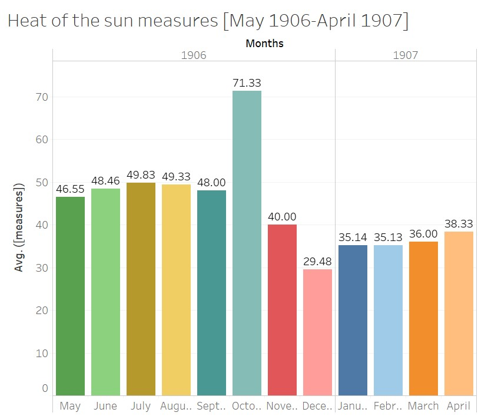
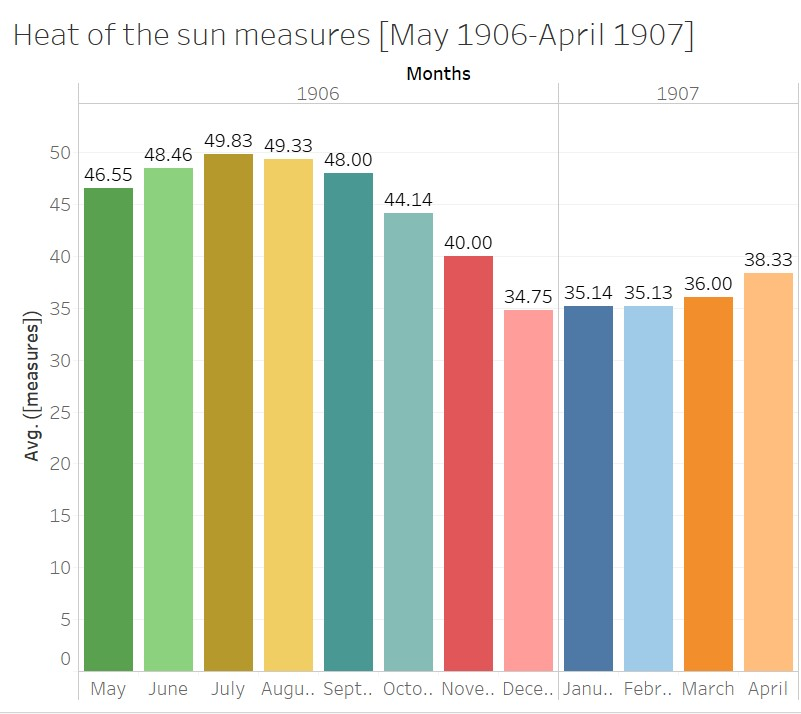

### Introduction

The effect of climate change on the environment has been something of great controversy and debate in the media. This uncertainty regarding the topic sparked an interest in our group and that was to find the validity of these claims. Our ability to gather different aspects of the weather and relate them to each other was crucial in reaching the results that were acquired. In this project, the main goal is to analyze the weather and heat of the sun in Egypt from May 1906 to April 1907. The subcategories chosen will allow us to see what the impact of the heat of the sun is on subjects such as state of clouds, humidity, maximum and minimum temperatures. Most importantly, we are trying to deduce how all of these factors affect the living conditions in the country of Egypt. The main questions that will be answered is how the heat of the sun varies from May 1906 to April 1907 and how this impacts the humidity, state of clouds, average temperature of Alexandria, and maximum and minimum temperatures in other stations.  The information needed to reach our results will be gathered from the Xpath Queries that will be listed below. This information will then be presented in a bar graph created in Tableau that shows the average heat of the sun monthly and will be compared to the other aspects that affect the climate to see which one plays the largest role. From this visualization we will be able to determine the significance of the data gathered and whether the heat of the sun and other factors of climate are connected in some way or another. Lastly, the results will be placed in historical context to see the importance of the results gathered and whether or not they are supported by the articles we have chosen.

### XPath Query

For my query, I wanted to pick something that yielded good enough results regarding the Heat of the Sun measures in which we can properly use it in our research, so we've come up with this. XPath Query: `//table[@xml:id="deg-ta-dawr01"]/row[matches(.,'heat of the sun', 'i')]/cell[2]/measure/text()`. In my query, I am limiting the results to only include those from the Daily Weather Report table, as with its corresponding ID. Once I've restricted it to the daily weather report, I needed to restrict it further to just the heat of the sun which I did here. I've noticed in some of the issues that some people capitalize the phrase "Heat of the sun" in various ways, so I made it case insensitive with the matches command. This query yielded 120 items, a lot more than what I had expecting and enough results for me to use research on however there were some discrepancies. In the earlier years, 1905 to mid-1906, there weren't many holes and the data was pretty dense however as I began looking at the results past that, the data begins to thin out, making it hard to use the data. There are many different reasons why this might be. As ironic as it sounds, maybe the 'Daily Weather Report' never actually reported daily, or the students that had the days in which the data was missing never did them, there are several possibilities. As a result, I needed to restrict the timeframe of my research. My initial intent was to explore the heat of the sun index across all years however the data given made it near impossible to do that. Because of this, I've decided to restrict it to 1 year, where the data works best in and that was from May 1905 to April 1906.

### Data Visualization

Now that I have my query results, I needed to take my results and make a visualization out of it. Because my data was dense in my specified timeframe, doing an average of each month was the best thing to do in order to give a visualization of what my data represents as the sample size was large enough to accurately depict the indexes for each month. After putting the results in a spreadsheet, transferring it to Tableau, and averaging the measures per its corresponding month I've come up with this:

Although the visualization here is good, as it gives a good initial representation of the heat of the sun averages for each month, as you can tell the graph spikes in October 1906 and sinks in December 1906. As a result, I began to find out why this is happening and noticed that it was an error in the data source. In one of the days for October, the measure was 452, blowing the average way out of proportion. Likewise, with December, a day had a measure of 8, lowering the average. This wasn't too big of a deal as we are only dealing with averages. Simply excluding the two days with the incorrect measures is all I needed to do in order to make the graph accurately representable of what we are trying to research, so that is what I did. After doing this, the graph looks like this: 

As you can tell, the data flows much better as the months go by. The visualization almost depicts a sinusoidal function as time goes by, where the averages of the heat of the sun peaks in the summer months and flows smoothly until it troughs into the winter months.

### Significance of the Data

The “Daily Weather Report” in the “Egyptian Gazette” gives readers information about the weather for the upcoming day. There are many different columns which describe various sections that relate to the weather like humidity, force of the anemometer, maximum and minimum temperatures, and most importantly, heat of the sun. When looking at the heat of the sun data, it is clear that there is significance behind it. The topic itself is odd; when we look at the weather forecast these days, there is no “heat of the sun” column. We focus on the maximum and minimum temperature for the day and if necessary, the probability of rain. Thus, this begs the question as to why readers of the “Egyptian Gazette” would want to know the heat of the sun for every single day. One reason for this may be that readers would want to know how the sun is heating the earth. The heat of the sun and the temperature are two different thing; the heat of the sun demonstrates how much the sun is heating up the earth, while the temperature shows how hot or cold it is on a specific day. The heat from the sun tends to stay in the ground for a while, and the more sun exposure that the earth gets, the warmer the earth feels. When looking at our data from May 1906 to April 1907, one can tell that the heat of the sun fluctuates throughout the course of the year. The graph shows steady growth during the summer months, reaches its peak during July, and eventually evens out when it comes to the winter and spring months.  Looking at this graph, one can see that the heat of the sun was significantly  higher during fall and summer when compared to the winter and spring months. Particularly, the heat of the sun measures do not start to decline until October and November, two months not commonly known for their excessive heat. However, it can be determined that the reason behind this, is because the earth is moving away from the sun, but all of the heat is still left over from the summer months. It is like how the longest day of the year occurs during the summer solstice, but the hottest day occurs during end of July and early August.  This data is significant because it gives readers a better insight into the heat of the sun in Alexandria, Egypt from 1906-1907. Not a ton of research is published that shows how the heat of the sun changes during the early 1900’s. The “Egyptian Gazette” provides us and other readers or researchers with additional information that was recorded firsthand. 

### Historical Context

As the group decides to dig deeper into the Egyptian Gazette issues, weather patterns around the country in the early 1900s make themselves pretty obvious. Although all that can be done on our half is make predictions about why that is so and how the future can be affected, there are luckily an abundance of secondary sources that use previously gathered weather data from parts of Egypt during this same time frame. A specific article that was found discusses the temperature change in the Nile Delta compared over three different eras: 1900-1947, 1950-1981, and 1982-2010. The article is linked [here](https://www.researchgate.net/publication/303018027_Temperature_trend_over_Nile_Delta_Egypt_during_20th_Century) for reference. It takes measurements from three of Egypt’s busiest ports, those being Cairo, Port Said, and the Port of Alexandria. A lot of the data that we found to exist in the newspaper issues goes along with the data provided in this article, which draws many interesting conclusions. In a historical sense, the winter of 1904 was a particularly dry season for Egypt in comparison to years past and prior. This means the transition into spring and summer would probably be more difficult with less moist soil, making it hard to harvest food. This would further explain the lack of ads included in the Egyptian Gazette issues during the spring months of 1904 because of the drought that occurred the winter prior. As technology advanced in cities like Alexandria, the question of how real global warming became popularized. People began to worry about how transportation would continue to make life more efficient, and how individuals would obtain shelter and food to feed their families with. The overall results concluded in the newspaper issues over time and other data surrounding similar topics found in primary sources test the validity of climate change on the state of Egypt. Correlating different components of Egypt’s climate with their personal statistics can tell the audience about what to expect for Egypt’s future and how to best prepare for it. 

### Research Remarks

After doing this research, there were a few remarks that I would like to point out regarding the accuracy of a given data element and how that can ultimately skew your research. Initially, as I began constructing my XPath Query, as I've discussed before, the data isn't always perfect. The query did not yield results for every single day in all 3 years. The results were dense in the earlier years but as time went by, that data began to thin out, making it very difficult to pick apart data that can accurately represent what I am trying to research. Even though the data that was presented, yielded, some of the measures were wrong, due to human error. For me, as I was dealing with averages across each month, the human error threw my data visualization off-proportion, in which I had to change. I am by no means saying that these digital methods of acquiring data are bad. In fact, the ability to use a query to yield results from various newspapers over several years is very efficient. However, a weakness of researching through digital methods is that the data presented isn't always accurate, questioning the validity and accuracy of the research itself. Furthermore, the data could be missing, also highlighting the inaccuracy of the data element.