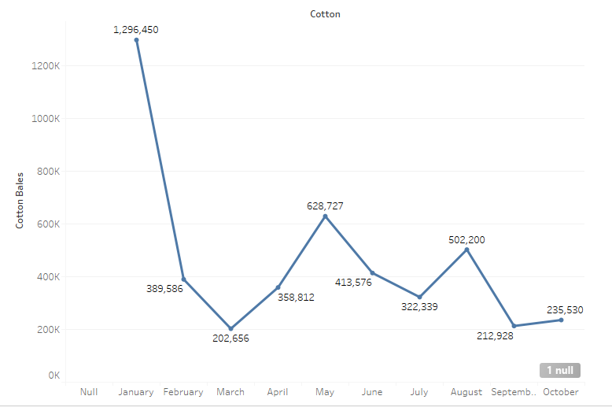
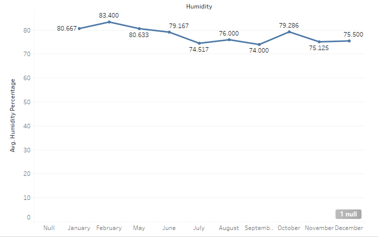
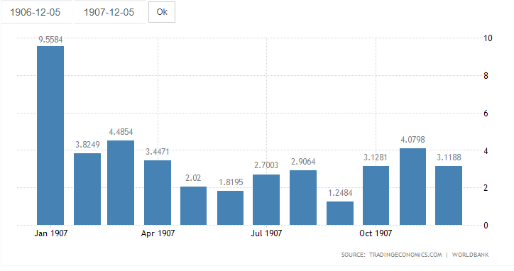

Humidity in and of itself does not have a strong correlation to cotton yields due to the fact that humidity by itself does not affect cotton. Germination of a cotton seed and the subsequent sprouting and ripening of that seed cannot be affected by the air’s relative humidity. The only thing that could possibly be affected by humidity if the quality of the cotton. For example, if the cotton was soaked through due to the humidity and therefore lost some of its inherent integrity as a fiber. However, humidity does in fact inform the analyst of one thing and that is whether there was rainfall and how frequently that rainfall was taking place. According to [Smart Fog]( https://www.smartfog.com/how-rain-and-humidity-connected.html) “When it rains, it will increase the relative humidity because of the evaporation. The air where the rain is falling may not be completely saturated with water vapor. However, the longer it rains, the more the humidity will increase because of the air constantly drawing the water.” Using this knowledge inferences can be made about rainfall as humidity increases across a certain time period and in turn see rainfalls effect on cotton yields. This roundabout, estimative way of seeing how rainfall affects cotton yields is necessary due to the fact that there is minimal rainfall data throughout the Egyptian Gazette so far as people have either not entered it in or left the template as it was. However, using this method there can at least be some inference about rainfall and its amounts and effect on cotton yield using secondary sources to add where the estimate lacks.

According to data gathered through Xpath queries executed on the Egyptian Gazette content repository which queried the tables that contained figures for cotton exports and recorded the sums found in each issue pairing them to the dates that they were found, Cotton yields were the highest in January. So high in fact that the amounts recorded outstrip the second highest value by more than twice that values amount. This implies that humidity and in turn rainfall was at optimal levels which according to [Organic cotton](https://www.organiccotton.org/oc/Cotton-general/Plant-and-fibres/Plant-requirements.php) is about 500mm of water between germination and boll formation. Yields then begin to fall to their lowest recorded in March but then rise to more than triple that amount by May. They then fall to almost half of May’s yields by July but almost rises back to May’s amounts in just one month in August but then fall by even lower than half in just one month to September. The least drastic difference occurs between September and October where compared to the other months it’s just a small rise in cotton yields.

Data gathered through the same method used to find data on cotton yields on humidity yielded much less exciting results as the average humidity throughout the months looks much different than the cotton yields. However, data can still be extracted from the results gathered. The graph shows a relative decrease in the average humidity from January to July and a relative increase from July to October. The humidity then begins on a decrease again from November to December which can be inferenced to be part of the relative decrease from January to July.

According to [trading economics](https://tradingeconomics.com/egypt/precipitation) , which is an online platform that provides historical data, economic forecasts, news, and trading recommendations across 196 countries, the relative increase and decrease of precipitation in Egypt in 1907 corresponds with the relative increases and decreases in humidity as shown in the humidity percentage graph. This supports the theory that by measuring the humidity fluctuations over each month it can be estimated whether it is raining more or less in a specific time period. Through both the graph of rainfall and the graph of humidity it can be inferred that relative rainfall was decreasing from January to July and increasing from July to October. Comparing this with the cotton exports graph shows very little correlation between cotton exports and humidity. The turning points of the cotton exports graph and the relative decreases and increases found in the humidity and rainfall graphs do not line up very well in the slightest. This suggests that either humidity and rainfall in Egypt don’t affect cotton growth very much or the way that the data itself is flawed in some way. This could be further investigated by making sure every humidity and cotton export value in every table analyzed is correct when compared to the page images the date is supposed to be taken from and/or doing the same for rainfall and correcting every rainfall value to see If rainfall may be different than what was found on [trading economics](https://tradingeconomics.com/egypt/precipitation).
