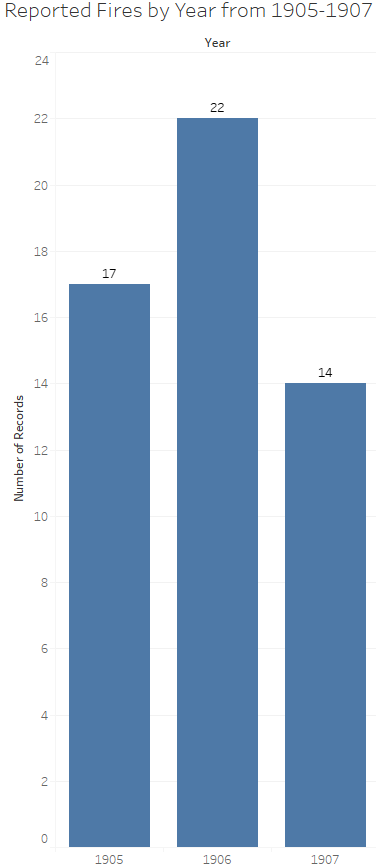
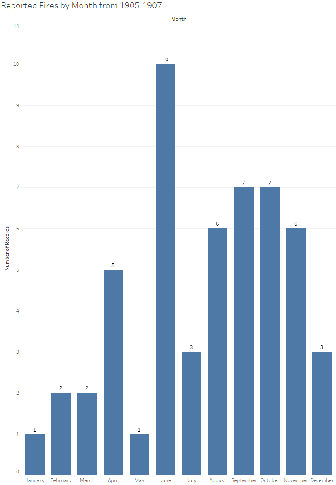

The purpose of my project is to analyze fire accidents reported by the Egyptian Gazette and find patterns in the months and years that they occurred in. I also tried to uncover how proficient the fire brigade was at the time and determine if the losses from these fires were partly a result of inadequate preparedness. To accomplish these tasks, I first searched the Egyptian Gazette repository using the XPath query //p[contains(., "fire") and contains(., "accident") or contains(., "fire brigade")]. I originally searched divs instead of paragraphs, but this search yielded many irrelevant results pertaining to fire insurance and other advertisements. Searching paragraphs seemed to give much more relevant results. This yielded 58 results which was filtered to 53 results after removing articles on subsequent days referring to the same incident. I saved these 53 results and removed any information unnecessary to data visualization, leaving only the year, month, and day of the incident. This data was then visualized in bar graphs below representing fires reported by year and month.

In examining the first graph, the amount of reported fire accidents seems to be fairly steady across the three years. However, upon examination of the second graph, there seems to be a spike in reported fires in the month of June. This could have been the result of multiple factors, but the city of Alexandria would’ve been in the midst of summer during this month and the high temperatures associated with the season seems to be the most probable cause of the spike. There also seems to be a relative spike of reported fire accidents in the months of winter, which is likely the result of people lighting their fireplaces at night to avoid cold temperatures and from people lighting their lamps and candles more often due to less daily sunlight. These visualizations obviously don’t provide any indication of the proficiency of the fire brigade at this time, but it does accomplish my first goal of finding patterns in the data visualizations.

In order to determine the reported proficiency of the fire brigade in Alexandria at the time, I searched the repository with a much simpler XPath query: //p[contains(., "fire brigade")].

After reading the context of each result, I noticed that most results had either good or neutral remarks about the fire brigade’s proficiency. In fact, there was an entire article praising the fire brigade’s competency. Among the negative remarks was an article explaining in detail how the fire brigade (and police department) was completely unprepared to put out a fire. According to the article, the fire brigade was immediately notified of the emergency but did not show up until 2 hours after the alarm. A few policemen were present at the fire after coincidentally strolling past it but did absolutely nothing about it until 30 minutes after it had started. In fact, they made the situation worse by instructing men from the power company, who started fighting the fire 5 minutes after it had started, to leave the scene. Among the query results were some unexpected articles explaining how the city of Alexandria itself was ill-equipped to combat fires at the time. I read a few articles explaining how there weren’t enough fire hydrants in the city, which meant the fire brigade had to attach their hoses to the hydrants from long distances before they could start fighting the fire. There were also articles stating that the roads were blocked by trees, rocks, and other debris that the fire engines couldn’t pass through. At the time, the city of Alexandria was in the process of constructing granite roads in place of their previous dirt ones. The road closures associated with this construction could have inhibited the movement of the fire engines, but an article by the Mediterranean Historical Review presents another road issue. According to the article, Scraping the surface: the techno-politics of modern streets in turn-of-twentieth-century Alexandria, “In wintertime the city’s dirt roads would become so muddy that pedestrians and beasts of burden had trouble advancing, and wheeled vehicles could hardly move at all.” This would have greatly inhibited the fire brigade’s ability to do their job and would have been made worse as the winters seemed to experience a greater frequency of fires as explained above.

After examining the data collected, I concluded that the fire brigade demonstrated great performance in most reported circumstances. There were some articles explaining where they fell short, but that can be said of any governmental organization. The major problem at the time seemed to be inadequacy of roads and equipment rather than the fire brigade itself. From the perspective of civilians living in Alexandria at the time, the fact that their fire brigade was skillful at what they did must have been led to a peace of mind, reassuring that a fire would be swiftly dealt with whenever one arose.

Analysis on this topic could be improved in the future by compiling fire accident reports from multiple newspapers in the city of Alexandria into data visualizations similar the ones above. However, this method may come with inaccuracies as it would be difficult to detect multiple newspapers reporting on the same incident, which may result in bias in the visualization towards larger incidents that more newspapers would have reported on.

## Bibliography

On Barak, “Scraping the Surface: The Techno-Politics of Modern Streets in Turn-of-Twentieth-Century AlexandriaPreview the document,” Mediterranean Historical Review 24, no. 2 (December 2009): 187–205.
