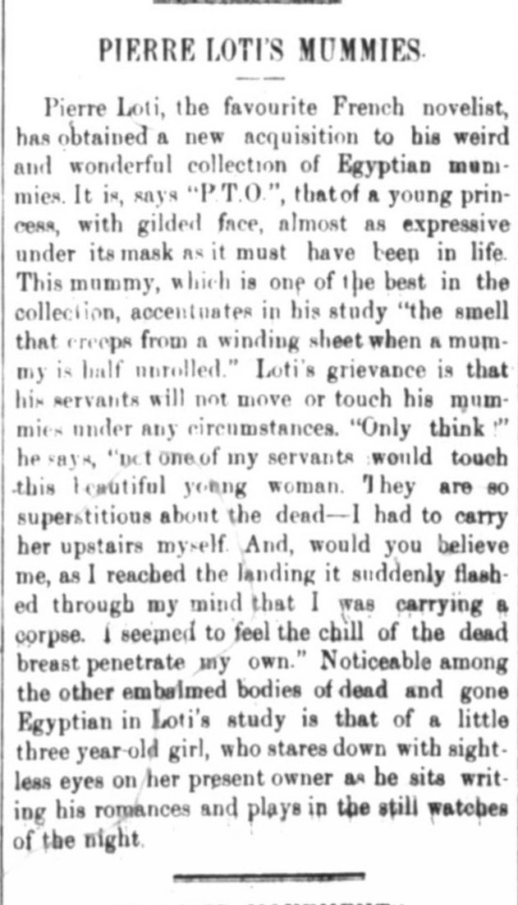

Nothing screams excitement more than finding a new *Mummy* to add to your cherished collection. Well, at least this is the case for novelist Pierre Loti who seems to have struck gold in the next piece of his mummy collection. Yes, you read that correctly. Pierre Loti possessed a collection of ancient Egyptian Mummies. This new mummy is said to hold a young princess and Loti claims it is one of the best in his collection, but never explains in what way. Best preserved? Best wrapped? Either way, Mr. Loti seems to be excited about his find. In Loti’s book *La mort de Philae*, he records his visit to Egypt and the Museum of Antiquities in Cairo as can be seen [here](http://anubis4_2000.tripod.com/subpages1/Loti.htm).   

Pierre Loti was born in 1850 in Rochefort, France. His birth name is Louis Marie-Julien Viaud with Pierre Loti being his pseudonym. He was raised in a very religious family, reading the Bible every day and originally aspiring to become a pastor. His career path changed as he desired to adventure around the world. More information about Loti's upbringing can be found in [this](https://www.museeprotestant.org/en/notice/pierre-loti-1850-1923-2/) article.

Superstitions run high in Egypt during this time and touching the dead is a big no. With religion being a focal point in Ancient Egypt, mummification was believed to be a way to preserve the body for resurrection as described by [this](https://www.historymuseum.ca/cmc/exhibitions/civil/egypt/egcr06e.html) article. A [Blog post ](https://dig-eg-gaz.github.io/post/18-blog-richardson/) by Claudia Richardson mentions that the dead were buried with an abundance of food for the afterlife. Gwen Lofman in her [Blog Post](https://dig-eg-gaz.github.io/post/2016-10-29-egyptology/) titled *Egyptology & Archeology* mentions how the newspaper served as a medium to share the discovery of these mummies. Loti explains how none of his servants would lay their hands on the body, which resulted in Mr. Loti having to transport it himself. Only when he arrived upstairs with the mummy did he realize he was holding on to a corpse. Either way, he added it to his study just as a kid would add a trophy to his trophy case and went along with his day. A typical day apparently in the life of Pierre Loti. Now if all this didn’t give off enough of an ominous vibe, right by Mr. Loti’s desk in his study resides the mummy of a three year old girl who watches as Loti writes. What an awkward study date that must be.

