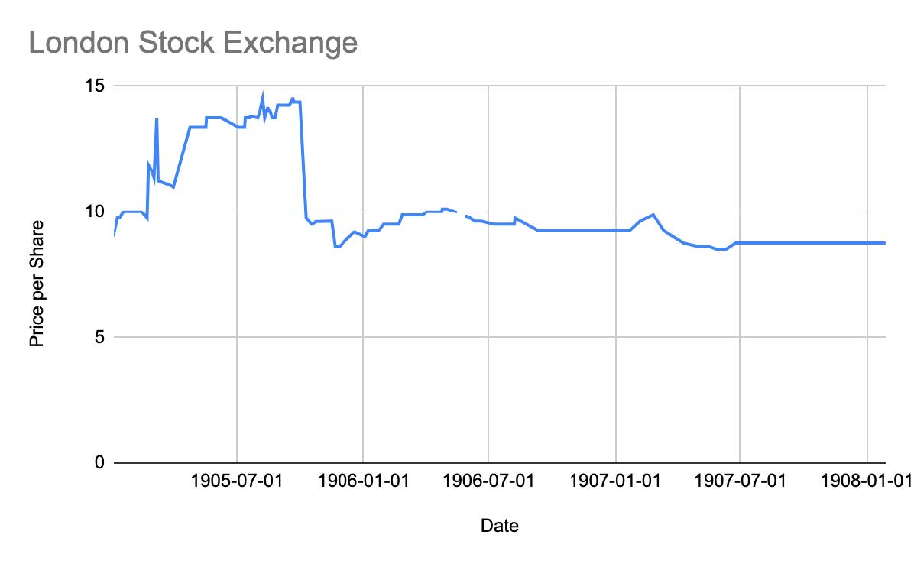
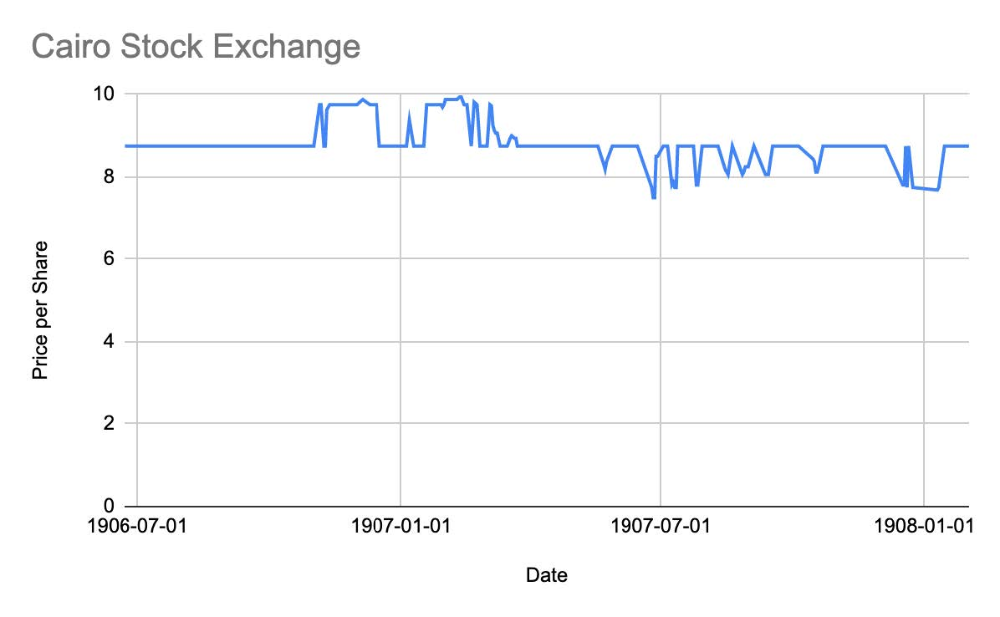

The idea of Agricultural Banks, facilitated through government tax collectors to distribute loans, originally started in the early 1880s in India. Lord Cromer, a prominent figure in Egypt’s economy, was originally pitched this idea by William Wedderburn while “serving in India as Finance Member of Lord Ripon’s government”. Lord Cromer was fond of the idea and pitched it to the Government of India, however, they rejected the idea. Lord Cromer then carried this idea to the Egyptian Government, where they finally established the “Agricultural Bank of Egypt in May of 1902”. The idea proved to be promising as it initially attracted a lot of investors as well as clients (Jakes).

My project aims to analyze the movement of the Agricultural Bank stocks on the different exchanges listed in the Egyptian Gazette. I mainly focus on the [London Stock Exchange](https://dig-eg-gaz.github.io/issues/templates/#london-stock-exchange): “Agricultural Banks” and the [Cairo Stock Exchange](https://dig-eg-gaz.github.io/issues/templates/#bourse-du-caire): “Agricultural Bank of Egypt”. To gather this data, I originally used the following Queries to locate my desired data:
-	`//div[@xml:id="deg-el-bduc01"]/table[1]/row[3]/cell[3]/measure`
-	`//div[@xml:id="deg-el-lsex01"]/table[1]/row[3]/cell[3]/measure`

While these queries located some of my data, it was evident that along the line there was a template change in both stock exchanges which led to inaccurate data. In order to combat, this I updated the following queries:
-	`//div[@xml:id="deg-el-lsex01"]/table[1]/row/cell[contains(., "Agricultural Banks")]/following-sibling::cell[1]/measure`
-	`//div[@xml:id="deg-el-bduc01"]/table[1]/row/cell[contains(., "Agricultural Bank of Egypt")]/following-sibling::cell[1]/measure`

This updated query gave me more accurate data, however, it was clear from the repeated values that a lot of the issues included the templated value and not the issue's actual value. In order to combat this, I had to double check the microscanned pages and manually fill in some values.

The upward trends in the graph could be facilitated through a multitude of reasons. The first being the initial upward trend could be a result of the reaction of the public to the newly created agricultural banks. As explained by Aaron Jakes, “Its mortgages at 9% interest seemed to offer the bank’s clients an appealing alternative to existing forms of local moneylending” (Jakes). Additionally, the influx of foreign money coming into Egypt propelled a lot of land owners into participating in one of Egypt's main agricultural exports at the time, cotton. Agricultural Banks established by Lord Cromer seemed to be an easy way into the agricultural industry. 

The downward trends can be explained by the apparent problems with the Agricultural Bank's structure as well as environmental problems during the early 1900s. While the foreign capital influenced landowners to enter the industry, the majority of the foreign money flowed directly into the pockets of wealthy landowners in the industry. Additionally, the foreign money also “drove down the profitability of loans against agricultural land and produce” (Jakes). The main driving force in the downward trends would be a result of the “cotton worm”. The cotton worm not only destroyed cotton seeds but also weakened the soil quality on which cotton was grown, decreasing yields. This caused people to stay out of the industry driving the Agricultural Bank’s stocks downwards.

### Source
Jakes, Aaron. _Egypt’s Occupation: Colonial Economism And The Crises Of Capitalism_. Stanford, California: Stanford University Press, 2020.