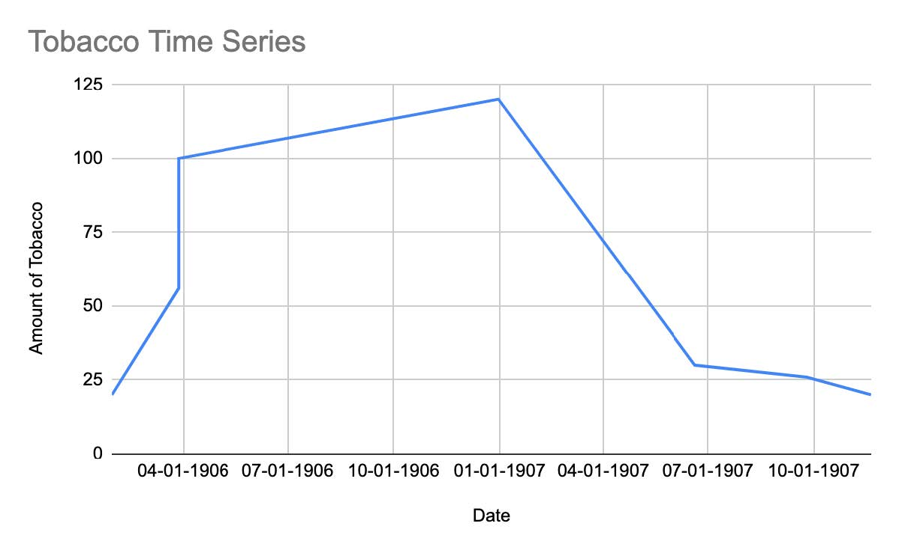
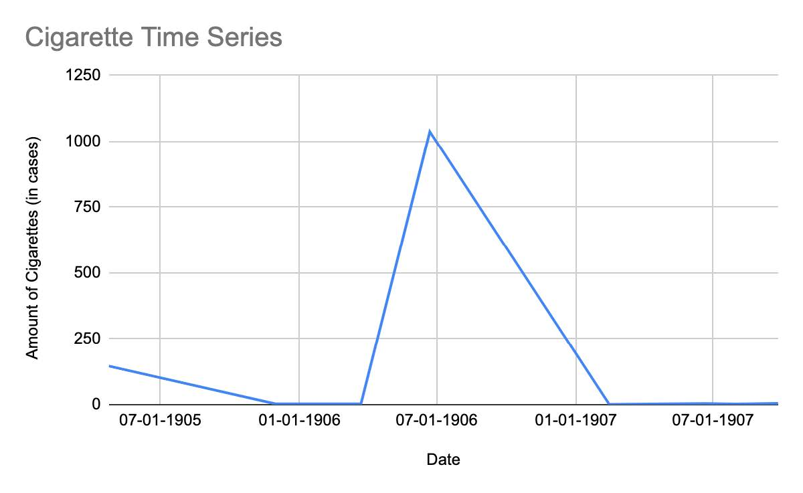
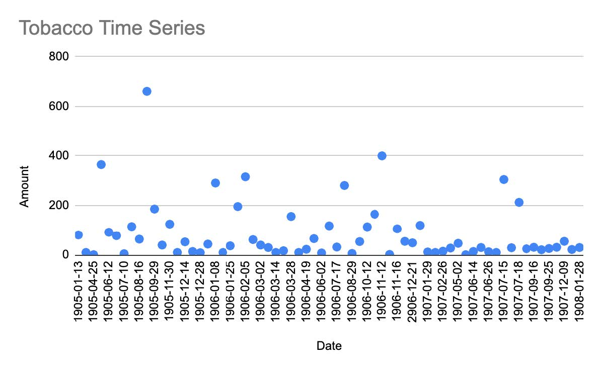
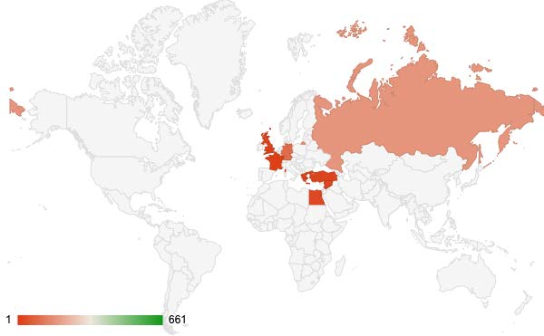

### Background

Throughout the mid-19th century, tobacco consumption began to gain popularity through the Ottoman Empire and Egypt. The tobacco industry thrived in Egypt alongside the “development of industrialized agriculture cash crops,” and Egypt was known for exporting luxury cigarettes around the world. Beginning in 1860, the Ottoman Empire’s state monopoly on tobacco only awarded Greek and Ottoman tobaccomen the right to cultivate tobacco (Shechter). This led to the expansion of the cigarette industry with the arrival of more tobaccomen from Greece and the Ottoman Empire, with the emergence of large-scale cigarette factories from previously smaller made-to-order tobacco stores. Eventually, in 1903, the Egyptian government adds a separate cigarette section to the annual foreign commerce reports (Shechter).

### Research

The initial research question I set out to analyze examined the cigarette and tobacco exports from Alexandria to Constantinople listed under the “Export Manifests.” From using the following queries:

- `//div[@feature='exportManifests']//p[contains(., 'CONST')]/following-sibling::p[1]`
- `//div[@feature='exportManifests']//p[contains(., 'CONST')]/following-sibling::p[2]`
- `//div[@feature='exportManifests']//p[contains(., 'CONST')]/following-sibling::p[3]`

I was able to find several data points under the Export Manifests feature containing the letters “Const” (for Constantinople), and that were in the paragraphs immediately, two, and three after the word “Const.”
From the table below, it is evident that there were not enough available data points to draw conclusions or analyze the data available for larger patterns or trends.

| **Date**   | **Amt  of  Tobacco**    | **Destination**      | **Co.**                |          |
| ---------- | ----------------------- | -------------------- | ---------------------- | -------- |
| 01-29-1906 | 20                      | Syria  &  Const      |                        |          |
| 3-28-1906  | 56                      | Piraeus  &  Const    |                        |          |
| 3-28-1906  | 100                     | Const                |                        |          |
| 12-31-1906 | 120                     | Syria  &  Const      | Cie  Nav  Helienique   |          |
| 06-20-1907 | 30                      | Port  Said  &  Const |                        |          |
| 09-25-1907 | 26                      | Const                |                        |          |
| 11-20-1907 | 20                      | Const                |                        |          |
| **Date**   | **Amt  of  Cigarettes** | **Destination**      | **Co.**                | **Unit** |
| 04-24-1905 | 146                     | Piraeus  &  Const    |                        | cases    |
| 11-30-1905 | 3                       | Const                | ED  Protapapas  &  Co. | cases    |
| 03-23-1906 | 3                       | Syria  &  Const      |                        | cases    |
| 06-22-1906 | 1,037                   | Piraeus  &  Const    |                        | baskets  |
| 02-14-1907 | 1                       | Const                |                        | cases    |
| 06-20-1907 | 4                       | Port  Said  &  Const |                        | cases    |
| 08-01-1907 | 2                       | Const  and  Rhodos   |                        | cases    |
| 09-25-1907 | 5                       | Const                |                        | cases    |

After conducting a new query that looked at just tobacco exports from the Export Manifests feature, I was able to gather a much wider time series, as follows.

| Date       | Amount | Destination          |
| ---------- | ------ | -------------------- |
| 1905-01-13 | 81     | Syria                |
| 1905-03-03 | 10     | Port Said/Syria      |
| 1905-04-25 | 1      | Malta                |
| 1905-04-27 | 365    | Port Said/Syria      |
| 1905-06-12 | 92     | Port Said/Syria      |
| 1905-07-05 | 78     | Port Said/Syria      |
| 1905-07-10 | 5      | Malta/Liverpool      |
| 1905-08-04 | 115    | Port Said/Mersina    |
| 1905-08-16 | 64     | Mersina              |
| 1905-08-23 | 661    | Port Said/Syria      |
| 1905-09-29 | 186    | Syria                |
| 1905-11-02 | 40     | Port Said/Syria      |
| 1905-11-30 | 125    | Syria                |
| 1905-12-01 | 10     | Rotterdam/Hamburg    |
| 1905-12-14 | 53     | Marseilles           |
| 1905-12-18 | 14     | Syria                |
| 1905-12-28 | 9      | Syria/Const          |
| 1906-01-05 | 44     | Port Said/Syria      |
| 1906-01-08 | 291    | Syria                |
| 1906-01-10 | 10     | Crete                |
| 1906-01-25 | 17     | Malta/Hamburg        |
| 1906-01-25 | 20     | Syria/Const          |
| 1906-01-29 | 176    | Syria/Odessa         |
| 1906-01-29 | 20     | Bremen/Rotterdam     |
| 1906-02-05 | 316    | Port Said/Syria      |
| 1906-02-21 | 62     | Syria                |
| 1906-03-02 | 40     | Syria                |
| 1906-03-12 | 30     | Malta/Hamburg        |
| 1906-03-14 | 10     | Port Said/Syria      |
| 1906-03-22 | 17     | Not specified        |
| 1906-03-28 | 56     | Piraeus/Const        |
| 1906-03-28 | 100    | Const                |
| 1906-04-11 | 10     | Syria                |
| 1906-04-19 | 23     | Syria                |
| 1906-05-17 | 7      | Crete                |
| 1906-05-17 | 59     | Syria                |
| 1906-06-02 | 8      | Syria                |
| 1906-06-08 | 118    | Syria                |
| 1906-07-17 | 32     | Brindisi and Trieste |
| 1906-08-02 | 281    | Syria                |
| 1906-08-29 | 6      | London               |
| 1906-08-31 | 54     | Port Said/Syria      |
| 1906-10-12 | 95     | Malta/Hamburg        |
| 1906-10-12 | 19     | Syria                |
| 1906-10-25 | 165    | Syria                |
| 1906-11-12 | 400    | Syria                |
| 1906-11-15 | 2      | London               |
| 1906-11-16 | 106    | Syria                |
| 1906-12-12 | 55     | Piraeus/Odessa       |
| 2906-12-21 | 49     | Syria                |
| 1906-12-31 | 120    | Syria/Const          |
| 1907-01-29 | 12     | Syria                |
| 1907-01-31 | 10     | Port Said            |
| 1907-02-26 | 15     | Malta/Liverpool      |
| 1907-02-28 | 28     | Marseilles           |
| 1907-05-02 | 47     | Syria                |
| 1907-05-29 | 1      | Port Said            |
| 1907-06-14 | 14     | Marseilles           |
| 1907-06-20 | 30     | Port Said/Const      |
| 1907-06-26 | 13     | Marseilles           |
| 1907-07-08 | 10     | Crete                |
| 1907-07-15 | 305    | Malta/Liverpool      |
| 1907-07-16 | 29     | Syria                |
| 1907-07-18 | 213    | Syria                |
| 1907-07-24 | 25     | Syria                |
| 1907-09-16 | 31     | London               |
| 1907-09-18 | 21     | Crete                |
| 1907-09-25 | 26     | Const                |
| 1907-11-20 | 10     | London               |
| 1907-11-20 | 21     | Const                |
| 1907-12-09 | 55     | Port Said            |
| 1907-12-24 | 22     | Piraeus/Odessa       |
| 1908-01-28 | 30     | Port Said            |

This new time series will allow me to try to examine trends in tobacco exports by data and by the final destination of the exports.

## Data Visualization

The results from my initial query were hard to analyze, again, due to a lack of data. When used to visualize changes in exports, it is not possible to draw any conclusions.

The results from the new query provide a better picture of what tobacco exports looked like from January 1905 to January 1908.

These two charts show the amount of tobacco export over time (Chart 1) and the density of tobacco exports by final location (Chart 2).

Another avenue of research that required further research was the quantity of cigarettes exported to Germany. The Shechter paper mentions Germany specifically as a top imported of Egyptian luxury cigarettes but does not provide any details further than noting that exports to Germany “dropped sharply after 1905 as a result of new tariff barriers” and that Germany was a “significant importer until 1914” (Shechter).

## Conclusion

Even after expanding the query to all available tobacco exports, it is still difficult to draw any conclusions regarding export patterns. There’s no clear trend as far as destination city or seasonal trends in where the tobacco is exported to. Furthermore, it was not possible to expand my query in this way by looking at cigarette exports because there were so many results; however, there were fewer entries under tobacco making it possible to extrapolate the numbers manually.

## Works Cited

Shechter, R. (2003). "[Selling Luxury: The Rise of the Egyptian Cigarette and the Transformation of the Egyptian Tobacco Market, 1850-1914](http://www.jstor.org/stable/3879927)". _International Journal of Middle East Studies_, 35(1), 51–75. 