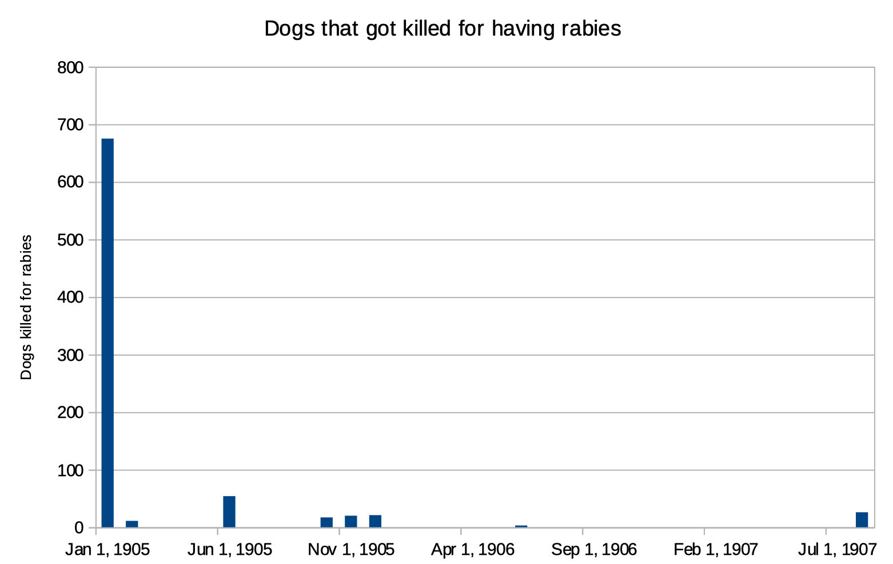

Rabies is caused by a RNA virus, by a number of animal. Rabies virus infects the central nervous system, resulting in death in infected human. Globally, the risk of rabies for humans is great in areas of the developing countries where rabies is common. Rabies can lead the animal into paralysis. Another thing is it sometimes causes an animal to lose its fear to humans. However, when humans, get rabies, their symptoms start out with simple headaches and fever and later progress to terrible things such as becoming hydrophobic because of painful throat spasms and paralysis. The virus is transmitted thru the bite and virus containing saliva of an infected animal. 

So much has been said and written about the Cairo police in the Egyptian newspaper. The Cairo police has brutally treated poorly the dogs. Dogs back in 1905 were not commonly thought of as dearly as people do now in days. However, since 1905, Alexandria experienced a volume of dogs having rabies. The Cairo police, have without previous motive or permission, sent down there to kill the dogs and poisoned any dog that is on the station or the streets irrespective of ownership or whether the dogs were "pariah." The action has caused some dissatisfaction prevention to animal in Cairo when it was happening. In addition,  due to the large numbers of dogs are being poised and shot by the Cairo police in the city. The Regulations on Dogs, and have issued an order to the office that all dogs in the streets must either be muzzled or led. The muzzle must be of one of the descriptions which are to be seen at the Municipality's central sanitary office. Owners of dogs are given one moths like, until the 27th November, to conform to this regulation. Infringements after that date will be severely punished. However, the police in Cairo was killing the dogs because the rabies were infecting humans. A total of 16 deaths claims of rabies, 7 at Cairo and 4 at Alexandria. Influenza terminated fatally in 85 cases, of which 18 were at Cairo and 6 at Alexandria. There were 19 deaths from leprosy. Medinet el-Fayoum had no less than 4 fatal cases out of the total, the balance being spread in even proportions all over Egypt. Puerperal fever terminated fatally in 215 cases, of which 75 were at Cairo and 44 at Alexandria. There were 136 deaths from whooping cough, 31 at Suez, 16 at Cairo, and 3 at Alexandria. Small- pox  was responsible for 1,093 and measles for 5, 260 deaths. Diphtheria was very fatal out of 586 fatal cases for all Egypt. 

| Date         | Dogs killed for rabies |
| ------------ | ---------------------- |
| Jan 17, 1905 | 675                    |
| Feb 17, 1905 | 11                     |
| Jun 26, 1905 | 54                     |
| Oct 27, 1905 | 17                     |
| Nov 29, 1905 | 20                     |
| Dec 24, 1905 | 21                     |
| Jun 20, 1906 | 3                      |
| Aug 2, 1907  | 26                     |

After doing searches about dogs in particular, there were not much articles that came up about how many dogs cot killed by the Cairo police for having rabies. While there are other blog posts about different animals and dogs, I saw few records of dogs getting killed for having rabies. I ran multiple XPath’s to be able to have a little chart explaining how many dogs the Cairo police killed from 1905 all the way to 1907. In each issue the Egyptian Gazette that was analyzed from my week there was one about “The Cairo Police” which for me was very interesting it was a subsection that fell below the general as well as the local portion of the paper. I started to work with the Cairo police article but honestly nothing seem interesting for me until I started reading about how the police was killing ownerless dog. This lead to the question Why are dogs getting killed by the Cairo police? To search through the digital Egyptian gazette at first was really hard to really look what was the actual idea of why the dogs were getting killed . In particular, I started using `//div[@type="section"]/div/p[contains(., 'dog')]` which brought me to the general and local section but for me that was not enough there is where I started reading that back In the early 19th century Egypt was filled with cases of dogs having rabies leading to the police killing them. Later on I started to look at rabies, Cairo dogs, police, registration of dogs, and rabid. Doing a search of `//div[@type="section"]/div/p[contains(., 'dog rabies')]`. This gave me an estimate of how many dogs the police of Cairo were killing since 1905 all the way to 1907. While doing this analysis project and doing research in the digital Egyptian Gazette I end up to the conclusion that stray dogs were never really under control as much as many dogs were killed and poison more continue to come. After that a regulation came that all dogs needed to be register with a collar that had a “metallic plaque” with a registration number. If the dogs were found without a registration number they were keep the dog for 5 days and then the police will poison them or killed them. For me this analysis project was challenging at first but realizing all the information that I learned from this was great. In conclusion, Egypt had a horrible case of those being stray because of this problem the city later on had rabies that were killing a lot of people leading to the police either poisoning the dogs or killing them since they had rabies and their difficulty to cure it. 