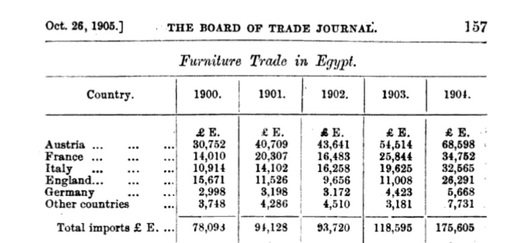
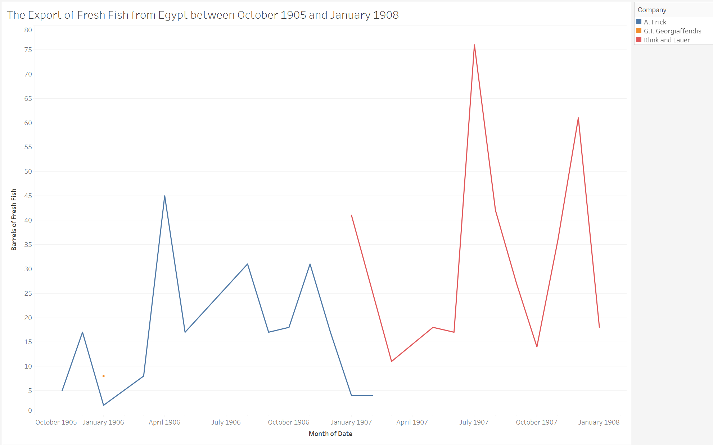

The nineteenth century was clearly defined as an age of empires as great European powers colonized the globe and extended their vast influence through trade or other means. While the Austro-Hungarian Empire wasn’t significantly involved in the Scramble for Africa or other colonial endeavors, the aging empire did still actively exert influence outside of Europe. Egypt was one of those nations where their presence was felt at the turn of the twentieth century, and this can be attributed to multiple factors. The first major reason for this influence was that in important Egyptian cities like Alexandria, Austro-Hungarians made up the fifth largest European community by 1905.[^1] As well, Austro-Hungarian currency was heavily present and widely used in Egypt and the Middle East as they produced the Maria Theresa Dollar which was a global currency as it traveled from Austria through the Ottoman Empire where it became engrained in African and Middle Eastern societies.[^2] The final reason for Austria-Hungary’s influence in Egypt was its exports and imports with the nation. In this analysis I will only be analyzing the significance of these trade relations, and through Austria-Hungary’s trade of furniture goods to Egypt and its trade of fresh fish from Egypt it’s evident that Austria-Hungary did have a significant presence in Egyptian society.

To inaugurate, the major import that Austria-Hungary and Austro-Hungarian businesses contributed to Egypt was furniture such as bentwood which was fashioned into chairs and other furnishings. Bentwood was important during the 1900s because cities like Alexandria were growing every year due to Europeans moving there or touring for extended periods of time.[^3] To support the creation of new houses for these newcomers, furniture was essential, and bentwood chairs were one of those items constantly in demand as Egypt grew. Austria-Hungary was the nation best suited to take advantage of this market for furniture because of its low freight rates and the labor to make furniture in Austria-Hungary cost less to produce bentwood products than any other European nation like Britain could.[^4] The exact comparison in how much lower Austro-Hungarian prices were was that “packing, freight, insurance, and duty from Austria 25 per cent of an invoice, whilst from London these charges amount to… 35 per cent”.[^5] The result was that Austria-Hungary imported nearly 43% of all furniture to Egypt from 1900-1904. This threatened nations like Britain who wanted to expand their control of the furniture trade to Egypt so they began advertising English furniture more heavily which is evident in “The Egyptian Gazette” through articles advertising “High Class English Furniture” catalogues for the public to view and browse.[^6] This was done because English merchants knew they couldn’t compete with Austria-Hungary’s lower prices so they tried making theirs seem of a higher quality and class.

[^7]
	
Moreover, Austria-Hungary also exerted influence in Egypt through its exports from the nation because it contributed to Egyptian businesses, and one of the most significant and interesting export was that of fresh fish. I discovered there was a significant trade of barrels of fresh fish from Egypt to Austria-Hungary because I had noticed Klink and Lauer was a company that consistently exported barrels of fresh fish to Brindisi and Trieste, and through a report on the Fishing and Aquaculture Exhibition at the Milan Exposition of 1906, I discovered the company made products like sardine oil and operated out of Trieste which was a major Austro-Hungarian port.[^8] Knowing that I hoped to compare its export of fresh fish to that of the rest of the world to ascertain its influence over this trade of fresh fish, but I was very surprised to learn there were only two companies from October 1905 to January 1908 which regularly exported fresh fish from Egypt.[^9] This other company was under the name A. Frick, and interestingly he exported fresh fish to Brindisi and Trieste from 1905- February 1907 while Klink and Lauer started in February 1907 and went until 1908 exporting primarily on the exact same route. While I couldn’t find scholarly articles expressing why there was a demand for fresh fish in Brindisi or Trieste outside of the nature of Klink and Lauer creating sardine oil, I do hypothesize that A. Frick is associated with Klink and Lauer due to the same routes and how smooth the transition for exports was with only one overlap in February 1907. This monopoly of fresh fish regularly going to one place over the course of nearly two and a half years displays that there was a demand and market for the product, but due to limited mentions of fresh fish in “The Egyptian Gazette” in articles and limited outside resources mentioning that trade I’m unable to dig further.

	
To reiterate, Austria-Hungary is clearly shown to have had significance and a role in Egyptian society because of how active it was in the importing of furniture and exporting of fish. The furniture was important because Austria-Hungary was uniquely able to produce cheap furniture that enabled those moving to Egypt to buy furnishings there. The export of fresh fish was unique because they seem to possible be the only ones who monopolized on that trade which likely helped fuel a part of that industry which focused on foreign exports.

In reflecting on this project, I really enjoyed how Oxygen made it easy to quickly search for terms across all the articles of “The Egyptian Gazette”, but misspellings of company names like Klink becoming “Klenk” in several export manifests, the inconsistencies on whether the exports were called “casks” or “barrels” of fresh fish, and even whether the exports were fresh fish or just “fish” made me have to search for a lot of different key terms to put my results together. I also originally intended to compare the number of barrels of fish going to Trieste to that of the rest of the world, but because Brindisi and Trieste was the route where all this trade happened, it wasn’t needed. As well, I had the option of several exports to focus on, but I didn’t choose the Austro-Hungarian company Puntigam which exported empty casks because there were nearly 750 results for empty casks in export manifests and Puntigam only contributed 20 so it was clear that company wouldn’t display significant Austro-Hungarian influence over the trade of empty casks. And finally, it was incredibly difficult finding information on these exporters like Klink and Lauer and A. Frick so I was left with many questions about them, and the lack of an import manifest limited my options for what goods I could show Austria-Hungary contributed to Egypt.

[^1]: Carole Escoffey, “The Austro-Hungarian Community in Alexandria,” in _Alexandria was our Destiny_, (Alexandria: The Alexandria and Mediterranean 5 Research Center Monographs, 2011). XXV
[^2]: Adrian E. Tschoegl, “[Maria Theresa's Thaler: A Case of International Money](http://www.jstor.org/stable/40326061).” _Eastern Economic Journal_ 27, no.4 (2001) 444-448
[^3]: _Alexandria was our Destiny_, (Alexandria: The Alexandria and Mediterranean 5 Research Center Monographs, 2011). XVI-XVII
[^4]: _Board of Trade Journal_, Volume 51, (London: H.M. Stationery Office, 1906), 156-160
[^5]: Ibid., 157
[^6]: _The Egyptian Gazette_ (February 5, 1907) 5
[^7]: _Board of Trade Journal_, Volume 51, (London: H.M. Stationery Office, 1906), 157
[^8]: _Relazione Sulla Mostra di Pesca ed Acquicoltura all'Esposizione di Milano, 1906_, (Tipografia Francesco Marcolli, 1907) 167
[^9]: _The Egyptian Gazette_