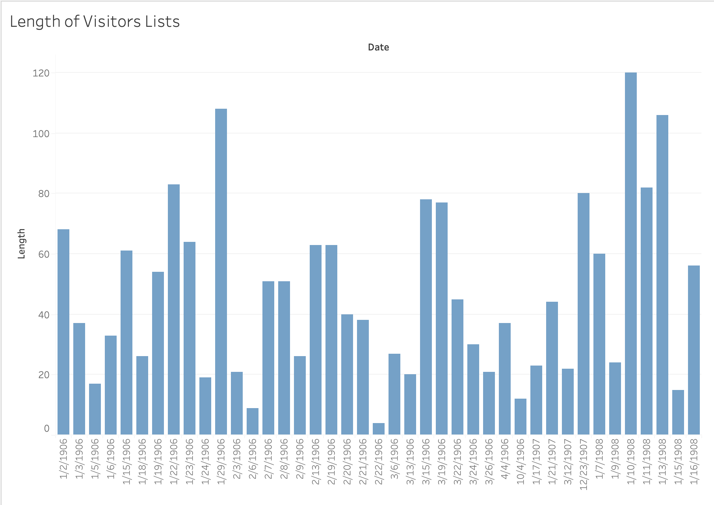
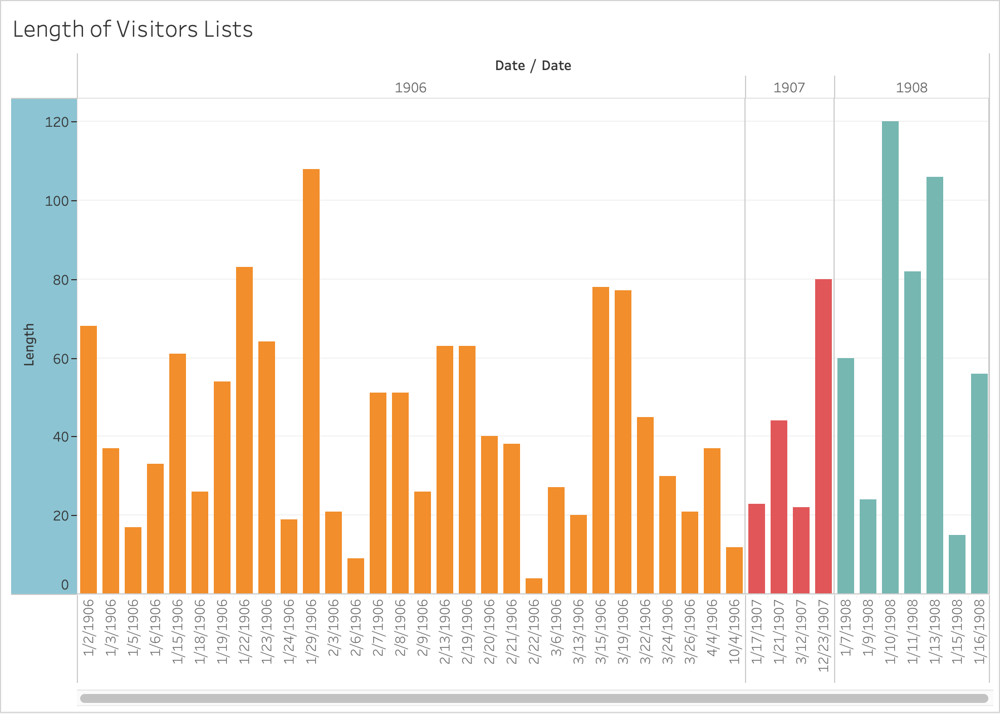
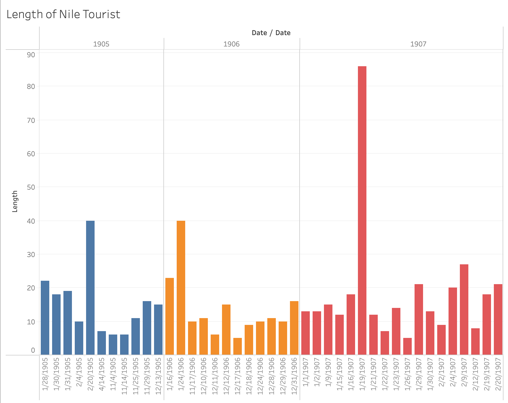

In the years leading up to financial collapse in early 20th century Egypt, a change in the number of visitors would be expected. Hard times were faced as Egypt was coming up on multiple crises. The hard times would seemingly create a change in how many people are visiting Egypt. In the early 20th century Egypt was struggling against cotton worms, disease, financial collapse, over-farming, and political instability. Given the high number of issues arising in Egypt a shift in the number of tourists and visitors on business would be expected. In addition a change in the ratio between the two groups of visitors would also be expected. After looking deeper, the data points to no obvious trend, up or down.

In "Boom, Bugs, Bust: Egypt’s Ecology of Interest, 1882–1914," Aron Jakes explores the intersection of the numerous crises in Egypt. Along with this Jakes also elaborates on how all the crises came together, amplifying each other. The dire situation faced in Egypt had many effects on everyday life in Egypt. For example Jakes discusses the employment of forced child labor. The server condition in Egypt would seemingly lower the number of visitors.

In order to gather data for a visualization of the number of visitors in Alexandria I used both the Visitors List and the Nile Tourists features. The two XPath queries I used are `//div[@type="item"][contains( . , 'VISITORS LIST')]` and `//div[@type="item"][contains( . , 'VISITORS LIST')]`. I copied the years with the start location and end location. I used the formula `=C1-B1` to give me the number of lines taken up by the section. The difference of the start and end location gives me an estimate of how many people were visiting Alexandria in comparison to other days. The numerical value of the difference has no other significance outside of the comparison. 

To visualize my findings I used multiple graphs. The first and second show the relation of Visitors List length to the date. 

The third shows the relation between the date and length of the Nile Tourists feature. 

All three of the graphs show no correlation between the progression towards the financial crisis and the number of visitors in Alexandria. The data range is wide in all four years examined. The graphs oscillate continuously. In addition to the lack of trend, the data also has major time gaps, making it impossible to estimate which years had the longest visitors list or Nile Tourists feature. After reviewing my results, it has become evident the rise of crises in Egypt did not affect tourism. From 1905 to 1908 there was neither an up or down trend in the number of visitors in Alexandria. It is possible in the years closer to 1914 there is a more visible change in tourism. 
