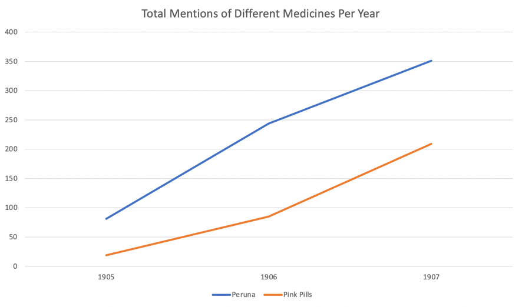
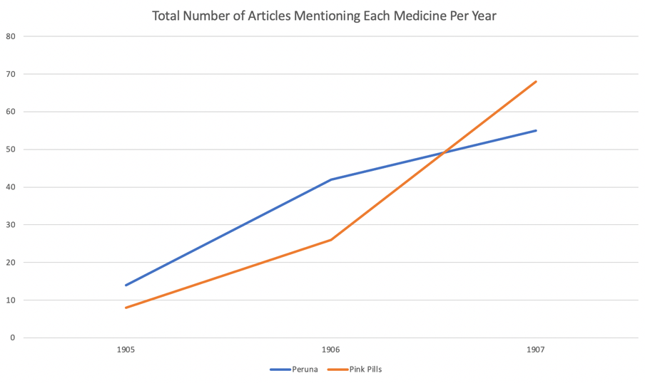
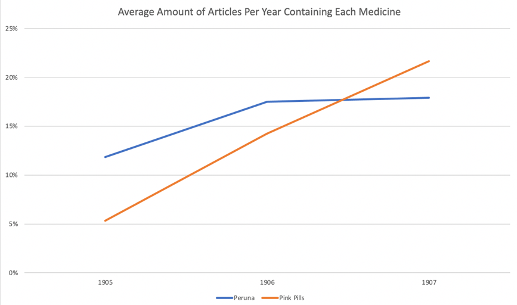

What happens when individuals, without any credentials, can make bold claims about a product and convince the public that they have the ‘miracle cure’ that can cure any disease? In a hypothetically rational society, this would be a great failure, and likely shut down very quickly as government officials would see this as a scam. However, in a time when the public is generally less skeptical of the media and more gullible towards misinformation, as a result of a lower standard of living and information not spreading around as easily as it does today, it would make sense that almost anyone could create a fake cure to multiple diseases and sell it as this sort of ‘miracle cure’ that you see with products advertised in the Egyptian Gazette, such as Peruna and Pink Pills for Pale People. Due to the lack of good medicine and understanding of how to treat severe diseases such as Cholera or kidney disease, snake oil cures became popular as what would be an alternative for people who were desperate at the time to cure deadly ailments and were especially even more appealing towards a society with a much lower standard of living and a very low standard of public health. 

Dr. Williams Pink Pills for Pale People contained miracle stories of patients making amazing recoveries from illnesses that would have them on the verge of death, but once they started taking these mysterious pills, the illness would go away. One problem with these stories is that they could have been made up, and there was no way for anyone to verify whether they were true or not. Another is that they all followed the same exact format of progression, starting with talking about how they were so ill that they were on death’s door, and none of the doctors had any idea what to do. Then, it would go to saying that they tried the pink pills, with a quote such as, “Then someone recommended me Dr. Williams Pink Pills for Pale People, and all my troubles were cured.” The format for the stories that were apparently submitted by customers were essentially all the same and were all written in incredibly formal tones with similar styles, hinting at the fact that they were likely made up. Peruna’s advertising strategy was very similar to this as well. All of the advertisements were written in ways in the newspapers that would make them look more like a news story rather than an advertisement too, a clever marketing scheme that would make it less likely for the reader to quickly skim over the advertisement. 

This graph basically shows the total amount of mentions of each medicine per year throughout the Egyptian Gazette. It gives the viewer a general idea of how the popularity of the medicines increased over these three years, but it doesn’t take into account whether some advertisements may have mentioned ‘Pink Pills’ for example maybe only twice, or maybe 10 times. 

This graph here shows the total amount of articles each year that mention either Peruna or Pink Pills. You can see that there is a significant increase in the popularity in both over the course of 1905 through 1907. This graph gives a pretty accurate idea of how many more advertisements there were for both ‘Peruna’ and ‘Pink Pills’ over the years, but one other factor to consider is the ratio of advertisements for both companies to the total number of issues of the Gazette per year.

This last graph does that, in that it shows the percentage of how many mentions of both ‘Peruna’ and ‘Pink Pills’ there were to the total number of issues of the Egyptian Gazette each year. Even when this percentage is considered, it can still be seen that there is still a significant increase in the frequency of these kinds of advertisements each year. It can be concluded that the popularity of the advertisements for ‘Pink Pills’ and ‘Peruna’ likely increased in Egypt between 1905 to 1907.

Another major question that is faced with this data is why are people gullible to these alternative medicines? It is obvious that one of the reasons is due to the lack of medical knowledge and transparency a century ago, but there is a bigger part of the explanation that many leave out. “Studies show that satisfaction with mainstream media is not an important factor in deciding to use CAM (Complementary and Alternative Medicine), that CAM users are generally satisfied with their mainstream care, and they use CAM because it aligns with their philosophy, and they simply want to expand their options.” (Steven Novella 2012, Why Do People turn to Alternative Medicine) It can be concluded from this that people today and in the past have also fallen for these scams due to wanting to have many different options and that they simply have the idea in mind of trying anything to cure the illness that they have. It seems that it is desperation that clouds people’s judgement to go towards snake oil cures, such as Peruna or Pink Pills, which would have been especially prevalent in early 20th century Egypt, due to the prevalence of diseases such as cholera, which makes people turn to anything that promises any sort of hope. 

## Xpath Queries:
- `count(//div/p[contains(., 'Peruna')])`
- `count(//div/p[contains(., 'Pink Pills')])`

## Sources:
- Steven Novella , et al. “[Why Do People Turn to Alternative Medicine](https://sciencebasedmedicine.org/why-do-people-turn-to-alternative-medicine/ ).” Science, 26 Dec. 2012.
- Qldmuseum. “[Dr William's Pink Pills for Pale People](https://blog.qm.qld.gov.au/2020/04/15/dr-williams-pink-pills-for-pale-people/ ).” The Queensland Museum Network Blog, 15 Apr. 2020. 
- Frimleyblogger. “[Dr Williams' Pink Pills for Pale People](https://windowthroughtime.wordpress.com/tag/dr-williams-pink-pills-for-pale-people/ ).” Windowthroughtime, 17 Nov. 2015.