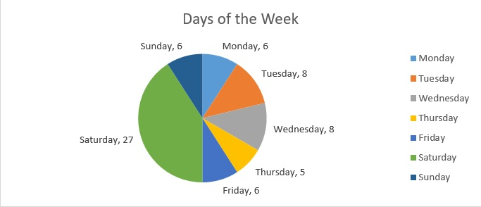
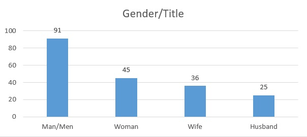
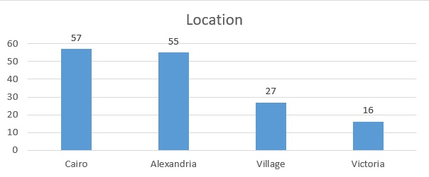
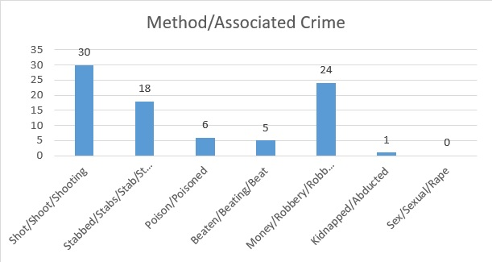

The darkness that drives an individual to commit murder has long been a mystery to all humanity. It is a taboo and curiosity drives audiences to the unknown. Crime is often reported in news sources for safety and to pique the interest of readers. This is true today as well as in Egypt in the early 1900s. Evident in The *Egyptian Gazette* is the reporting of murders and other various crimes across the city and sometimes from across the world. What I wish to do in this paper is dive into news articles related to murder from 1905 and 1906 and use data and analysis to get a look at how often murder was reported, the methods used to report it, and what kind of murders were taking place in Egypt.

## Data
I wanted to give a separate introduction to the data I will be referencing throughout the paper. I began by taking the latest update of content files from GitHub and creating a project in oXygen. From there I had to come up with a query search to retrieve the articles I needed for analysis. I began the trial and error of finding the right search to yield the most data. I knew I wanted all the paragraphs containing the word ‘murder’ or any form of the word. I started with `//div[@type="section"]/div/p[contains(., 'murder')]`, but only received 70 results condensed mostly within 1905. Knowing there was a lot more data I was missing, I then decided to go with a much broader search of my XML files. The XPath query I ended up going with was `//div/p[contains (., 'murder')]`, bringing in over 200 results ranging from January 1905 to October 1906. With the results, I was then able to create tables of reporting frequency as well as word frequency, in other words how many times a specific word was used across the 200+ articles. I sorted through the most frequent words and got rid of the structural and filler words such as “the”, “he”, “she”, “and”, etc. I will be using visualized forms of this data to draw my analysis and conclusions from throughout this paper.

## Frequency
I counted the number of articles containing the word “murder” from each month from 1905-1906 and the data is as follows. A note to keep in mind when looking at 1906 is that it the data is still developing as more of the newspaper is being digitized.

Another note I would like to mention is I am not implying anything of a crime rate here. It would be safe to assume not all murders are reported in the *Egyptian Gazette* and creating a trend relative to frequency is not what I wish to do. I will point out however that the earlier months of 1905 and 1906, January to March, do see less reporting of murders. Whether this has ties to the rate of crime I cannot say, but nonetheless I find it worth pointing out. I also mined the word frequencies of the individual days of the week to see if I could find any trends in certain days having murder reported more or less often than others.

This chart counts every time each day of the week was used in an article. For example, the word Saturday was counted 27 times, being the most frequent by a wide margin compared to the rest of the days. Saturday seems to have been a very eventful day in terms of murder and the events surrounding it.

## The Mystery of Murder
When an event happens, there are a few go-to questions that circulate: “who?”, “where?”, “when?”, and “why?”. The question of when has been answered above in the “Frequency” section. It talks about how often murder was reported in durations of months in the *Egyptian Gazette* from January 1905 until October 1906. It also goes over the days of the week and how often they are specifically mentioned. Leaving us with four more questions. I mined data to hopefully give us some leads and answers to these questions. Let’s start with who.

I have here a chart to visualize the data of gender and marital roles. It shows how often they are used across all the articles containing the word “murder”. Interestingly, man, or men, is used vastly more than woman, or women; however, wife is used more than husband. The issue with this data is how to interpret it. What one would need to do to further investigate gender roles on both the criminal and victim side of murder would be to query search murder and then read through the key articles containing the gender roles above, which is exactly what I did. What I found is that the “man/men” tended to be the murderer or the one accused of murder, where the “woman/women” tended to more often play the victim role. This plays in to the word “wife” being more frequent than the word “husband”.  The reporters tend to use this more as a property/object role in the article. A “man and his wife were killed” or “his wife was killed” seemed frequent as opposed to a “woman and her husband” or “her husband”. Remembering the paper was written in the early 1900s; it’s not very hard to imagine the woman being more itemized as the wife than the man as the husband.

This chart depicts the frequency of nationalities across murder articles. I did separate “native” and “Egyptian” in the chart but for my analysis I am going to consider them one on account of the newspaper's setting in Egypt. Native Egyptians make up for over 43% of all the nationalities mentioned. That is a huge chunk of the pie dedicated to one group of people, considering the next would be the Greeks at a little over 16%. The remaining nationalities are European, and a few Americans. Zooming our scope out a bit we can remember that the English had occupied Egypt and with that came a lot of commerce for England and Europe, but as with most colonized countries, it can cause a lot of social disruption among the natives. We see the proof in high tensions evident in this data. Egyptians account for almost half of the involvement in the murders reported in the *Egyptian Gazette*, both on the criminal and victim side.

I believe this graph to be self-evident as an answer to “where?”. There were occasional blips of international locations where an important murder occurred and was reported all the way from Europe to Egypt, but the numbers were too small to be included alongside these. I also wanted to keep my data refined to Egyptian reports.

I briefly want to go over some extra data I mined from my searches. I wanted to see how regularly certain methods were used or if associated crimes were reported alongside the murders. The most commonly reported method of murder was at the hand of a firearm, followed by stabbing, poisons, and then beatings. Robbery was reported somewhat commonly as an associated crime with the murder. This can also be an answer to our “why” question. A timeless motive for crime has always been money, and with a colonized country, one can expect a large economical gap between classes (especially between the colonizers and the colonized). Kidnapping only appeared once. Weirdly enough, there were zero accounts of sexual assault or rape associated across over 200 crime reports of murder. I am personally not sure whether this is a product of the absence of that crime alongside murder, or if it was never reported in the *Gazette*. This would be an interesting serial question to search and consider in the future.

## Error analysis
Before my conclusion, I want to discuss all the possible errors in my data, analysis, and thoughts. As a science major, in all my laboratory reports we are required to discuss the discrepancies and possible mishaps in our studies, I think the same can apply in this “experimental” type of research. First, I would like to reiterate that this is a developing document: the digitization of the *Egyptian Gazette* is a work in progress, therefore, all the possible articles containing murder are not available at the time of this writing. This merely serves as a stepping stone for further analysis when more of the newspaper becomes available for querying. Next, there are many, many typos across the digital version of the *Egyptian Gazette*. This may factor and interfere with the number of articles I pulled in my query as well as the numbers I listed in my charts and graphs of frequency. I would also like to mention the sheer hours of manpower it would take for one to read all the queried articles. Being completely fair and honest, between all the 200+ articles I pulled, when compiled resulted in 63 pages of Microsoft Word text. I read many of articles to come to the conclusions I did throughout my analysis, but it is always open for many interpretations and much, much deeper analysis. A question I would like to see further investigated from the work I have done are its social and chronological relevancies to the microhistory of Egypt in 1905 and 1906. What small events had large significance in the lives of these people and how did it affect the crime and how it was reported?

## Conclusion
A lot of murder was reported in the *Egyptian Gazette*. My findings were backed by lots of numerical data gathered from over 200 articles about murder in Egypt, including statistics on when it occurred, statistical data of gender and racial persons involved, where it occurred, and hopefully gave a brief view into why it occurred. The reporting of murder found in the articles interested me enough to take this dive in to the vast amount of information across the span of two years. It was a great experience and it can parallel a lot of the crime we see today. In my findings, a lot of the information relevant to the murders back then resonate with the crime of today.
