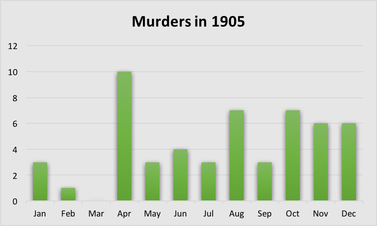
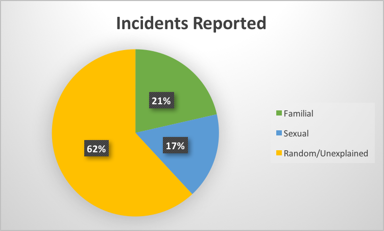

### How has the murder rate in Alexandria, Egypt changed over the course of 1905?

Something that stands out in _The Egyptian Gazette_ is the rate of murders that the newspaper covers. Throughout the paper, short articles explain, typically in detail, about any murder or attempted murder that has occurred within the week. These reports were significant to the population of Alexandria, Egypt because they warned the people of any potential danger they could be in; however, they are still significant to this day because they allow further studies and analysis to be done on the people and politics of the time. Additionally, the murders covered in 1905 provide insight to the gender differences in Alexandria, notably that women either did not murder or did not get caught- until fifteen years later. Although there was no clear trend over the course of the year, it can still be seen that murders increased as the year progressed. It is more the nature of the murders that are important in this discussion. However, the data is incomplete due to the nature of how it has been collected. College students at Florida State University worked to go through digital copies of this newspaper and transcribe it into readable, comprehensive data. This method, while viable, offers a significant source of human error. Even so, the information about the murders committed is, at the very least, mostly accessible. With the assistance of _The Egyptian Gazette_, the violent politics of Alexandria, Egypt in 1905 can be analyzed sufficiently, though not without limitations.

One notable change made to the data collected is the exclusion of the year 1906. Although select entries appear ranging from 1 January to 3 October, the data is so scattered and incomplete that it would not be advantageous to include it. For this reason, it has been omitted from the results so as to not skew any data. As it was, including search results for 1906, only two murders have been recorded for the entire year, one occurring in August and the other in September. The remainder of this project will not discuss 1906, but instead focus on 1905 only.

By performing a simple x-path query of `//div[@type=“item”]/div/p[contains(., ‘murder’)]`, eleven results appear with the key search word included in the text. Upon further inspection, only four entries describe murders or attempted murders that actually occurred during the year. The others consist of reports of previous murders from the year before or describe a murderer who, at the time, was currently residing in prison. The results increase significantly when the x-path query search term is changed to `//div[@type=“section”]/div/p[contains(., ‘murder’)]`. 61 results appear, with 39 entries being entirely relevant to the question at hand. Similar to the first list of results, the others consist of past murders or are multiple articles covering the same case. Combined, there are 42 total reports and 53 total deaths. Because some were mass murders, the data changes to account for this factor. A search using `//div[@type=“article”]/div/p[contains(., ‘murder’)]` was done as well, though it yielded no results.

The number of people murdered, threatened to be murdered, or severely wounded with the intent to murder had a general increase as the year went by, but no strict conclusions can be drawn in this respect, as the number of deaths per month is too random. Graph A shows how many incidents occurred per month in Alexandria in 1905:

Noticeably, April has the maximum number of murders, with all ten of these incidents being murders that were carried through, not threats or attempts. The primary reason for this spike is a group of 17 prisoners who, together, killed five people. With this act on top of five other single murders, the number increases dramatically. However, a simple statistical test shows that April is not an outlier, as follows:

A Five-Number Summary Statistical Analysis of Deaths Per Month in Alexandria, Egypt in 1905:

Minimum|0
First Quartile|3
Median|3.5
Third Quartile|6.5
Maximum|10

Therefore, it can be concluded:

Interquartile Range|3.5
Lower Fence|-2.25
Upper Fence|11.75

These fences describe the range of normal data. Therefore, an outlier does not exist unless the number of murders is less than -2.25, which would be impossible, or higher than 11.75. As the highest value is ten deaths in one month, there is no outlier; all data is valid. With this in mind, it can be seen how the murder rate increased as the year progressed. The first half of the year, from January to June, had an average of 3.5 deaths per month. In the second half of the year, from July to December, there was an average of 5.3 deaths per month. These numbers are plainly inaccurate, as there cannot be half a death, but the conclusion still stands: there was an increase of almost two more deaths by murder per month in Alexandria between the first and second halves of 1905. However, this conclusion is fairly weak and not the central point of this discussion. What is perhaps more intriguing is the reasoning behind the murders.

While some descriptions are vague and do not explicitly explain the circumstances surrounding the murder, others detail the people and reasoning involved. The incidents listed can be effectively categorized into three motives: familial, sexual, and random/unexplained. Familial motives include the murder of a spouse for reasons other than infidelity; the murder of children, nieces, or nephews; and the murder of parents, aunts, or uncles. The one exception that is included in this category is an incident on 13 October, when a man killed someone he thought was responsible for killing his son. Sexual motives came about with the discovery of infidelity and wanting to marry someone else without getting a divorce. The random or unexplained deaths were either vaguely described in the newspaper or dealt with people who did not know each other. For example, on 7 July, two men murdered a female egg seller. Because the motive behind this was not further described, it is being assumed as a random murder. Graph B shows the breakdown of incidents by category:

Specifically, 42 people committed murders in 1905. Of these, nine were familial, seven were sexual, and 26 were random or unexplained. These incidents were mostly singular problems, not mass murders. Only a few of the ones described involved more than two or three people. However, there was a seemingly well-known case of two serial killers that happened soon after 1905 and was most likely given a great deal of coverage in _The Egyptian Gazette_.

The case that occurred after 1905 and is commonly thought to be one of the most famous [serial murders](http://www.haaretz.com/israel-news/.premium-1.633795) in Alexandria’s history was actually committed by two women. From 1919 to 1920, two sisters, Raya and Sakina Ali Hammam, were responsible for the disappearance and murder of many women in the area. It ended up being Raya’s ten year old daughter, Badia, who turned them in. This case seems to stand out as an exception, as the murder rate in Alexandria was not significantly high. Further research into how _The Egyptian Gazette_ specifically handled the case would provide important insight to this discussion. One of the most intriguing aspects of Raya and Sakina’s case is the fact that they were women. In all 53 cases described in the newspaper in 1905, only one murder was committed by a woman; all others were by men. Women were often victims, but either not often killers or simply not caught or given attention. The case that did involve a woman happened at the very end of the year, 27 December, and had to do with a polygamist relationship. Two wives of an Arab of Adlieh were on bad terms with each other and one ended up shooting the other. She claimed it was accidental, but an investigation proved that it was intentional murder. With this knowledge, it seems as though women were indeed held to the same standards as men- that murder is a punishable crime that should be public knowledge. Perhaps then women either did not often kill or at the very least did not get caught.

However, there are definite limitations to this information. The primary factor withholding details is simply the lack of content. Not all transcriptions of _The Egyptian Gazette_ have been accurately uploaded, which can skew the content. Furthermore, although multiple XPath queries were done, not all murders were explicitly labeled as “murder” in the newspaper. Some described acts of terror and brutal deaths without using key words that make the content easy to find. Unsolved crimes were most likely not always accounted for or covered in the newspaper as well. It seems as though it would be difficult to record every attempted murder, as some were most likely kept quiet by those involved. Despite these setbacks, the search did find important, relevant information that assisted with this discussion. With all of the aforementioned in mind, it seems that while murder was somewhat of a problem in Alexandria, it cannot truly be known how serious of a problem it was. What should be noted instead is the high rate of both random murders and murders committed by men.
