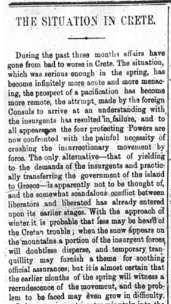
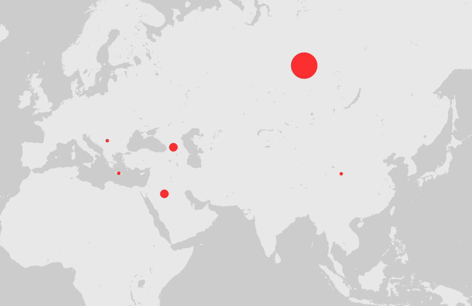

Prior to the Red Scare and the rise of Communism throughout Europe, Anarchism was the ideology that posed the highest threat to European states as well as their respective colonial governments. The goal of this analysis project is to investigate how the *Egyptian Gazette* reported on anarchist movements and activity and how it relates specifically to the British and their control of Egypt. This question is important because during the time period leading up to World War 1, colonialism was still a thriving policy for European governments. Wars between European powers were still being fought over foreign land in Asia and Africa. Anarchists laid the foundation for anti-colonial revolutions after the first and second World Wars. European states were able to point to anarchists as enemies of the state, similar to communists during the Cold War. The *Gazette* gives a unique view of what Europeans living within the British colony of Egypt would be thinking at the time of such upheaval. I chose this topic primarily to explore my curiosity of anarchism as an ideology but also to prove how Anarchism in one side of Europe can affect the policies of the whole continent, as well as neighboring regions. While doing research for this analysis project, it also gave me the chance to read articles by a specific person whose teachings I respect.

My research has shown that the reporting done in the *Egyptian Gazette* promotes the fear of anarchy throughout Europe and its colonies. I struggled while conducting my research in The *Egyptian Gazette*. Primarily, the task of connecting the various forms of anarchism that were mentioned within the newspaper was difficult. There are various contexts in which anarchism is mentioned within the newspaper, most of which do not involve Egypt or Great Britain. The newspaper mentions anarchy in the context of peasant revolutions in the Baltic regions, assassinations against the Spanish monarch, as well as the state of the Russian government during the Russo-Japanese War in 1905. There are a few instances where Egypt is directly mentioned such as the anarchist, Francesco Blandini, who was banned from Egypt and wanted in Italy. However, these events mentioned within the *Egyptian Gazette* are being read by Europeans doing business within the colony. It effects how they view the state of the world and creates a sense of danger. Anarchism can threaten the survival of the state itself, such as how the *Egyptian Gazette* reported about the Russian tsar in early 1905. Anarchy was feared throughout Europe as an ideology that possessed the power to overthrow not only the colonial system but also the primary state itself. To the British, anarchism is dangerous because it can unravel their control of Egypt and create mayhem in a similar way that armed peasants in the Baltics did. An anarchist uprising could spark within the Egyptian peasantry and potentially abolish Britain's presence in the land. At the time, Egypt was one of Britain's most valuable colonies, alongside India. The *Egyptian Gazette* mirrors what a British businessman with investments in Egypt would be thinking during the time. They would pay special attention to the few articles that reference anarchism because they had a fear it would spread.

My search for the keyword "anarchism" in The *Egyptian Gazette* began with an article I read in the June 4, 1906 edition of the paper. It was about an anarchist by the name of Matteo Moral, who was being hunted for the attempted assassination of the King Alfonso of Spain. There were only a few more mentions of anarchism within that edition of the paper so I began doing XPath searches for the terms: anarchy, anarchist, and anarchism. I received a total of twenty four instances where the three terms were mentioned. However, I did not receive any results for the term anarchism. After collecting a list of when the two terms were used, I organized the data into a spreadsheet. I organized the data by counting how many times a specific region was mentioned in reference to anarchy. It appears that Russia was mentioned the most out of any other region, with most regions only being mentioned a few times. For example, Russia was mentioned a total of eight times while Crete was only mentioned once. It makes sense that Russia is mentioned the most due to the political unrest and revolution that occurred in Russia during 1905.

Another issues that came up was that there are a few instances where the term anarchy comes up in articles but the author was not referring to the ideology or a revolution. There are three times anarchy is mentioned that are outliers to the rest of the data set. Although they mention a specific region, the word anarchy is not used in the context of war. In the case of the outliers, anarchy was used to describe the state of an unmanageable situation. For example, there is an article in the September 6, 1906 edition of the newspaper that talks about stock markets being in a state of anarchy. Although it mentions that this is due to the political instability in tsarist Russia, there is no mention of anarchy in the revolutionary sense. There are more articles that use the word anarchy simply to describe a series of unfortunate events such as the Moroccan Conference as well as crimes against Armenians in the Ottoman Empire. I had trouble deciding how to treat these articles in relation to the rest of my data. I decided to treat them as outliers since they do not actively describe anarchy in the political sense. They merely use the term descriptively. I created a separate category to count them as "general".

After creating the spreadsheet, I entered the data into a website called Palladio. It allowed me create a visual representation of the data which makes it easier to comprehend. I created a map of the world and added red points to the coordinates of the mentioned regions. The size of the dots are in relation to how many times each
respective region was mentioned.

Researching through digital methods of microhistory had its challenges. One of the most challenging aspects of doing this analysis project was that my research was restricted primarily to the 1905 and 1906 editions of The *Egyptian Gazette*. There were a couple issues that came from using that as my main point of research. To start, I only had access to two years of newspapers. Two years and hundreds of pages only yielded twenty four results when searching for three terms. Also, if I was able to see newspapers from 1904 or 1907 or from any other year in that decade, I could read articles that talk about events that led up to and after the events I describe in my research, such as the 1905 Russian Revolution. I could read more articles that show the consequences of such events. I would be able to use those potential articles as further evidence for my thesis.

Two years gives minimal results when searching for events tied to one specific ideology. When searching for the three listed terms, there are only a few mentions of specific people being arrested or killed for having anarchist connections. One of which was Francesco Blandini, which was a high profile case. To add, when searching for the term "anarchist", only three results are found. It becomes difficult to use other keywords to find more articles since anarchy is one specific belief system. If I were to search for related events that are often times described in the anarchist articles, I would not be able to actually use them to support my thesis since anarchy is not specifically mentioned. For example, I can not search the term Crete conflict by itself because I would not be able to relate it to anarchism, unless it already had the word anarchy in the article.

However, some outside research was used as well. In researching basic concepts of anarchy, I found that reading Noam Chomsky was insightful. Chomsky wrote a great article in which he explains basic concepts of anarchist thought through various intellectuals opinions through out history: "[A Brief History of Anarchism](http://inthesetimes.com/article/16081/a_history_of_anarchism/)". To add to the article, Chomsky has a book called *[On Anarchism](https://www.yumpu.com/en/document/view/25655902/chomsky-on-anarchismpdf-zine-library)* in which he further explains anarchist beliefs while also explaining his views on the ideology.
