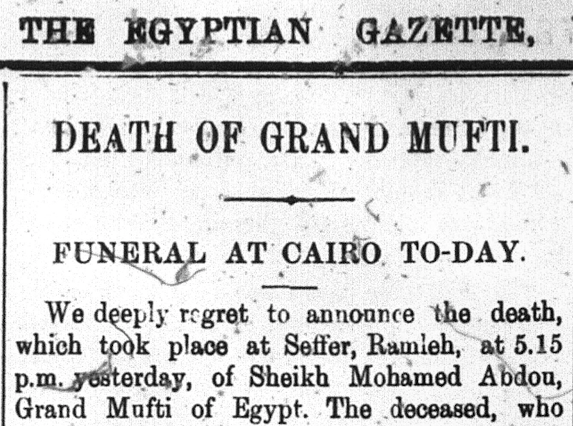

Muhammad 'Abduh died on July 11, 1905. Because he was the leading Muslim thinker of Egypt and a prominent player in political and public life, it is not surprising that 'Abduh's illness, funeral, and memory were the subject of daily reports in the *Egyptian Gazette.*

The pro-British paper lauded the memory of the pro-British cleric.