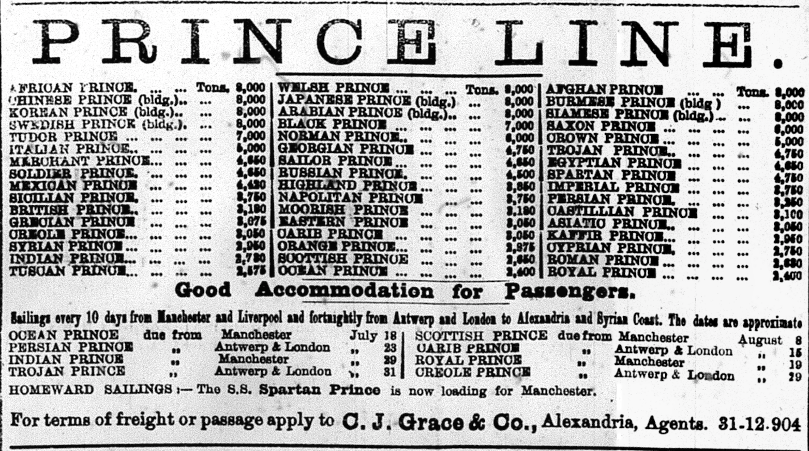
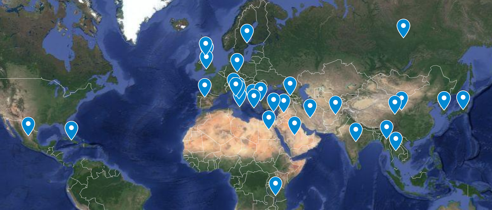

Back in 1984, Billy Ocean had a big hit with his song "[Caribbean Queen](https://en.wikipedia.org/wiki/Caribbean_Queen)." It was a versatile song in global terms, as Ocean recorded versions that charted in other markets: "African Queen" and "European Queen" didn't require much extra reworking to benefit from [internationalization and localization](https://en.wikipedia.org/wiki/Internationalization_and_localization).

<iframe width="560" height="315" src="https://www.youtube.com/embed/Cahch0_M06c" frameborder="0" allowfullscreen></iframe>

I got to thinking about "Caribbean Queen" while I was preparing an [xml version of the Prince Lines advertisement](https://github.com/dig-eg-gaz/advertisements/blob/master/ad-text/pri01.xml) that appeared on the front page of most issues of the *Egyptian Gazette* in 1905.

The ad lists 48 ships owned by the company by name and weight. Each name is a prince of a certain region, nation, type, or character. Billy Ocean might be gratified to see that there is a massive Carib Prince (8,000 tons) and a somewhat slighter African Prince (3,050 tons). No European Prince, but lots of Princes from various parts of Europe:

I was struck by the coverage of names. The geography of colonial shipping interests dictated part but not all of this range--though the heaviest ships seemed to follow the empire's shipping lanes. British whimsy seemed to supply other names--Highlands Prince, Soldier Prince, Merchant Prince, and so on. And of course there's an Ocean Prince: Billy honored before his time.
